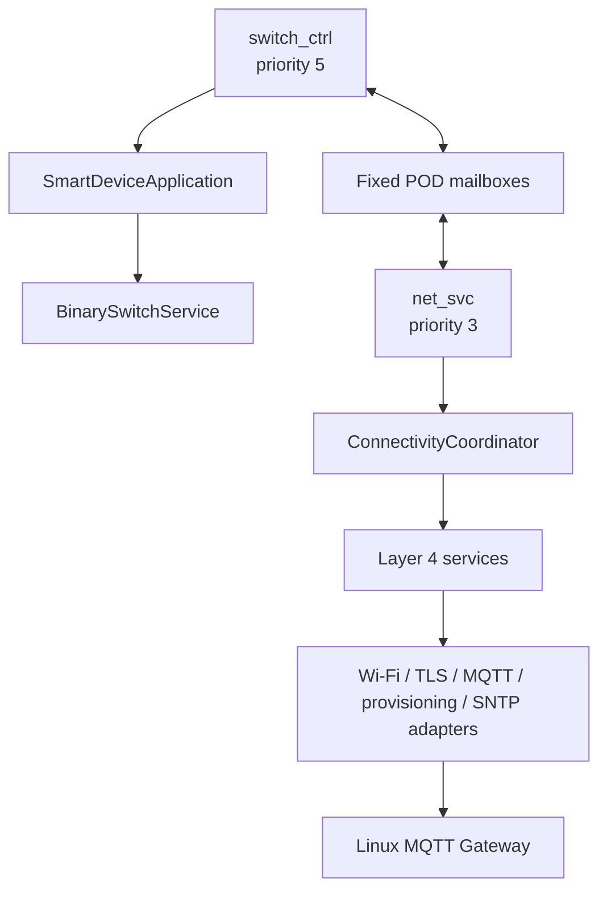

# Layer 5 Gateway-Connected Node

## Mục tiêu

Mở rộng product thành Gateway-connected node nhưng giữ local button/relay control độc lập, ưu tiên cao và hoạt động khi Wi-Fi, TLS, MQTT, Gateway hoặc time sync lỗi.

Profile đầu tiên dùng Wi-Fi primary và MQTT/TLS tới Linux Gateway. Slot 4G/failover chỉ giữ qua `INetworkLink`; không tạo fake modem khi BOM chưa chốt. BLE Mesh, local Web UI và direct Cloud không thuộc scope. OTA framework policy tồn tại nhưng không compose cho đến khi có secure ESP-IDF adapters và partition layout phù hợp.

## Bắt buộc trước khi compose

### Harden ProvisioningService

* Kiểm tra `set_blob()` trước `commit()`; một trong hai lỗi tính là validation failure.

* Dùng `PortalConfig::timeout_ms`, không hard-code timeout.

* Zeroize pending credentials sau success hoặc terminal failure.

* Thêm `stop()` để đóng portal khi connectivity thành công.

* Local control không phụ thuộc provisioning state.

### Harden NetworkManager

* Thêm `stop()` để dừng và reset mọi link/backoff.

* Thêm primary-return hold-down chống flap.

* Sửa observer report sai `LinkKind` khi connecting/offline.

* Stop inactive links khi một link đã UP.

* Explicit `set_provisioned(bool)` thay vì dùng `add_link()` như side effect.

* Không tự reboot; HealthMonitor sở hữu escalation.

### Harden queue/messaging/commands

* `QueuedMessage` giữ `correlation_id`.

* Reject oversized topic thay vì truncate.

* `OfflineQueue` thành template depth; product dùng depth 16, khoảng 5.8 KiB BSS.

* Telemetry replay phục hồi correlation ID.

* Command response queue failure không bị bỏ qua; expose dropped-response counter và diagnostics.

* Diagnostics thêm bounded snapshot.

* OTA thêm pending-confirm/confirm/rollback timeout nhưng vẫn không compose.

Framework tests phải cover mọi thay đổi trên và architecture checker phải pass trước product work.

## Parent bridge components

Tạo bridge chỉ cho capability được Gateway profile sử dụng:

* `framework_libraries`

* `framework_services_types`

* `framework_network_manager`

* `framework_provisioning`

* `framework_indication`

* `framework_messaging`

* `framework_mqtt_contract`

* `framework_offline_queue`

* `framework_telemetry`

* `framework_command_dispatcher`

* `framework_time_sync`

* `framework_diagnostics`

* `framework_health_monitor`

* `framework_security_policy`

Không tạo `framework_ota_manager` trong profile này.

## Concrete ESP32/product adapters

### Generic framework Layer 1/3

Hoàn thiện ESP32-C6 watchdog:

* Layer 1 wrapper trên task watchdog.

* `Esp32C6Watchdog : uhal::IWatchdog`.

* Register source trong `framework_platform_esp32c6`.

### `components/net_esp32c6`

Tạo product infrastructure component riêng để connectivity dependencies không leak vào `product_smart_device` application component.

* `WifiStationLink : INetworkLink`

  * Non-blocking ESP-IDF STA lifecycle.

  * Event callbacks chỉ latch flags; `poll()` đổi state.

  * RSSI quality, non-metered.

  * `stop()` nhường radio cho provisioning.

* `TlsSocket`

  * esp-tls, CA pinning, server validation.

  * Không fallback plaintext.

* `CoreMqttTransport : IMessageTransport`

  * coreMQTT pinned version.

  * Static 1024-byte network buffer và bounded incoming staging.

  * `MQTT_ProcessLoop` trong net task.

* `SoftApProvisioningPortal : IProvisioningPortal`

  * `wifi_prov_mgr` + `wifi_prov_scheme_softap`.

  * Security2 khi có salt/verifier; security1 fallback phải ghi deviation.

  * Không port legacy WebServer/UI.

* `WifiCredentialValidator`

  * `busy` khi association đang chạy, `ok` khi GOT\_IP, `denied` khi auth fail.

* `SntpTimeSource` và `SystemTime`.

* `Ws2812Indicator : IIndicator` trên GPIO8 qua pinned `espressif/led_strip` RMT backend.

* `EspRecoveryAction`.

* `NvsConfigStore : IConfigStore` trên namespace `smartcfg`.

4G không có adapter. NetworkManager capacity 2 và metered session policy là extension seam duy nhất cho đến khi modem được chốt.

## Pure Layer 5 structure

### SmartDeviceApplication

Giữ vendor-neutral và thêm semantic API:

* State observer với `SwitchStateSnapshot { on, revision }`.

* `set_switch(bool, CommandSource)`.

* Connectivity/provisioning/fault semantic callbacks.

* Product indication mapping:

  * relay state giữ GPIO2 mirror hiện tại,

  * connecting/provisioning/fault/OTA dùng WS2812 GPIO8,

  * fault có priority cao nhất.

* Không include Wi-Fi, MQTT, board, NVS, FreeRTOS hoặc concrete adapter.

### RuntimeCoordinator

Tạo pure `ConnectivityCoordinator`, host-testable, inject Layer 4 services và mailbox ports. Không include FreeRTOS/vendor.

Poll order cố định:

1. Drain control→network semantic events.
2. Provisioning owns radio khi chưa provisioned.
3. NetworkManager poll.
4. On link UP, start time sync và MQTT TLS session.
5. TimeSync poll.
6. MQTT transport poll và command dispatch callback.
7. Subscribe command topic, publish birth/status/state once.
8. Publish dirty retained state và periodic telemetry.
9. Replay tối đa 4 offline records/tick.
10. Publish diagnostics mỗi 60 giây.
11. Indication poll.
12. Health check-in/watchdog decision.

### Product handlers

* `SwitchCommandHandler` implements `ICommandHandler` for `switch.set` và `switch.toggle`.

* Handler chạy net task nên không gọi application trực tiếp; gửi bounded `ControlRequest` qua mailbox.

* `GatewayCommandAuthorizer` dùng SecurityPolicy.

* Command accepted response không giả là authoritative state; retained state event sau khi control task apply mới là nguồn sự thật.

## Runtime/task model

Giữ hai task để TLS/coreMQTT không làm tăng button latency:

* `switch_ctrl`: priority 5, local control, ISR queue, control mailbox, 5 ms active poll, 250 ms idle wake.

* `net_svc`: priority 3, stack 8192, tick 100 ms, connectivity coordinator.

Hai fixed queues:

* net→control depth 4, POD requests.

* control→net depth 8, POD state/ack/indication events.

Không mutex/service locator/shared mutable application state giữa tasks.

## Composition và degraded startup

`SmartDevice.cpp` init order:

1. NVS init; failure ghi fault và dùng volatile defaults, không fail local startup.
2. Board init; hardware safe-state failure là hard fail duy nhất.
3. Diagnostics và optional WS2812 indication.
4. BinarySwitch + NVS state store + SmartDeviceApplication restore.
5. Mailboxes và `switch_ctrl`; local control live tại đây.
6. Tạo network/provisioning/TLS/MQTT/time/telemetry/command/health objects.
7. Start `net_svc`; mọi lỗi connectivity chỉ degraded/retry, `smart_device::start()` vẫn trả `ok`.

OTA không được compose và partition vẫn single-app-large.

## Budgets và config

Document/enforce:

* switch task 3072 stack, priority 5.

* net task 8192 stack, priority 3.

* ISR queue 1.

* control queue 4.

* event queue 8.

* OfflineQueue depth 16.

* coreMQTT buffer 1024.

* TLS memory deviation documented; project code itself không allocate sau startup.

* lwIP sockets tối đa 6.

* Custom CA only; certificate-bundle fallback disabled.

## Tests

Framework hardening tests:

* Provisioning storage errors/timeout/zeroization.

* Network stop/hold-down/failover/observer kind.

* Queue oversized-topic/correlation preservation.

* Command response drop diagnostics.

* Diagnostics snapshot.

* OTA confirm/rollback timeout.

Parent host tests:

* Application semantic state/revision/indication.

* Coordinator poll order và degraded operation.

* Provisioning suppresses MQTT.

* Subscribe/birth/state once after connect.

* Replay cap 4.

* Command authorization/idempotency/mailbox full.

* Local control hoạt động khi config, indicator, network và transport đều fail.

Target acceptance được ghi riêng; không flash trong implementation scope.

## Matter decision

Matter bị defer khỏi implementation hiện tại. Không thêm `esp-matter`, `connectedhomeip`, Matter endpoints/clusters, BLE Matter commissioning, fabric storage hoặc Matter OTA. Project tiếp tục pin ESP-IDF v6.0.2 và MQTT Gateway path là proprietary transport, không được mô tả là Matter-compliant.

Nếu Matter được mở lại, compatibility gate bắt buộc phải chốt lại toolchain chính thức trước khi code; baseline đã khảo sát là esp-matter release/v1.6 trên ESP-IDF v5.5.5, không phải current v6.0.2.

## Completion criteria

* Local switch path không depend network services và vẫn build/test khi connectivity profile lỗi.

* Application headers không có vendor/RTOS/board/NVS dependency.

* Gateway profile dùng Wi-Fi + TLS/coreMQTT; không plaintext fallback.

* No fake 4G/cloud/OTA adapter.

* Framework tests, parent tests, boundary/budget checks và ESP-IDF build pass.

* Không commit, push, flash, monitor, reset hoặc clean Git.

