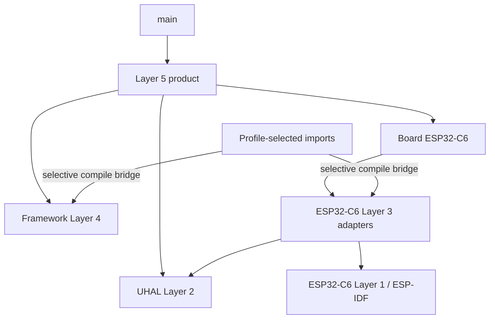

# Kế hoạch tài liệu hóa toàn bộ cấu trúc repository

## Mục tiêu

Tạo một tài liệu tiếng Việt tại `docs/architecture/repository-structure.md` mô tả cây thư mục **theo kiến trúc** của repository hiện tại. Tài liệu sẽ giải thích cho từng nhóm thành phần:

- dùng để làm gì;
- vì sao được tạo;
- vì sao/điều kiện nào nó tồn tại trong repository;
- ai sở hữu;
- thuộc layer nào hoặc có vai trò gì trong build;
- trạng thái active, optional, profile-selected, generated, roadmap hay legacy/reference-only.

Không liệt kê mọi artifact trong `build/` hoặc mọi file legacy. `reference/` được tóm tắt riêng và ghi rõ không phải kiến trúc authoritative.

## Phạm vi thay đổi

### 1. Thêm `docs/architecture/repository-structure.md`

Tài liệu gồm các phần sau.

#### Quy ước trạng thái

Dùng nhãn nhất quán để người đọc không nhầm “có thư mục” với “đã triển khai”:

- **Active source** — source hiện được build hoặc sử dụng.
- **Profile-selected** — chỉ được ESP-IDF discover khi chọn product profile tương ứng.
- **Optional** — capability/integration chỉ tham gia khi được bật rõ ràng.
- **Generated/local** — cache, build output hoặc cấu hình sinh tại máy; không phải source of truth.
- **Roadmap/draft/partial** — contract hoặc cấu trúc có tồn tại nhưng chưa phải implementation hoàn chỉnh.
- **Legacy/reference-only** — chỉ dùng đối chiếu, không thuộc dependency graph hiện hành.

#### Cây repository tổng thể

Vẽ cây từ root đến các thư mục có ý nghĩa kiến trúc và các file điều phối chính:

```text
agile-smart-device/
├─ main/
├─ components/
│  ├─ board_esp32c6/
│  └─ product_smart_device/
├─ imports/
│  ├─ common/components/
│  ├─ local_switch/components/
│  └─ gateway_node/components/
├─ external/agile-firmware-framework/
├─ docs/
├─ tests/
├─ tools/
├─ reference/
├─ .github/workflows/
├─ CMakeLists.txt
├─ sdkconfig.defaults
└─ các artifact local/generated
```

Mở rộng đủ sâu các phần active quan trọng:

- `components/board_esp32c6/include`, `src`;
- `components/product_smart_device/include`, `src/application`, `composition`, `runtime`, `adapters`;
- toàn bộ bridge component theo ba profile import;
- `tests/host`, `tests/architecture`, `tests/hil`;
- `docs/architecture`, `docs/rules`, `docs/checklists`;
- các nhóm chính bên trong framework submodule.

#### Giải thích parent project

Giải thích riêng từng nhóm:

- `main/` là ESP-IDF entry point tối thiểu, tồn tại để chuyển quyền điều khiển cho composition root.
- `components/board_esp32c6/` chứa board facts, pin/polarity và concrete board object vì wiring thuộc SKU/PCB, không thuộc reusable framework.
- `components/product_smart_device/` là Layer 5, tách application vendor-neutral khỏi composition/runtime/adapters phụ thuộc ESP-IDF/FreeRTOS/NVS.
- `imports/` là các ESP-IDF bridge compile source framework có chọn lọc, tồn tại vì framework dùng standalone CMake thay vì trực tiếp là ESP-IDF component catalog.
- `common`, `local_switch`, `gateway_node` tồn tại để giới hạn component discovery theo `PRODUCT_PROFILE`; ghi rõ Gateway profile compile catalog không đồng nghĩa Wi-Fi/TLS/MQTT product đã hoàn thiện.
- `tests/`, `tools/`, `.github/`, `docs/` tồn tại để kiểm chứng và quản trị dependency/architecture thay vì chỉ dựa vào convention.
- `sdkconfig`, `build`, `.cache`, `.embedder`, host-test build directories được phân loại generated/local.

#### Giải thích framework submodule

Vẽ và giải thích cấu trúc framework ở mức capability:

```text
external/agile-firmware-framework/
├─ components/
│  ├─ uhal/{core,interfaces}
│  ├─ platform/{fake,esp32c6,stm32}
│  ├─ libraries/
│  ├─ devices/
│  ├─ protocols/
│  └─ services/
├─ docs/{architecture,integration,roadmap}
├─ examples/local_switch/
├─ products/env_monitor/
├─ tests/{unit,integration}
├─ tools/
└─ config/
```

Nêu rõ:

- UHAL là Layer 2 contract để Layer 4 không phụ thuộc vendor SDK.
- `platform/.../low_level` là Layer 1; `platform/.../adapters` là Layer 3.
- `fake` chỉ phục vụ host tests.
- ESP32-C6 và STM32 là integration catalog tùy chọn; không mô tả toàn bộ peripheral directory là hoàn thiện.
- libraries/devices/protocols/services là Layer 4 reusable capability catalog.
- roadmap giữ ý tưởng chưa đủ implementation thay vì tạo source placeholder giả.
- examples/products là mẫu composition, không thuộc smart-device production firmware.
- framework `build/` là generated và artifact cũ không được xem là source hiện hành.

#### Legacy `reference/`

Tóm tắt các nhóm `application`, `domain`, `middleware`, `platform`, `docs`, `web_src` và script cũ. Ghi rõ:

- đây là submodule/reference legacy;
- chỉ dùng đối chiếu hành vi hoặc migration;
- không phải nơi thêm feature mới;
- không dùng claim/config cũ của nó làm source of truth cho kiến trúc hiện tại.

#### Quan hệ build và ownership

Thêm sơ đồ Mermaid để thể hiện đường phụ thuộc thay vì khiến người đọc suy luận từ tên thư mục:



Giải thích parent sở hữu product/board/profile/schema, còn submodule sở hữu reusable Layers 1–4.

#### Hướng dẫn đặt code mới

Kết thúc bằng bảng quyết định ngắn:

- board pin/wiring → `components/board_*`;
- product use case → `product_smart_device/src/application`;
- scheduling/ISR/task → `src/runtime`;
- NVS/vendor product infrastructure → `src/adapters`;
- reusable policy/algorithm/protocol/device → framework Layer 4;
- vendor implementation → framework platform Layer 1/3;
- ESP-IDF source selection → `imports/<profile>/components`;
- rule/check/test/docs → thư mục governance tương ứng.

Liên kết đến các tài liệu authoritative hiện có như rules, checklist, architecture blueprints, board/product README, framework layers/catalog/testing/integration/roadmap.

### 2. Cập nhật `README.md`

Giữ repository map ngắn để onboarding nhanh, nhưng thêm liên kết rõ đến `docs/architecture/repository-structure.md` thay vì sao chép toàn bộ tài liệu. Không tạo `docs/README.md` mới vì hiện chưa có docs index và yêu cầu không cần thêm một tầng điều hướng.

## Nguyên tắc nội dung

- Mô tả trạng thái từ source/CMake hiện tại, không dựa vào tên thư mục.
- Không tuyên bố Matter, OTA adapter, TLS, MQTT transport, 4G, STM32H5 hoặc mọi ESP32 peripheral đã hoàn thiện.
- Không tuyên bố CI/hardware acceptance pass chỉ vì workflow hoặc HIL README tồn tại.
- Không mô tả `reference/` là production architecture.
- Không sửa source, CMake, build profile hoặc cấu trúc thư mục trong task tài liệu này.
- Không đưa cache/build output chi tiết vào cây vì chúng biến đổi theo máy và gây nhiễu.

## Kiểm chứng sau khi viết

1. Đối chiếu mọi path trong tài liệu với cây thư mục hiện tại.
2. Kiểm tra bridge/profile claims với root `CMakeLists.txt` và từng bridge `CMakeLists.txt` liên quan.
3. Kiểm tra link Markdown nội bộ tồn tại.
4. Chạy `git diff --check` để phát hiện lỗi whitespace.
5. Chạy architecture documentation/checker test liên quan nếu tài liệu hoặc README nằm trong phạm vi checker.
6. Báo cáo tách biệt file mới, file README cập nhật và các khu vực chỉ được mô tả là optional/roadmap/legacy.

## File thay đổi dự kiến

- Thêm `docs/architecture/repository-structure.md`.
- Cập nhật `README.md` để liên kết tài liệu mới.
