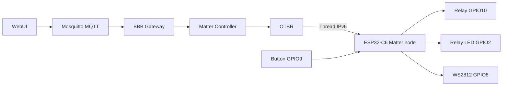
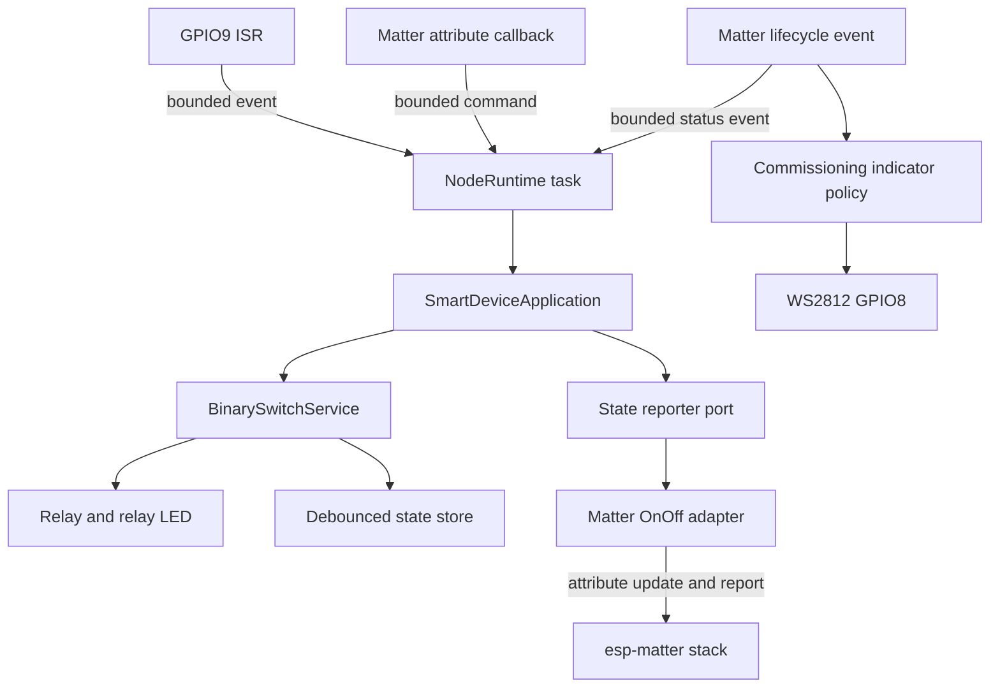
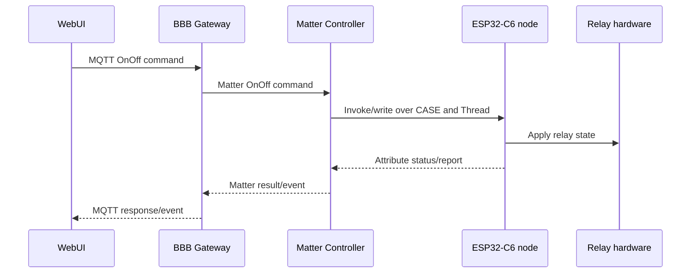

# Kế hoạch phát triển ESP32-C6 thành Matter-over-Thread smart node

## 1. Kết luận kiến trúc

Node hiện tại sẽ được phát triển thành **Matter On/Off Plug-in Unit chạy trên Thread** và kết nối với Matter Controller/OTBR thật trên BBB.

Đường dữ liệu chuẩn:

Ranh giới bắt buộc:

* MQTT, JSON envelope, `request_id`, WebSocket và correlation thuộc WebUI/BBB Gateway.

* Firmware node chỉ triển khai Matter data model, Thread lifecycle và local hardware behavior.

* Không compile MQTT/network-manager Gateway bridges vào Matter node image.

* Endpoint 0 là Matter management endpoint.

* Endpoint ứng dụng đầu tiên là **On/Off Plug-in Unit**, có OnOff server cluster `0x0006`.

* Local button vẫn hoạt động khi Thread, OTBR, Controller, Gateway hoặc WebUI lỗi.

* Power-restore policy của relay là khôi phục trạng thái hợp lệ đã lưu, nhưng GPIO10 phải giữ fail-safe OFF cho tới khi firmware hoàn tất khởi tạo và kiểm tra persistence.

## 2. Hiện trạng và khoảng trống

### Đã có và sẽ tái sử dụng

* Board mapping GPIO9/GPIO10/GPIO2 trong `components/board_esp32c6`.

* `SmartDeviceApplication` và `BinarySwitchService` cho hành vi On/Off vendor-neutral.

* `SwitchRuntime` cho ISR handoff, task và debounce.

* `NvsBinaryStateStore` với schema product-owned.

* Host tests, layer checker, CMake checker và hai build profile hiện tại.

* UHAL GPIO/clock, `ButtonInput`, indication policy, diagnostics/health policies trong framework.

### Chưa có

* esp-matter/ConnectedHomeIP dependency và toolchain đã pin.

* Matter node, endpoint, device type và OnOff attribute callback.

* OpenThread/Matter commissioning lifecycle.

* Đồng bộ hai chiều giữa Matter OnOff attribute và một state owner duy nhất.

* Commissioning/factory-reset gesture bằng long press.

* WS2812 status adapter/pattern tại GPIO8.

* Matter factory data, attestation, production security và OTA partitions.

* Real-controller integration tests với BBB.

* Thread recovery, subscription/reporting và hardware acceptance evidence.

`gateway_node` hiện chỉ compile Layer 4 Gateway/MQTT policies và không tạo Matter node. Profile này không được dùng làm production node target.

## 3. Nguyên tắc triển khai

1. **Không ghép esp-matter vào ESP-IDF 6.0.2 bằng phỏng đoán.** Chọn một esp-matter release/commit, rồi dùng đúng ESP-IDF commit và toolchain mà release đó yêu cầu.
2. **Không đổi toolchain chính trước compatibility gate.** Upstream ESP32-C6 Matter OnOff example phải build, flash, commission và read/write được qua BBB trước khi project migration.
3. **Một state owner duy nhất.** Matter callback, local button và recovery event không được trực tiếp cạnh tranh ghi GPIO/NVS/attribute.
4. **Callback phải ngắn và bounded.** ISR và Matter stack callback chỉ validate rồi đưa event vào fixed-capacity queue.
5. **Không block local control vì network.** Thread/Matter lifecycle chạy độc lập với local control path.
6. **Không dùng test credential cho production.** Development credential chỉ phục vụ bring-up và phải được đánh dấu rõ.
7. **Không tuyên bố Matter/Thread/OTA/security pass nếu chưa có log và HIL evidence.**

## 4. Kiến trúc runtime mục tiêu

### Event model

Tạo bounded product event model, tối thiểu gồm:

* `LocalShortPress`

* `MatterSetOnOff`

* `OpenCommissioningWindow`

* `FactoryResetRequested`

* `ThreadStateChanged`

* `MatterFabricChanged`

* `PersistenceFlushDue`

Mỗi event có source rõ ràng. Matter command chỉ được acknowledge thành công sau khi validation và enqueue thành công. Queue-full phải trả về trạng thái lỗi phù hợp, không silently drop command.

### State synchronization

* **Local button:** ISR → runtime → application toggle → hardware/persistence → Matter attribute update/report.

* **Matter write:** Matter callback → runtime queue → application set → hardware/persistence → cập nhật attribute nếu giá trị thực tế thay đổi.

* **Boot restore:** đọc schema/state → validate → apply hardware → publish initial Matter attribute sau khi endpoint sẵn sàng.

* So sánh desired/current state để tránh callback loop và duplicate NVS writes.

* Unsolicited local change phải được Matter subscription report tới Controller; node không tạo MQTT event.

## 5. Các phase triển khai

## Phase 0 — Audit BBB và đóng băng contract tích hợp

Trước khi đổi firmware:

1. Ghi version/commit của OTBR, Matter Controller và API/CLI Gateway đang chạy trên BBB.
2. Xác nhận RCP riêng, `otbr-agent`, `wpan0`, Thread channel/PAN ID/dataset và IPv6 routing khỏe.
3. Xác nhận Controller storage/fabric tồn tại qua reboot.
4. Dùng một node/reference device đã biết hoặc controller diagnostic để xác nhận Controller có thể:

   * mở commissioning;

   * discover endpoint/Descriptor;

   * read/write OnOff;

   * subscribe attribute;

   * remove fabric/node.
5. Chốt Gateway mapping cho OnOff Plug-in Unit:

   * Node ID do fabric/controller cấp;

   * endpoint lấy từ Descriptor, không hard-code phía WebUI nếu inventory có thể cung cấp;

   * cluster `0x0006`;

   * commands Off `0x00`, On `0x01`, Toggle `0x02`.
6. Không đưa Thread dataset, setup passcode, DAC key hoặc fabric secret vào Git/log.

**Gate:** BBB Controller và OTBR thật hoạt động độc lập với firmware project; mock controller không được dùng làm acceptance evidence.

## Phase 1 — Chọn và pin esp-matter toolchain

1. Từ upstream Espressif, chọn esp-matter release/commit có ESP32-C6 Thread OnOff example.
2. Checkout đầy đủ submodules và dùng đúng ESP-IDF commit/toolchain do esp-matter release khai báo.
3. Trên Windows, kiểm chứng clean environment bằng upstream install/export scripts; không dùng lẫn environment IDF 6.0.2.
4. Build upstream OnOff example cho ESP32-C6.
5. Flash lên board thử nghiệm, commission qua BBB OTBR/Controller thật, rồi chạy:

   * Descriptor discovery;

   * OnOff read;

   * On/Off/Toggle command;

   * subscription report;

   * remove fabric và recommission.
6. Ghi lại exact SHAs, Python/toolchain version, build command và known patches.
7. Chỉ sau gate mới chọn cách tích hợp reproducible:

   * ưu tiên pin esp-matter và dependency bằng Git submodule/CI checkout có SHA rõ ràng;

   * không phụ thuộc vào một `ESP_MATTER_PATH` không được version hóa mà CI không tái tạo được.

**Gate:** upstream example pass end-to-end với chính BBB đang dùng. Nếu gate fail, dừng migration và sửa environment/controller compatibility trước, không viết adapter project dựa trên API chưa xác nhận.

## Phase 2 — Tạo profile `matter_node` và migration build

1. Thêm `PRODUCT_PROFILE=matter_node` trong root `CMakeLists.txt`.
2. `matter_node` dùng common/local hardware capabilities cần thiết nhưng không thêm `imports/gateway_node/components`.
3. Tạo bridge/component integration tối thiểu cho esp-matter/OpenThread theo cách upstream đã xác nhận.
4. Cập nhật product `CMakeLists.txt` chỉ với dependency thật sự dùng.
5. Giữ `local_switch` là host/local regression profile trong giai đoạn chuyển đổi.
6. Ngừng xem `gateway_node` là target firmware của repository node:

   * loại nó khỏi production build matrix;

   * hoặc giữ tạm như compile-only catalog gate với tên/trạng thái rõ ràng;

   * không cho source MQTT/Gateway xuất hiện trong `matter_node` compile database/map file.
7. Pin `sdkconfig.defaults` theo Matter/OpenThread requirements, không copy nguyên sdkconfig của example.
8. Thêm partition table có dung lượng được đo từ image; dành chỗ cho NVS/factory data và cấu trúc OTA trước production hardening.
9. Ghi baseline flash, IRAM/DRAM, heap và task stack sau khi Matter image link thành công.

**Gate:** clean configure/build `local_switch` và `matter_node`; compile database/map chứng minh Matter node không chứa MQTT/JSON Gateway components.

## Phase 3 — Củng cố local state owner trước khi nối Matter

1. Generalize `SwitchRuntime` thành runtime/coordinator nhận cả local và remote semantic events.
2. Giữ GPIO ISR chỉ enqueue; không gọi application, Matter hoặc NVS từ ISR.
3. Mở rộng `ButtonInput` bằng behavior có test cho:

   * short press: toggle relay;

   * commissioning long press;

   * factory-reset long press dài hơn, có confirmation pattern và chỉ thực thi sau release/confirm;

   * debounce và chống kích hoạt nhầm lúc boot.
4. Ngưỡng long press là product constants có tên và được HIL xác nhận, không rải magic number.
5. Tạo state-reporting port vendor-neutral để application thông báo committed state mà không include esp-matter.
6. Coalesce persistence writes bằng product adapter/runtime timer; không ghi NVS lặp lại cho cùng state.
7. Boot restore sequence:

   * cấu hình output ở safe OFF;

   * init NVS và kiểm tra schema/CRC hoặc validity marker;

   * nếu state hợp lệ, apply state đã lưu;

   * nếu NVS lỗi/corrupt, giữ OFF, ghi diagnostic và vẫn cho local control theo policy đã chốt.
8. Host-test coordinator, queue-full, duplicate state, NVS load/save failure và degraded local operation.

**Gate:** toàn bộ local behavior pass host tests và HIL trước khi Matter callback được phép điều khiển relay.

## Phase 4 — Thêm Matter On/Off Plug-in Unit

1. Tạo Matter integration bên trong product infrastructure, không đưa esp-matter headers vào `SmartDeviceApplication` hoặc framework Layer 4.
2. Tạo node và endpoint:

   * endpoint 0: Matter root/management;

   * endpoint ứng dụng: On/Off Plug-in Unit device type;

   * OnOff server cluster `0x0006`;

   * Descriptor/Basic Information/Identify và mandatory clusters theo esp-matter data model của version đã pin.
3. Dùng generated/dynamic endpoint ID được composition lưu giữ; không hard-code contract phía Gateway ngoài inventory discovery.
4. Attribute callback chỉ xử lý đúng endpoint/cluster/attribute và enqueue `MatterSetOnOff`.
5. State reporter cập nhật OnOff attribute dưới Matter stack lock/context đúng theo API version đã pin.
6. Xử lý command On, Off, Toggle idempotently.
7. Local short press phải phát attribute report qua subscription.
8. Matter read sau reboot phải bằng physical output và persisted state.
9. Log node/endpoint/cluster/state ở mức diagnostic nhưng không log secret.

**Gate:** Controller thật discover đúng device type/cluster, điều khiển physical relay, đọc đúng attribute và nhận unsolicited local-button report.

## Phase 5 — Commissioning, Thread lifecycle và indication

1. Compose Thread/Matter lifecycle callback và state machine cho:

   * uncommissioned;

   * commissioning window open;

   * joining/attaching Thread;

   * commissioned and operational;

   * Thread detached/degraded;

   * fault/factory-reset confirmation.
2. Dùng WS2812 GPIO8 cho commissioning/Thread/fault patterns; GPIO2 tiếp tục mirror relay state.
3. Concrete WS2812 implementation phải dùng ESP-IDF-supported driver/component của toolchain đã pin; không bit-bang trong application task.
4. Pattern phải bounded, non-blocking và có priority rõ:

   * factory-reset confirmation/fault;

   * commissioning;

   * Thread reconnecting;

   * operational/idle.
5. Long-press commissioning chỉ mở/reopen commissioning window theo policy Matter.
6. Factory reset phải:

   * yêu cầu gesture dài hơn và visual confirmation;

   * xóa fabric và Thread credentials bằng API stack;

   * xóa product state hay giữ state/calibration đúng policy đã tài liệu hóa;

   * reboot về trạng thái commissionable an toàn.
7. Thread detach/controller outage không được vô hiệu local button/relay.
8. Test power cycle BBB, OTBR restart, node restart, Thread detach/reattach và recommission.

**Gate:** factory-new commission, operational reconnect và intentional factory reset đều lặp lại được; local control vẫn hoạt động trong mọi network-degraded case.

## Phase 6 — Diagnostics và reliability

1. Thu thập bounded diagnostics:

   * firmware/build version;

   * reset reason;

   * Matter commissioning/fabric count;

   * Thread role/attach state;

   * relay desired/actual state;

   * NVS/schema error;

   * event queue high-water/drop count;

   * minimum free heap;

   * task stack watermark;

   * watchdog/fault counters.
2. Không log setup passcode, discriminator-secret relationship, Thread master key, fabric key, DAC private key hoặc full credential blob.
3. Thêm watchdog/recovery policy nhưng không reset liên tục khi BBB/Thread mất.
4. Xác nhận relay fail-safe bias phần cứng giữ OFF trước khi GPIO10 được cấu hình.
5. Chạy brownout/power-cycle test để xác nhận không có relay glitch và state restore đúng.
6. Mọi queue/buffer dùng fixed capacity; đo stack/heap trên hardware thay vì chỉ ước lượng.

**Gate:** fault injection cho NVS, Thread outage, Controller outage, queue pressure và repeated reboot không phá local safety hoặc gây reboot loop.

## Phase 7 — Security, factory data và OTA production gate

Phase này bắt buộc trước production release, không chặn development commissioning bằng test credential.

1. Chốt production VID/PID, product/device identity và certification path.
2. Tạo manufacturing flow cho unique discriminator/passcode và Matter attestation:

   * DAC;

   * PAI;

   * Certification Declaration;

   * private key được bảo vệ;

   * QR/manual setup payload.
3. Không commit production secrets; factory data phải được provision bằng controlled tool/process.
4. Chốt và kiểm chứng secure boot, flash encryption, NVS encryption, JTAG/UART production policy.
5. Thiết kế signed OTA và anti-rollback theo Matter OTA path của SDK đã pin.
6. Partition table phải có `otadata` và hai app slots đủ lớn sau khi đo Matter image.
7. Test download interruption, invalid signature, rollback, power loss và version monotonicity.

**Gate:** có manufacturing/security/OTA evidence; development test credential không xuất hiện trong production image.

## Phase 8 — BBB/WebUI end-to-end và HIL acceptance

Chạy đúng đường production:

Acceptance matrix tối thiểu:

1. Commission factory-new node qua BBB.
2. Inventory/Descriptor hiển thị đúng node, endpoint và OnOff Plug-in Unit.
3. WebUI On/Off/Toggle điều khiển đúng GPIO10 và GPIO2.
4. Button GPIO9 thay đổi relay và tạo unsolicited Matter subscription event tới WebUI.
5. QoS1 duplicate tại MQTT boundary không làm sai final state; node command vẫn idempotent.
6. Node power cycle khôi phục state hợp lệ, không relay glitch.
7. BBB/Gateway/Matter Controller/OTBR restart từng thành phần và khôi phục subscription/state.
8. Thread mất rồi có lại; local button luôn hoạt động.
9. Invalid endpoint/cluster/command bị Gateway/Controller từ chối, firmware không crash.
10. Factory reset gesture không kích hoạt nhầm và node recommission được.
11. Soak test đo heap/stack/queue/watchdog, không leak hoặc reboot loop.
12. Chứng minh binary/map/strings không chứa MQTT topic/JSON Gateway contract hoặc credential nhạy cảm.

Evidence cần lưu gồm firmware SHA/build ID, toolchain SHAs, BBB versions, node ID/endpoint descriptor, timestamped Gateway/Controller/node logs, test vector/result và physical relay observation.

## 6. File/thư mục dự kiến thay đổi

### Parent build và dependencies

* `CMakeLists.txt`

* `.gitmodules` hoặc dependency manifest được chọn sau compatibility gate

* `sdkconfig.defaults`

* partition table mới hoặc hiện có

* `.github/workflows/ci.yml`

### Board

* `components/board_esp32c6/include/board/BoardPins.hpp`

* `components/board_esp32c6/include/board/Board.hpp`

* `components/board_esp32c6/src/Board.cpp`

* `components/board_esp32c6/CMakeLists.txt`

* `components/board_esp32c6/README.md`

### Product Layer 5

* `components/product_smart_device/include/smart_device/SmartDeviceApplication.hpp`

* `components/product_smart_device/src/application/SmartDeviceApplication.cpp`

* `components/product_smart_device/src/composition/SmartDevice.cpp`

* `components/product_smart_device/src/runtime/SwitchRuntime.*` hoặc `NodeRuntime.*`

* `components/product_smart_device/src/adapters/NvsBinaryStateStore.*`

* Matter integration files mới dưới `src/adapters/matter/` hoặc `src/matter/`

* WS2812/indication concrete adapter dưới board/platform infrastructure

* `components/product_smart_device/CMakeLists.txt`

* `components/product_smart_device/README.md`

### Profile bridges

* `imports/matter_node/components/` cho bridge thực sự cần thiết

* `imports/gateway_node/` được loại khỏi production node profile hoặc ghi rõ compile-only/deprecated

### Framework chỉ khi capability thật sự reusable

* `external/agile-firmware-framework/components/libraries/button/` nếu long-press state machine được generalize

* `external/agile-firmware-framework/components/services/indication/` nếu cần pattern/state policy reusable

* unit tests tương ứng

Không đưa esp-matter API vào UHAL hoặc Layer 4 chỉ để “bọc” toàn bộ SDK.

### Tests và tài liệu

* `tests/host/CMakeLists.txt`

* host tests mới cho coordinator/state sync/persistence/gesture

* `tests/hil/README.md` và HIL procedure/evidence schema

* `docs/architecture/node-service-catalog.md`

* `docs/architecture/repository-structure.md`

* `docs/full-context/00-trang-thai-va-quyet-dinh.md` và open issues sau khi toolchain/device type được chốt

* README/build instructions

## 7. CI và verification gates

CI không cần hardware sẽ chạy:

1. framework host tests;
2. parent host tests;
3. architecture/CMake/dynamic allocation checks;
4. `local_switch` clean build;
5. `matter_node` clean build bằng pinned esp-matter/IDF toolchain;
6. compile database/map audit cấm MQTT/Gateway source trong Matter node;
7. firmware size và static memory budget report;
8. credential/string scan phù hợp, không coi scan là thay thế security review.

Hardware/BBB pipeline riêng chạy khi board và OTBR available:

1. flash development image;
2. factory reset;
3. commission;
4. Descriptor/OnOff read-write-subscribe;
5. local button event;
6. reboot/reconnect/recommission;
7. outage/fault matrix;
8. lưu logs/evidence.

## 8. Definition of Done cho milestone smart switch

Milestone đầu tiên chỉ hoàn tất khi:

* dùng esp-matter và ESP-IDF commits đã pin, build tái tạo được;

* BBB commission node thật qua OTBR, không dùng mock controller;

* node xuất hiện là On/Off Plug-in Unit với OnOff server cluster;

* WebUI điều khiển relay qua MQTT → Gateway → Matter → Thread;

* local button hoạt động offline và event quay lại WebUI qua Matter subscription;

* state restore sau reboot đúng policy, không có relay glitch quan sát được;

* commissioning/recommission/factory reset bằng long press và WS2812 hoạt động;

* Thread/BBB outage không phá local safety;

* host tests, architecture gates, `local_switch` và `matter_node` builds pass;

* HIL evidence được lưu;

* firmware không chứa MQTT/JSON Gateway implementation;

* các mục production security/attestation/OTA chưa hoàn thành phải được ghi rõ là release blockers, không được ngầm coi là done.

