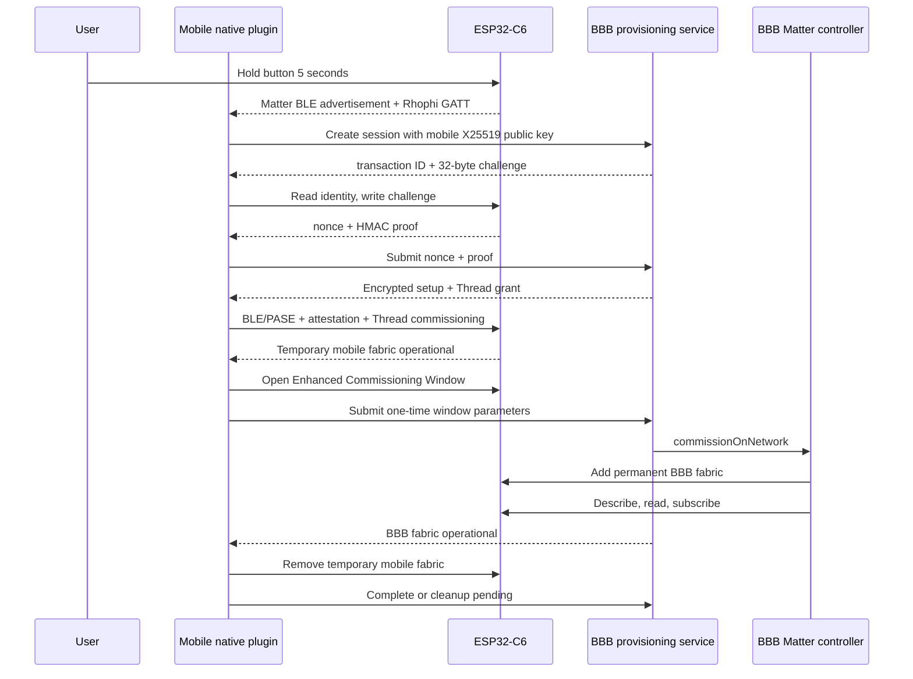

# Kế hoạch đồng bộ provisioning Firmware – Mobile – BBB

## Mục tiêu

Triển khai luồng provisioning thật, không dùng mock trong production, trên ba source tree:

- Firmware ESP32-C6 tại `C:\Users\lesli\WS\agile-smart-device`
- Mobile Ionic/Capacitor tại `C:\Users\lesli\WS\agile-smart-device\mobileapp-reference`
- Dashboard/BBB active tại `C:\Users\lesli\WS\agile-dashboard`

Luồng chuẩn được cố định như sau.



## Quyết định kiến trúc

- Dùng ConnectedHomeIP Android controller JNI/AAR được build từ đúng commit mà esp-matter đang pin. Không dùng Web Bluetooth hoặc mock native SDK.
- Rhophi GATT không yêu cầu BLE bonding. Bảo vệ bằng physical-presence window, một connection/session tại một thời điểm, TTL, rate limit, replay cache và HMAC unique per-device.
- Backend là bên duy nhất xác nhận claim proof. Firmware chỉ phát proof; trạng thái `claimed` chỉ được persist sau khi Matter commissioning hoàn tất.
- Basic Commissioning Window từ gesture phục vụ fabric đầu tiên. Enhanced Commissioning Window do mobile administrator mở qua Administrator Commissioning cluster cho BBB Multi-Admin.
- Setup passcode và Thread Operational Dataset không đi qua advertisement, MQTT hoặc log. Chúng chỉ nằm trong encrypted grant gửi cho mobile ephemeral key.
- `dashboard-reference` chỉ là nguồn đối chiếu. Implementation backend được merge có chọn lọc vào `C:\Users\lesli\WS\agile-dashboard`, không ghi đè auth/mobile-session mới hơn.
- Không sửa tay file generated như `tsconfig.tsbuildinfo`, `capacitor.build.gradle`, `capacitor.settings.gradle`, `capacitor.plugins.json` và `deploy/demo/*.cjs`.

## Gate 0 — Bảo toàn trạng thái và baseline

1. Ghi lại `git status -sb`, HEAD và diff của cả ba tree; không dùng `git clean`, reset, stash hoặc checkout bỏ thay đổi.
2. Giữ nguyên các thay đổi hiện tại trong mobile `packages/client-sdk/src/http.ts` và tests; giữ docs chưa commit trong active dashboard.
3. Chạy baseline trước khi sửa:
   - Firmware host CMake/CTest
   - Matter build bằng `tools/build_matter_node.sh`
   - Active dashboard `npm run typecheck && npm test`
   - Mobile `npm run typecheck && npm test`
4. Xác nhận exact ConnectedHomeIP SHA bên trong esp-matter và API Android/ESP32 từ source pin trước khi viết wrapper.
5. Xác nhận Android SDK, NDK, JDK và ABI cần hỗ trợ. Nếu pinned ConnectedHomeIP không build được controller JNI, dừng tại gate này thay vì tạo stub.

## Gate 1 — Đóng băng wire contract dùng chung

### Rhophi BLE contract

Tạo `docs/architecture/rhophi-claim-protocol.md` và codec tương ứng ở firmware/mobile.

- Service UUID `9a7d5210-8e21-4f41-a131-52484f504849`
- Characteristics `...5211` đến `...5216` cho Identity, Challenge, Response, State, Identify, Cancel
- Identity 36 byte:
  - protocol version `u8`
  - product ID `u16 little-endian`
  - claim ID `16 bytes`
  - nonce `16 bytes`
  - flags `u8`
- Challenge `32 bytes`
- Proof `32 bytes`
- HMAC input chính xác: `nonce[16] || challenge[32] || claim_id[16]`
- REST dùng base64url không padding cho binary fields.
- Mobile phải gửi nonce đã đọc trước khi ghi challenge; firmware rotate nonce sau khi tạo proof.

Thêm một known-answer vector giống nhau vào:

- `tests/host/ClaimProtocolTests.cpp`
- `agile-dashboard/packages/provisioning/test/claimVector.test.ts`
- `mobileapp-reference/packages/client-sdk/test/claimVector.test.ts`

### State contract

Server states là canonical cho phần backend sở hữu. Mobile được giữ local UI states nhưng phải chứa đầy đủ:

```text
CREATED
CLAIM_CHALLENGE
CLAIM_VERIFIED
GRANT_ISSUED
PASE_ESTABLISHED
ATTESTATION_VERIFIED
THREAD_ATTACHING
TEMP_FABRIC_COMMISSIONED
WINDOW_OPEN
BBB_FABRIC_COMMISSIONING
ENDPOINT_DISCOVERY
SUBSCRIBING
TEMP_FABRIC_REMOVING
CLEANUP_PENDING
COMPLETE
```

Bổ sung error codes có retry target rõ ràng. `CLEANUP_PENDING` không làm mất permanent BBB fabric.

## Gate 2 — Active dashboard và BBB backend

### Port source có chọn lọc

Đưa các module provisioning đang có trong `dashboard-reference` vào active dashboard:

- `packages/provisioning/`
- `packages/contracts/src/provisioning.ts`
- `packages/webui-bff/src/controllerManagementClient.ts`
- `packages/webui-bff/src/provisioningCoordinator.ts`
- `packages/webui-bff/src/provisioningRoutes.ts`
- Matter controller RPC/runtime additions cho `commissionOnNetwork`, `removeNode`, `describeNode`, `read`, `subscribe`, notifications
- Gateway controller event connection và tests

Hand-merge, không chép đè:

- `packages/contracts/src/http.ts`
- `packages/webui-bff/src/main.ts`
- `packages/webui-bff/src/sessions.ts`
- `packages/webui-bff/src/config.ts`
- manifests, workspace build graph và contract tests

### Wire BFF thật

Trong active `webui-bff/src/main.ts`:

1. Khởi tạo provisioning service/coordinator chỉ khi `PROVISIONING_ENABLED`.
2. Gắn routes sau auth/CORS/CSRF checks và trước command route.
3. Dùng mobile bearer session; không cấp MQTT credential cho mobile.
4. Đẩy provisioning progress vào SSE hiện có.
5. Map lỗi thành 403/404/409/410/429 thay vì blanket 400.
6. Redact `claim_secret`, `proof`, `device_nonce`, `grant`, `ciphertext`, `setup_passcode`, `thread_operational_dataset` và nested variants.

### Durable secret providers

Thêm trong `packages/provisioning`:

- Encrypted file registry dùng AES-256-GCM, master key file mode 0400, per-record nonce/AAD và constant-time claim comparison.
- Thread Dataset provider đọc TLV hex từ file đặc quyền mode 0400; không shell-out hoặc log plaintext.
- Durable transaction store thay `Map` trong production, hỗ trợ TTL, one-active-session-per-device, consumed challenge/nonce, attempt counter và resume sau BFF restart. Test có thể tiếp tục dùng in-memory implementation.

### Controller handoff

`POST /window` phải:

1. Kiểm tra transaction đang `TEMP_FABRIC_COMMISSIONED`.
2. Nhận Enhanced Window passcode/discriminator/timeout và optional IPv6.
3. Gọi `commissionOnNetwork`.
4. Describe endpoint, đọc OnOff và tạo subscription.
5. Chỉ trả BBB operational sau khi các bước trên pass.

`POST /complete` nhận kết quả remove temporary fabric. Nếu remove thất bại, lưu `CLEANUP_PENDING` và cho phép retry idempotent.

### Backend tests

- Schema strictness và state transitions
- HMAC/X25519/HKDF/AES-GCM vectors
- Wrong key, tamper, expiry, replay, concurrent claim và rate limit
- Auth/CORS/CSRF trước provisioning handler
- Controller commission/read/subscribe/remove và notification reconnect
- Transaction restart recovery
- Log redaction và absence of secrets

Regenerate package lock và demo bundles bằng scripts chính thức, không sửa bundle trực tiếp.

## Gate 3 — Firmware claim service

### Per-connection session

Sửa:

- `RhophiClaimGatt.hpp/.cpp`
- `RhophiClaimProtocol.hpp/.cpp`
- `MatterNode.hpp/.cpp`

Thực hiện:

1. Một claim connection owner tại một thời điểm, sentinel handle rõ ràng.
2. First valid challenge bind connection; response chỉ đọc/notify được bởi connection đó.
3. Connection khác không được consume attempts, cancel session hoặc đọc response.
4. Release binding khi BLE disconnect nhưng giữ physical window đến TTL.
5. Clear response/challenge buffers khi cancel, expiry, disconnect hoặc fail.
6. State characteristic có value handle và phát notification cho owner.
7. Mutable protocol/GATT state được serialize bằng fixed execution context hoặc mutex phù hợp FreeRTOS; không giữ mutex khi gọi NimBLE notify.

### Physical window, replay và persistence

- 5-second gesture mở Rhophi claim window và Basic Matter window cùng vòng đời 900 giây.
- Nếu factory material không hợp lệ, không mở claim surface và không log secret.
- Replay cache bounded, không dynamic allocation.
- Persist failed-attempt/lockout state và claimed marker trong writable NVS namespace riêng.
- Rate limit sống qua reboot; gesture mới không reset lockout.
- `claimed` chỉ set sau Matter `kCommissioningComplete`, không set chỉ vì firmware đã tạo HMAC.
- Factory reset xóa product claim state cùng Matter fabrics.
- Matter commissioning window close/expiry đóng claim window và zeroize buffers.

### Discovery

Không patch NimBLE advertising. Ưu tiên API scan-response chính thức nếu pinned CHIP hỗ trợ mà không phá Matter payload. Nếu không có, mobile scan Matter BLE advertisements, connect và đọc Rhophi Identity để lọc candidate. GATT service vẫn chỉ claimable khi physical window active.

### Firmware tests

- Wire codec và HMAC KAT
- Original nonce semantics
- Cross-connection isolation
- Replay cache và persisted lockout
- Inactive/expired window
- Disconnect/cancel zeroization
- Matter commissioning completion persistence
- Factory reset cleanup
- Custom GATT + CHIPoBLE build/link
- Binary scan không chứa test/default secret

Sau đó chạy host tests, architecture gates và Matter build; ghi size delta. Chưa đánh dấu runtime pass nếu chưa HIL.

## Gate 4 — ConnectedHomeIP Android artifact

Tạo `mobileapp-reference/tools/android/`:

- Lock file chứa ConnectedHomeIP SHA, Android SDK/NDK/JDK versions, ABI và artifact SHA-256.
- Reproducible build script dùng Android controller/JNI build flow có thật trong pinned source.
- Artifact output ở staging/cache ngoài Git; không commit AAR hoặc `.so`.
- Gradle app fail nếu artifact thiếu hoặc checksum sai.

Không giả định tên target/build command từ ConnectedHomeIP version khác. Đọc build files của commit pin và dùng chính target/API của commit đó.

## Gate 5 — Native Capacitor commissioning plugin

Tạo package `mobileapp-reference/packages/commissioning-plugin` và native Android implementation.

### Native responsibilities

- BLE permissions và scan Matter/Rhophi candidates
- Read/decode Identity, Identify write, Challenge write, Response notification
- X25519 ephemeral key generation
- Wrap private key bằng non-exportable Android Keystore AES key; chỉ unwrap trong native memory
- AES-GCM encrypted grant decrypt, AAD/transaction/expiry validation
- ConnectedHomeIP controller lifecycle và temporary fabric persistence
- BLE/PASE commissioning
- DAC/PAI/PAA/CD attestation result enforcement
- Thread Operational Dataset TLV commissioning
- Enhanced Commissioning Window invoke qua Administrator Commissioning cluster
- Fabric list lookup và RemoveFabric cho đúng mobile fabric index
- Event callbacks cho progress/error
- Best-effort zeroization và tuyệt đối không log credential

Thêm Android permissions theo API level:

- `BLUETOOTH_SCAN`
- `BLUETOOTH_CONNECT`
- legacy Bluetooth/location permissions chỉ cho Android <= 30

Đăng ký plugin trong `MainActivity`, sau đó dùng Capacitor sync để sinh generated Gradle/plugin files.

## Gate 6 — Mobile TypeScript orchestration

### Client SDK

Thêm strict schemas và methods cho:

- Create/get/cancel session
- Submit claim proof
- Thread attached
- Enhanced window handoff
- Complete/cleanup retry
- Device list/details/remove
- Provisioning SSE envelope

Parse mọi response bằng Zod; không để untyped encrypted payload đi thẳng vào native plugin.

### Commissioning service/store

Sửa:

- `apps/mobile/src/services/commissioning/types.ts`
- `apps/mobile/src/services/commissioning/index.ts`
- `apps/mobile/src/stores/commissioning.ts`
- `apps/mobile/src/views/AddDeviceView.vue`
- realtime/API adapters

Production native path phải thực hiện:

1. Generate ephemeral key và create backend session.
2. Scan/select/read identity.
3. Write backend challenge và lấy nonce/proof.
4. Submit proof, nhận encrypted grant và chuyển thẳng vào native plugin.
5. PASE, attestation, Thread commissioning, temporary fabric.
6. Notify backend thread-attached.
7. Open Enhanced Window và gửi one-time data cho BBB.
8. Chờ backend xác nhận describe/read/subscription.
9. Remove temporary fabric.
10. Complete hoặc `CLEANUP_PENDING`.

Mock chỉ được tồn tại cho development/tests và không được chọn trong release build. Web build hiển thị unsupported thay vì giả provisioning.

### Resume/retry

Persist tối thiểu:

- Transaction ID và expiry
- Current state
- Claim/device metadata không nhạy cảm
- Temporary node/fabric reference
- Wrapped mobile ephemeral private key reference
- BBB node ID và cleanup status

Retry phải đi đúng target state, không `reset()` về scan cho mọi lỗi. Nếu ephemeral key mất, cancel transaction và yêu cầu bắt đầu lại; không cố decrypt grant.

### Mobile tests

- Identity/base64url codec
- API schemas và every backend error code
- Full orchestrator với fake native bridge, không fake crypto output
- Targeted retries và process-resume snapshots
- Cleanup-pending invariants
- Release mode không load mock
- Android JVM/unit tests cho grant decrypt/tamper/expiry
- Gradle debug build với checksum-pinned ConnectedHomeIP artifact

## Gate 7 — Manufacturing pipeline

Tạo `agile-smart-device/tools/mfg/`:

1. Sinh unique per-device:
   - claim ID 16 bytes
   - claim secret 32 bytes
   - Matter discriminator
   - valid unique setup passcode
   - serial/product metadata
2. Sinh factory NVS đúng keys firmware đang đọc: partition/namespace `fctry/rhophi`, `product_id`, `claim_id`, `claim_secret`.
3. Dùng esp-matter manufacturing tooling để sinh/provision DAC, PAI reference, Certification Declaration và secure-cert partition.
4. Export encrypted backend registry tương thích provider Gate 2.
5. Không ghi output secret trong worktree hoặc stdout; output directory phải explicit và mặc định ngoài repo.
6. Thêm `.gitignore` và secret-scanning test cho `*.registry.enc`, factory bins, keys và fixtures production.
7. Viết operator runbook cho generate, registry import và flash; flash vẫn cần user approval riêng.

Tests kiểm tra uniqueness, Matter passcode validity, registry encrypt/decrypt/tamper và NVS key layout. Không dùng test credentials trong production image.

## Gate 8 — Integration và HIL acceptance

### Automated gates

- Active dashboard typecheck, unit/integration tests và regenerated bundles
- Firmware host/architecture tests và pinned Matter build
- Mobile typecheck/tests và Android Gradle build
- Shared claim vector pass ở cả ba codebase
- Static scan không thấy credential trong source, logs, MQTT fixtures hoặc firmware binary

### Hardware acceptance

Chỉ đánh dấu end-to-end verified khi:

1. 5-second gesture mở claim + Matter window; non-gestured node không claimable.
2. Phone thật scan, identify và claim đúng device.
3. Replay và second-phone interference bị reject.
4. Failed-attempt lockout sống qua reboot.
5. PASE và production attestation pass.
6. Node nhận Thread Dataset qua Matter và attach OTBR.
7. Temporary mobile fabric operational.
8. Mobile mở Enhanced Window; BBB commission on-network thành permanent fabric.
9. BBB describe endpoint 1, read OnOff và restore subscription.
10. Local GPIO9 update đến Mobile/WebUI.
11. Temporary mobile fabric được remove sau khi BBB operational.
12. Forced cleanup failure tạo `CLEANUP_PENDING`, retry không làm mất BBB fabric.
13. App, node, BFF, controller và OTBR restart có recovery đúng.
14. Không có secret trong BLE advertisement, MQTT, logs, Git hoặc crash reports.

## Critical files

### Firmware

- `components/product_smart_device/src/matter/RhophiClaimGatt.*`
- `components/product_smart_device/src/matter/RhophiClaimProtocol.*`
- `components/product_smart_device/src/matter/RhophiClaimPlatform.*`
- `components/product_smart_device/src/matter/MatterNode.*`
- New NVS claim-state adapter
- `tests/host/ClaimProtocolTests.cpp`
- `sdkconfig.defaults.matter_node`
- `partitions_matter.csv`
- `tools/mfg/`

### Mobile

- `packages/client-sdk/src/contracts.ts`
- New `packages/client-sdk/src/commissioning/`
- `packages/client-sdk/src/sse.ts`
- New `packages/commissioning-plugin/`
- `apps/mobile/src/services/commissioning/`
- `apps/mobile/src/stores/commissioning.ts`
- `apps/mobile/src/views/AddDeviceView.vue`
- Android manifest, app Gradle and `MainActivity`
- `tools/android/`

### Active dashboard

- `packages/contracts/src/provisioning.ts`
- `packages/provisioning/`
- `packages/webui-bff/src/main.ts`
- `packages/webui-bff/src/provisioning*.ts`
- `packages/matter-controller/src/MatterRuntime.ts`
- `packages/matter-controller/src/main.ts`
- `packages/matter-controller/src/rpc.ts`
- Gateway controller adapters and deployment configuration

## Definition of Done

Không coi task hoàn tất chỉ vì code compile. Hoàn tất khi automated gates pass, phone thật commission temporary fabric, BBB nhận permanent fabric bằng Multi-Admin, subscriptions phục hồi sau restart, temporary fabric cleanup đúng recovery semantics, manufacturing material unique per-device và không credential nào xuất hiện trong source/log/MQTT/Git.