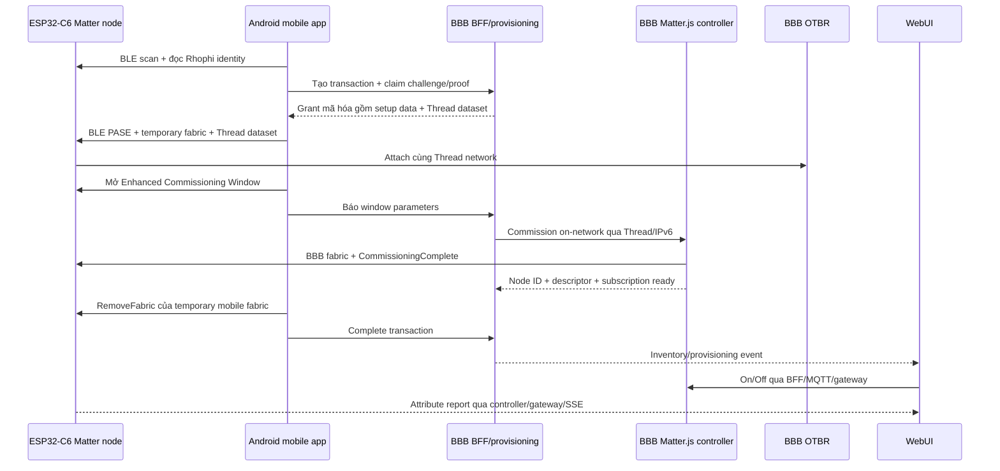

# Kế hoạch hoàn thiện commissioning Matter end-to-end

## Mục tiêu và kiến trúc khuyến nghị

Hoàn thiện trực tiếp ba source hiện có để ESP32-C6 được commission bằng BLE từ Android, sau đó thuộc fabric chính do BeagleBone Black quản lý qua Thread. BBB chạy OTBR, Matter controller, gateway, BFF và phục vụ WebUI. MVP phải có inventory động, On/Off hai chiều, remove/recommission và phục hồi sau restart BBB/node.

BBB không có BLE nên không thể trực tiếp thực hiện PASE ban đầu. Luồng chuẩn phù hợp phần cứng là mobile tạo fabric tạm, đưa node vào Thread, mở Enhanced Commissioning Window, BBB commission on-network qua Thread/IP, rồi mobile xóa fabric tạm.

## 1. Baseline và preflight phần cứng

- Chạy build/test baseline của firmware, `dashboard-reference` và `mobileapp-reference` bằng script/config trong repo; lưu lỗi có sẵn trước khi sửa.
- Xác minh toolchain ESP-IDF 6.0.2, Node/npm, Android SDK/JDK/NDK và artifact ConnectedHomeIP Android được pin/checksum. Không cho phép Android build âm thầm rơi về mock source set.
- Xác minh ADB đã authorize điện thoại. Môi trường hiện thấy `/dev/ttyACM0` là BBB console và `/dev/ttyACM1` là ESP32-C6 USB JTAG/serial; xác nhận lại trước khi flash.
- Qua SSH `leslie@192.168.7.2`, kiểm tra `otbr-agent`, `wpan0`, RCP owner, active Thread dataset, IPv6 routing, Mosquitto, Matter controller, gateway và BFF. Chỉ tiếp tục khi OTBR/RCP ổn định và không có process khác chiếm RCP.
- Sao lưu env, bundle và state hiện tại trên BBB, đặc biệt Matter controller storage và BFF/device metadata; định nghĩa rollback từ `matterjs` về `mock` trước khi cutover.

## 2. Tạo lại credentials lab và khóa contract dùng chung

- Dùng `tools/mfg/` tạo bộ lab mới gồm device identity, `claim_id`, claim secret, setup passcode/discriminator, encrypted device registry/key và factory partition theo MAC thật của ESP32-C6.
- Lấy Thread Operational Dataset hiện hành từ OTBR theo đường bảo mật; không ghi dataset, claim secret, registry key hoặc grant plaintext vào log, MQTT, git hay test artifact.
- Flash factory partition đúng offset đọc từ `partitions_matter.csv`, sau khi xác minh kích thước/hash và có backup. Build application không bật development claim bypass.
- Giữ wire contract Rhophi hiện có: identity 36 byte và proof HMAC trên `nonce || challenge || claim_id`; thêm một known-answer vector dùng chung cho C++, TypeScript và Kotlin để ngăn drift giữa ba chương trình.
- Ghi rõ đây là credential/attestation lab cho MVP; DAC/PAI production, secure boot, flash encryption và OTA signing nằm ngoài phạm vi lần này.

## 3. Hoàn thiện BBB provisioning và Matter controller

### Provisioning/BFF

- Thay registry/dataset in-memory bằng adapter file-backed tối thiểu trong `dashboard-reference/packages/provisioning/src/`, tương thích chính xác output của `tools/mfg/`.
- Bổ sung transaction store atomic, permission `0600`, chỉ lưu state không nhạy cảm cần cho recovery. Không persist challenge, proof, claim secret, grant plaintext hoặc dataset trong transaction.
- Rehydrate transaction chưa hoàn tất khi BFF restart; transaction đang ở bước cleanup phải tiếp tục/hiển thị `CLEANUP_PENDING`, còn transaction mất secret tạm thời phải hết hạn rõ ràng để mobile retry từ đầu.
- Trong `dashboard-reference/packages/webui-bff/src/config.ts` và `main.ts`, khởi tạo provisioning conditionally, mount `provisioningRoutes`, nối provisioning event vào SSE, áp dụng auth/origin/CSRF hiện có và map mã lỗi domain sang HTTP nhất quán.
- Redact toàn bộ grant/challenge/proof/dataset/passcode khỏi logger. Bổ sung rate-limit/expiry semantics đang có trong contract thay vì trả `BAD_REQUEST` chung.

### Controller và inventory

- Dùng Matter.js persistent storage làm source of truth cho fabric/node. Lưu sidecar metadata tối thiểu bằng atomic file cho label, product, commissioning time và trạng thái inventory; reconcile sidecar với node list khi khởi động.
- Hoàn thiện `commissionOnNetwork`, `describeNode`, OnOff read/invoke/subscribe và remove trong `dashboard-reference/packages/matter-controller/src/MatterRuntime.ts`.
- Sau BBB commission, chỉ báo ready khi `CommissioningComplete`, CASE, descriptor/read và subscription đều thành công.
- Khi controller/node restart, re-arm subscription và cập nhật online state. Remove phải có timeout, best-effort xóa fabric trên node và policy rõ ràng cho local forget khi node unreachable.
- Chuyển deployment từ `CONTROLLER_MODE=mock` sang `matterjs` bằng script có backup, health check và rollback; không xóa mock adapter vì vẫn cần unit/integration tests.

Các file trọng tâm

- `dashboard-reference/packages/provisioning/src/{service,registry,crypto}.ts`
- `dashboard-reference/packages/webui-bff/src/{main,config,provisioningRoutes,provisioningCoordinator}.ts`
- `dashboard-reference/packages/matter-controller/src/MatterRuntime.ts`
- `dashboard-reference/deploy/bbb/enable-hil-provisioning.sh`
- `dashboard-reference/deploy/bbb/install-production.sh`

## 4. Hoàn thiện mobile BLE commissioning thật

- Trong `mobileapp-reference/apps/mobile/src/stores/commissioning.ts`, bỏ cưỡng bức `mock=true` và các identity/grant giả; mock chỉ còn là dependency test được chọn tường minh.
- Sửa `RhophiBleClient.kt` để scan Matter BLE service, kết nối GATT và đọc Rhophi identity thật. Không suy diễn hoặc hard-code `claim_id`/nonce từ advertisement.
- Bổ sung `readIdentity` xuyên suốt native Capacitor definitions/service/mock; `identifyDevice` gọi characteristic thật nhưng lỗi identify không được phá hủy transaction.
- Dùng grant từ BFF để thực hiện đúng thứ tự: BLE PASE, attestation policy cho lab, Add/Connect Thread network, temporary mobile fabric, mở Enhanced Commissioning Window, gửi window parameters cho BFF, chờ BBB ready, tìm đúng mobile `fabricIndex`, rồi `RemoveFabric`.
- Persist Android controller/fabric storage và transaction ID đủ để app restart có thể resume hoặc cleanup; không tạo fabric tạm mới khi state cũ còn hợp lệ.
- Không dùng fabric index cố định. Sau cleanup, BFF/BBB đọc Operational Credentials FabricList và xác nhận chỉ còn fabric BBB trước khi đánh dấu `COMPLETE`.
- Pin ConnectedHomeIP Android artifact/commit/checksum phù hợp với project; build fail-closed nếu artifact thật không tồn tại.

Các file trọng tâm

- `mobileapp-reference/apps/mobile/src/stores/commissioning.ts`
- `mobileapp-reference/apps/mobile/src/services/commissioning/`
- `mobileapp-reference/packages/commissioning-plugin/src/definitions.ts`
- `mobileapp-reference/packages/commissioning-plugin/android/src/main/java/uk/rhophi/commissioning/RhophiBleClient.kt`
- `mobileapp-reference/packages/commissioning-plugin/android/src/main/java/uk/rhophi/commissioning/RhophiCommissioningPlugin.kt`
- `mobileapp-reference/packages/commissioning-plugin/android/src/main/java/uk/rhophi/commissioning/MatterControllerHost.kt`
- `mobileapp-reference/tools/android/`

## 5. Firmware ESP32-C6

- Giữ endpoint 1 On/Off Plug-in Unit và kiến trúc callback → runtime queue → Matter attribute report hiện có; không đưa vendor/RTOS logic vào application layer.
- Xác minh build Matter Thread-only, BLE commissioning và Rhophi claim GATT dùng factory material mới; bỏ mọi development bypass trong acceptance image.
- Bảo đảm Thread dataset/fabric table được giữ qua reboot và event `CommissioningComplete`, fabric add/remove, Thread role và endpoint được log ở mức đủ debug nhưng không lộ secret.
- Sau khi fabric tạm bị xóa, node vẫn giữ fabric BBB. Khi xóa fabric cuối cùng/factory reset, node quay lại trạng thái có thể claim và recommission theo policy hiện có.
- Chỉ sửa behavior firmware nếu HIL chứng minh thiếu transition/recovery; mọi thay đổi phải qua `docs/checklists/level5-change.md`, layer checker, host CTest và ESP-IDF build.

Các file trọng tâm

- `components/product_smart_device/src/matter/MatterNode.cpp`
- `components/product_smart_device/src/matter/RhophiClaimGatt.cpp`
- `components/product_smart_device/src/matter/RhophiClaimProtocol.cpp`
- `components/product_smart_device/src/matter/RhophiClaimPlatform.cpp`
- `sdkconfig.defaults.matter_node`
- `tools/build_matter_node.sh`
- `tools/flash_matter_node.sh`

## 6. Inventory động và UI đồng bộ

- `GET /api/devices` trở thành contract duy nhất cho WebUI và mobile; dữ liệu lấy từ Matter controller + metadata, không từ catalog/node hard-code.
- WebUI chỉ render capability thực có trong descriptor; với node hiện tại chỉ hiển thị OnOff endpoint 1. Nối provisioning/snapshot/status SSE để tự refresh sau commission, remove và reconnect.
- Mobile Home/Device Detail dùng cùng inventory API và command path qua BBB; wizard commissioning giữ layout/convention hiện có, chỉ bổ sung progress, lỗi domain và hành động retry/cleanup.
- Loại bỏ đường browser MQTT credential cũ khỏi flow đang dùng; BFF giữ credential server-side và client tiếp tục dùng HTTPS/SSE.

Các file trọng tâm

- `dashboard-reference/apps/webui/src/App.vue`
- `dashboard-reference/apps/webui/src/services/{apiClient,sseClient}.ts`
- `mobileapp-reference/packages/client-sdk/src/deviceCatalog.ts`
- `mobileapp-reference/apps/mobile/src/views/{HomeView,DeviceDetailView,AddDeviceView}.vue`

## 7. Test tự động

- Firmware host tests cho identity 36 byte, HMAC vector chung, nonce/replay/lockout, fabric lifecycle transition; chạy architecture checker, CTest và clean ESP-IDF Matter build.
- Provisioning tests cho registry decryption, dataset validation, transaction persistence/rehydrate, secret redaction, error mapping và auth/origin trên tất cả commissioning routes.
- Controller/gateway integration dùng fake Unix RPC để kiểm tra commission/describe/read/subscribe/remove, timeout và attribute event tới MQTT/SSE trước khi dùng hardware.
- Android JVM/plugin tests cho identity decode, grant decrypt, state resume/cleanup và build fail-closed khi thiếu CHIP artifact.
- Web/mobile component tests cho inventory động, OnOff capability, provisioning progress/error và remove/recommission UI.
- Không tuyên bố MISRA/CERT compliance; chỉ báo cáo các test/analyzer thực sự đã chạy.

## 8. Deploy và HIL acceptance

Thực hiện tuần tự để khoanh vùng lỗi

1. Xác minh OTBR/RCP, active dataset và IPv6 trên BBB; lưu `journalctl` baseline.
2. Deploy controller/BFF/gateway, bật provisioning và `matterjs`; health check phải qua trước khi flash/mobile test.
3. Flash factory partition + firmware ESP32-C6; theo dõi serial `/dev/ttyACM1` để xác nhận claim service, BLE window và endpoint 1.
4. Build/install APK thật qua ADB; theo dõi Android `logcat` và chạy full flow BLE claim → temporary fabric → Thread attach → ECW → BBB fabric → temporary fabric removal.
5. Xác nhận `/api/devices` có node thật, BBB CASE/read/subscription hoạt động và FabricList chỉ còn BBB fabric.
6. WebUI và mobile cùng hiển thị node. Toggle từ mỗi UI phải đổi relay/LED; nút vật lý phải report ngược và cập nhật cả hai UI không reload.
7. Restart lần lượt Matter controller, gateway/BFF, toàn BBB và power-cycle node; inventory và subscription phải phục hồi từ persistent state.
8. Remove node, xác nhận inventory/state bị xóa nhất quán; mở lại commissioning và recommission thành công.
9. Thu evidence đã redact gồm test outputs, service health, OTBR state không chứa dataset, controller node list, API inventory, serial event lines, logcat state sequence và journalctl liên quan.

## Điều kiện hoàn thành

- Không còn forced mock trên đường production của mobile, BFF hoặc gateway.
- Android commission ESP32-C6 qua BLE và handoff thành công sang fabric BBB qua Thread/IP.
- Sau cleanup, node chỉ còn fabric BBB và vẫn điều khiển/report được.
- WebUI và mobile dùng inventory động, điều khiển OnOff hai chiều và nhận local state report.
- Restart BBB/node không làm mất fabric, inventory hoặc subscription lâu dài.
- Remove và recommission chạy được với cùng bộ phần cứng.
- Secrets không xuất hiện trong repo, MQTT, console log hoặc evidence.
- Build/test của cả ba chương trình và HIL checklist đều có kết quả ghi nhận; tài liệu as-built được cập nhật để bỏ các mô tả mock/lỗi thời.
