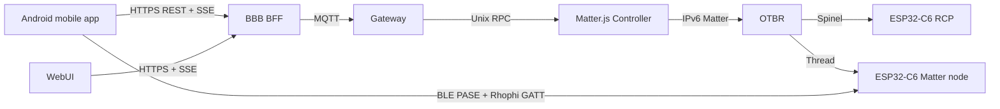
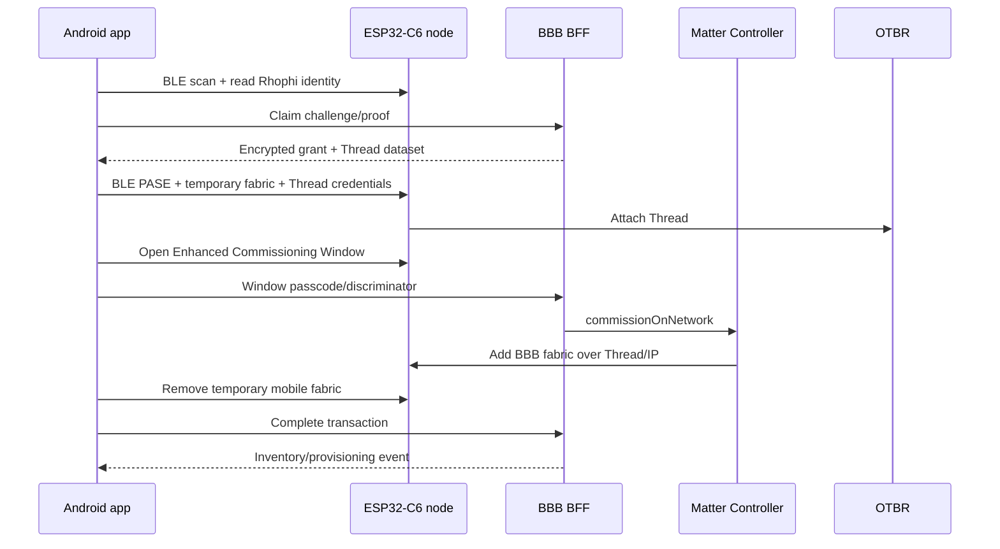

# Kế hoạch viết lại toàn bộ tài liệu hệ thống

## Mục tiêu

Tạo một bộ tài liệu tiếng Việt duy nhất có thẩm quyền tại root `docs/`, phản ánh đúng hệ thống ESP32-C6 Matter, Android commissioning, BBB OTBR/Matter Controller/Gateway/BFF và WebUI theo ba mức độc lập

- **Source** — hành vi tồn tại trong source và có kiểm thử phù hợp.
- **Deployed** — artifact đã build/cài/flash và health check trên đúng target.
- **HIL** — hành vi end-to-end đã được xác minh trên phần cứng với evidence đã redact.

Tài liệu course, full-context, reference và snapshot cũ được giữ để tra cứu lịch sử nhưng phải có banner `LEGACY / NON-AUTHORITATIVE` và trỏ về chương authoritative thay thế. Thông tin bench cụ thể nằm trong runbook lab riêng, không chứa secret.

## Nguyên tắc nguồn sự thật

Thứ tự ưu tiên khi có mâu thuẫn

1. Source, config, schema và test đang được build.
2. Artifact/build metadata và runtime health/log đã xác minh lại.
3. Tài liệu authoritative mới.
4. README cục bộ của component.
5. Course, full-context, reference và kế hoạch cũ.

Không dùng nội dung trong `build/`, `node_modules/`, `.cache/`, `.embedder/plans/` hoặc tài liệu legacy làm nguồn duy nhất. Không tuyên bố production-ready, MISRA/CERT compliance hoặc HIL pass nếu không có evidence tương ứng.

## Cấu trúc tài liệu authoritative

```text
docs/
├── README.md
├── 00-tong-quan-san-pham.md
├── 01-kien-truc-end-to-end.md
├── 02-firmware-esp32c6.md
├── 03-rhophi-claim-gatt.md
├── 04-mobile-commissioning.md
├── 05-bbb-gateway-controller-webui.md
├── 06-thread-ipv6-routing.md
├── 07-contract-api-mqtt-sse.md
├── 08-build-flash-deploy.md
├── 09-security-manufacturing-secrets.md
├── 10-testing-hil-evidence.md
├── 11-operations-troubleshooting.md
├── 12-status-open-issues.md
├── 13-thuat-ngu-ownership-repository.md
├── runbooks/
│   ├── README.md
│   ├── lab-hardware.md
│   ├── firmware-build-flash.md
│   ├── android-build-install.md
│   ├── bbb-deploy-rollback.md
│   ├── commissioning-e2e.md
│   └── recovery-reset.md
├── legacy/
│   └── README.md
├── rules/
└── checklists/
    ├── level5-change.md
    └── doc-change.md
```

Root `README.md` trở thành entry point ngắn. Component README chỉ mô tả ownership cục bộ và link lên chương authoritative, không sao chép kiến trúc hoặc trạng thái runtime.

## Nội dung từng chương

### `docs/README.md`

- Định nghĩa authoritative/legacy và Source/Deployed/HIL.
- Index theo vai trò Firmware, Mobile, Platform/BBB, WebUI, QA và vận hành.
- Ghi mốc cập nhật và commit/working-tree source được dùng.
- Chỉ rõ kế hoạch, build artifact và course không phải as-built evidence.

### `00-tong-quan-san-pham.md`

- Mục tiêu sản phẩm, actor, use case và phạm vi MVP.
- Trạng thái chức năng cấp cao theo Source/Deployed/HIL.
- Phân biệt node sản phẩm, RCP của BBB, mobile commissioner và BBB permanent controller.

### `01-kien-truc-end-to-end.md`

- Topology toàn hệ thống và process boundary.
- Ownership fabric, Thread dataset, claim material, device registry và inventory.
- Luồng điều khiển On/Off hai chiều.



### `02-firmware-esp32c6.md`

- Layering, composition root, board pins, safe output, runtime queue/task/ISR.
- Boot sequence, NVS ownership, relay/button/WS2812 behavior.
- Matter On/Off Plug-in Unit endpoint và local/Matter state synchronization.
- Thread native radio, BLE commissioning, partition table và recovery.
- Gesture được lấy từ `ButtonInputConfig`, không chép ngưỡng cũ.

### `03-rhophi-claim-gatt.md`

- Canonical UUID và byte order `BLE_UUID128_INIT`.
- GATT service/characteristic permissions và session binding.
- Identity 36 byte, challenge/proof 32 byte, nonce/replay semantics.
- HMAC input `nonce || challenge || claim_id` và PSA Crypto implementation.
- Claim window tự mở cùng Matter window khi fabric count bằng 0.
- Device-side lockout hợp lệ đã bị loại bỏ; backend rate limit là authoritative.
- Factory state, commissioned/reset behavior và known limitations.

### `04-mobile-commissioning.md`

- Ionic Vue/Capacitor/Pinia/SDK architecture và native Kotlin boundary.
- Auth bearer, secure token storage, SSE và dynamic inventory.
- BLE scan, identity read, GATT cache refresh/reconnect và connection cleanup.
- Grant crypto, PASE, attestation continuation trên Android main thread, Thread dataset, temporary fabric, ECW, BBB handoff và RemoveFabric.
- Android permissions gồm BLE và multicast.
- State machine, idempotent update, persistence, retry và cleanup semantics.
- ConnectedHomeIP artifact pin/build fail-closed.
- Trạng thái final commissioning phải được re-probe trước khi ghi HIL.

### `05-bbb-gateway-controller-webui.md`

- OTBR/RCP ownership, `wpan0`, Matter.js persistent fabric.
- Unix RPC đầy đủ `health`, `listNodes`, `commissionOnNetwork`, `removeNode`, `describeNode`, `read`, `subscribe`, `invoke`.
- Gateway MQTT, BFF REST/SSE/auth, provisioning coordinator và WebUI inventory động.
- File-backed encrypted registry, Thread dataset provider và transaction persistence.
- Systemd users, paths, sockets, service dependency và restart recovery.
- Phân biệt source RPC với bundle thực sự đang deploy; health check là bắt buộc.

### `06-thread-ipv6-routing.md`

- Thread mesh-local/OMR, infra link, OTBR forwarding và Android Wi-Fi path.
- `FindOperationalForStayActive` và yêu cầu Android có route tới OMR.
- Multicast RIO bị AP lọc và unicast `radvd` route cho bench hiện tại.
- Cách xác minh read-only trên Android và BBB.
- Runtime prefix/MAC cụ thể chỉ nằm trong runbook lab.

### `07-contract-api-mqtt-sse.md`

- MQTT topics, envelope, QoS, Node ID, endpoint/cluster/command.
- REST auth/session/command/health/devices/commissioning routes.
- SSE envelope, reconnect và giới hạn replay.
- Commissioning state/error schemas và inventory descriptor.
- Bảng ownership giữa mobile, BFF, gateway và controller.

### `08-build-flash-deploy.md`

- Toolchain pin được đọc từ script/lockfile tại thời điểm viết.
- Build firmware, host tests, dashboard, mobile SDK/plugin/APK.
- Artifact path và dependency boundaries.
- Chỉ chứa lệnh read-only hoặc build; flash/deploy/erase nằm trong runbook có cảnh báo và rollback.

### `09-security-manufacturing-secrets.md`

- Claim secret, registry key, setup data, Thread dataset, DAC/PAI, token và cloud credential ownership.
- Manufacturing pipeline và encrypted registry format.
- Secret redaction rules và các output cấm đưa vào Git/log/evidence.
- Lab credentials so với production attestation.
- Secure boot, flash encryption, factory partition encryption và OTA signing blockers.

### `10-testing-hil-evidence.md`

- Host/unit/integration/component test hiện có ở cả ba codebase.
- Ma trận Source/Deployed/HIL cho claim, PASE, Thread attach, ECW, BBB handoff, cleanup, inventory, On/Off, restart và remove/recommission.
- Evidence format và redaction.
- Đồng bộ `tests/hil/README.md`; xóa tiêu chí lockout thiết bị lỗi thời.

### `11-operations-troubleshooting.md`

- Chẩn đoán theo tầng BLE/GATT, claim, crypto, PASE/attestation, Thread, IPv6/RIO, BBB RPC, MQTT/BFF/SSE và UI.
- Bảng triệu chứng → log cần xem → nguyên nhân thường gặp → hành động an toàn.
- Bao gồm các lỗi đã xác nhận như UUID byte order, GATT cache, callback main thread, multicast permission, `ENETUNREACH`, RPC bundle cũ và stale transaction.

### `12-status-open-issues.md`

- Snapshot trạng thái theo Source/Deployed/HIL với ngày và evidence.
- Known issues và next probe còn mở.
- WIP/submodule drift và production release gates.
- Commissioning chỉ được đánh `HIL: Có` sau khi inventory BBB, temporary fabric cleanup và On/Off hai chiều đều pass.

### `13-thuat-ngu-ownership-repository.md`

- Glossary tiếng Việt/English term.
- Phân biệt node/RCP, claim/commissioning, temporary/permanent fabric, PASE/CASE/ECW, OMR/RIO.
- Repository tree, submodule ownership và generated artifact policy.
- Quy chuẩn status label, file naming và source citation.

## Runbook lab

- Tài liệu chính dùng `${BBB_HOST}`, `${PORT}`, `${ANDROID_SERIAL}` và placeholder.
- `runbooks/lab-hardware.md` ghi bench hiện tại như `/dev/ttyACM0`, `/dev/ttyACM1`, BBB host và Android model nhưng không ghi password/token/dataset/key.
- Mọi lệnh thay đổi trạng thái phải có tiền điều kiện, expected output, backup/rollback và cảnh báo secret.
- `commissioning-e2e.md` ghi một chuỗi duy nhất từ clean state tới BBB-only fabric, inventory và On/Off.
- `recovery-reset.md` phân biệt reset transaction, GATT cache, Android controller storage, node Matter NVS, factory partition và BBB controller storage.

## Diagram canonical

Mỗi luồng chỉ có một diagram canonical; tài liệu khác link tới diagram đó

- Topology và trust boundary tại `01`.
- Firmware layers và boot tại `02`.
- Claim GATT sequence/state tại `03`.
- Commissioning end-to-end tại `04`.
- On/Off round trip và BBB process graph tại `05`.
- IPv6 OMR/RIO path tại `06`.
- Source → Deployed → HIL gates tại `10`.



## Xử lý tài liệu cũ

Giữ nội dung nhưng chèn banner đồng nhất ở entry point hoặc từng file authoritative cũ

```markdown
> **LEGACY / NON-AUTHORITATIVE.** File này được giữ để tra cứu lịch sử và có thể sai so với source hiện tại.
> Tài liệu có thẩm quyền nằm tại [`docs/README.md`](...). Không dùng file này làm căn cứ implement, review hoặc acceptance.
```

Phạm vi legacy

- `docs/handbook/`
- `docs/full-context/`
- `docs/architecture/` sau khi nội dung được chuyển sang bộ mới
- `dashboard-reference/docs/full-context/` và course README
- `mobileapp-reference/mobile-app/context.md`
- `reference/`, `Refactor_plan.md`, `EmbedderAI.md`

`docs/legacy/README.md` lập bảng đường dẫn, lý do lỗi thời và chương thay thế. Course vẫn được giữ như tài liệu học, không chứa tuyên bố runtime authoritative.

## Trình tự thực hiện

1. Chụp baseline read-only từ source, lockfile, build metadata và runtime health; tuyệt đối không đọc/paste secret dataset.
2. Viết glossary/status/ownership rồi viết lại `docs/README.md` để khóa cấu trúc.
3. Viết claim và firmware từ source/test.
4. Viết mobile commissioning từ SDK/native plugin/state machine.
5. Viết BBB/controller/gateway/BFF/WebUI và Thread IPv6 routing.
6. Viết architecture end-to-end và contracts sau khi component chapters ổn định.
7. Viết build/deploy, security, testing/HIL, operations và status/open issues.
8. Viết runbook lab với placeholder và rollback.
9. Đồng bộ `tests/hil/README.md`, root/component README và checklist.
10. Gắn legacy banner và lập legacy index.
11. Kiểm tra link, terminology, source citation, secret patterns và status consistency.
12. Chạy lại build/test/link gates; ghi kết quả thật vào status/evidence.

## Quy chuẩn soạn thảo

- Tiếng Việt kỹ thuật; giữ nguyên thuật ngữ giao thức tiếng Anh.
- Tên file không dấu, kebab-case, có prefix số cho chương chính.
- Mỗi chương theo cấu trúc `Phạm vi` → `Source/Deployed/HIL` → `Kiến trúc` → `Chi tiết` → `Kiểm chứng read-only` → `Giới hạn` → `Nguồn sự thật`.
- Mỗi fact quan trọng có source path và symbol/line khi ổn định.
- Không ghi “hiện tại” hoặc “mới nhất” nếu không có ngày/commit.
- Không sao chép secret, full Thread dataset, private key, bearer token, password hoặc grant ciphertext vào tài liệu.
- Không ghi lệnh Windows/WSL trong runbook Linux hiện tại.
- Không coi build artifact hoặc kế hoạch là as-built evidence.

## Kiểm tra tự động tài liệu

Thêm checker tối thiểu để kiểm

- Relative markdown link tồn tại.
- Mọi chương được index trong `docs/README.md`.
- Chương tính năng có bảng Source/Deployed/HIL.
- File legacy có banner.
- Không còn pin/path/trạng thái lỗi thời trong tài liệu authoritative.
- Không có Windows path, dataset hex dài, PEM/private key hoặc chuỗi giống secret.
- Không có tuyên bố `CONTROLLER_MODE=mock` trong authoritative docs trừ phần lịch sử/troubleshooting.

Checker được tích hợp vào architecture/doc tests nhưng không thay thế review thủ công.

## File trọng tâm cần cập nhật

- `README.md`
- `AGENTS.md`
- `docs/README.md`
- Toàn bộ chapter/runbook mới trong `docs/`
- `tests/hil/README.md`
- `docs/checklists/level5-change.md`
- Component README ở firmware, manufacturing, dashboard và mobile
- Entry point docs trong `dashboard-reference/` và `mobileapp-reference/`
- `tools/check_docs.py` và test tương ứng

Nguồn kỹ thuật trọng tâm

- `components/product_smart_device/src/matter/{MatterNode,RhophiClaimGatt,RhophiClaimProtocol,RhophiClaimPlatform}.cpp`
- `components/product_smart_device/src/runtime/SwitchRuntime.cpp`
- `tools/build_matter_node.sh`, `partitions_matter.csv`, `tools/mfg/`
- `mobileapp-reference/apps/mobile/src/stores/commissioning.ts`
- `mobileapp-reference/packages/commissioning-plugin/android/src/main/java/uk/rhophi/commissioning/`
- `dashboard-reference/packages/{matter-controller,gateway,provisioning,webui-bff}/src/`
- `dashboard-reference/apps/webui/src/`
- `dashboard-reference/deploy/`
- `.embedder/hardware/cases/ble-commission-timeout/CASE.md` chỉ dùng làm input trạng thái debug, không link từ tài liệu sản phẩm.

## Điều kiện hoàn thành

- Người đọc có thể hiểu, build, deploy, commission, vận hành và troubleshoot mà không mở tài liệu legacy.
- Không có hai tài liệu authoritative mô tả cùng contract khác nhau.
- Toolchain/version/path khớp source và lockfile thực tế.
- Claim protocol mô tả đúng UUID byte order, PSA HMAC, no device-side lockout và auto claim window.
- Mobile docs mô tả đúng native implementation và các fix Android đã triển khai.
- BBB docs mô tả đầy đủ RPC/provisioning file-backed/inventory động và IPv6 routing.
- Mọi tính năng đều có Source/Deployed/HIL rõ ràng.
- Commissioning HIL chỉ được đánh pass khi BBB inventory, fabric cleanup, On/Off hai chiều và restart recovery có evidence.
- Mọi legacy entry point có cảnh báo và link thay thế.
- Link checker, secret scan, host tests, dashboard tests và mobile tests đều pass.
