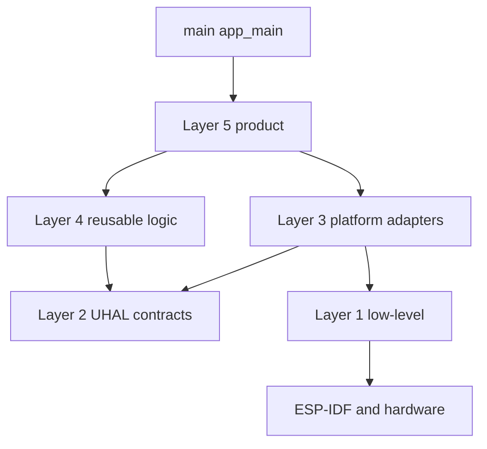
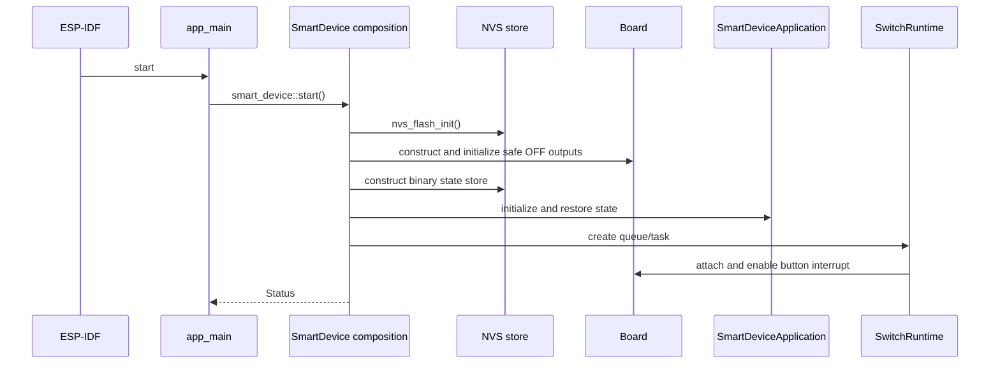

# agile-smart-device

ESP-IDF firmware architecture for reusable smart-device products on ESP32-C6. The current product profile is a one-channel local switch. The framework also contains reusable Layer 4 policies for future Gateway-connected device profiles.

## Current hardware profile

| Function | Resource | Behavior |
|---|---:|---|
| Button | GPIO9 | Active-low, internal pull-up, both-edge interrupt |
| Relay | GPIO10 | Active-high, restored from NVS |
| Relay state LED | GPIO2 | Active-high, mirrors relay state |
| Future status LED | WS2812 GPIO8 | Reserved for connectivity/provisioning/fault indication |
| Flash | 16 MB DIO | Single large application partition in the current profile |
| SDK | ESP-IDF 6.0.2 | ESP32-C6 RISC-V target |

GPIO9 is a strapping pin. Holding it during reset enters download mode. The relay input on GPIO10 requires an external fail-safe bias so the relay remains off before firmware initializes the pin.

## Dependency direction



```text
main
  -> Layer 5 composition/application/runtime
      -> Layer 4 services/libraries/protocols
          -> Layer 2 UHAL contracts
      -> Layer 3 concrete adapters
          -> Layer 1 vendor access
              -> ESP-IDF / hardware
```

Rules are enforced by `tools/check_layer_boundaries.py` and documented in `AGENTS.md` plus `docs/rules/`.

## Layer 1 — ESP32-C6 low-level

Layer 1 is the only reusable platform layer that directly calls ESP-IDF peripheral APIs. It does not contain product behavior.

Location:

```text
external/agile-firmware-framework/components/platform/esp32c6/esp_idf/low_level/
```

Implemented files used by the current product:

```text
low_level/system/Gpio.hpp
low_level/system/Gpio.cpp
low_level/system/SysTimer.hpp
low_level/system/SysTimer.cpp
low_level/system/Watchdog.hpp
low_level/system/Watchdog.cpp
```

Responsibilities:

- Configure/read/write GPIO.
- Install per-pin GPIO interrupt handlers.
- Enable/disable GPIO interrupts.
- Read monotonic milliseconds and delay a task.
- Subscribe, feed, and unsubscribe the current task from the ESP task watchdog.

Other peripheral files in the ESP32-C6 platform catalog remain placeholders until a real vertical slice requires them.

## Layer 2 — UHAL contracts

Layer 2 defines platform-neutral capabilities. Contracts never receive board pin numbers or vendor handles on every operation; each object represents an already configured resource.

Locations:

```text
external/agile-firmware-framework/components/uhal/core/include/uhal/
external/agile-firmware-framework/components/uhal/interfaces/include/uhal/
```

Important files:

```text
core/include/uhal/Status.hpp
interfaces/include/uhal/IGpio.hpp
interfaces/include/uhal/IGpioInterrupt.hpp
interfaces/include/uhal/IClock.hpp
interfaces/include/uhal/IStorage.hpp
interfaces/include/uhal/IWatchdog.hpp
interfaces/include/uhal/IUart.hpp
```

`Status.hpp` contains common error values including `not_found`, `no_resources`, `corrupt`, `not_ready`, `denied`, and `aborted`.

## Layer 3 — Platform adapters

Layer 3 implements UHAL contracts by translating them to Layer 1/ESP-IDF operations. It may know configured hardware resources, but it must not contain product policy, MQTT topics, persistence schema, button actions, or relay behavior.

Location:

```text
external/agile-firmware-framework/components/platform/esp32c6/esp_idf/adapters/
```

Implemented adapters:

```text
adapters/gpio/Esp32C6Gpio.hpp
adapters/gpio/Esp32C6Gpio.cpp
adapters/clock/Esp32C6Clock.hpp
adapters/clock/Esp32C6Clock.cpp
adapters/watchdog/Esp32C6Watchdog.hpp
adapters/watchdog/Esp32C6Watchdog.cpp
```

Classes:

- `esp32c6::adapters::OutputPin`
- `esp32c6::adapters::InputPin`
- `esp32c6::adapters::PinInterrupt`
- `esp32c6::adapters::Clock`
- `esp32c6::adapters::Watchdog`

The parent project imports these files through:

```text
components/framework_platform_esp32c6/CMakeLists.txt
```

## Board configuration

Board facts are not reusable platform drivers. They belong to the product repository.

Location:

```text
components/board_esp32c6/
├─ CMakeLists.txt
├─ include/board/Board.hpp
├─ include/board/BoardPins.hpp
└─ src/Board.cpp
```

`BoardPins.hpp` owns GPIO numbers and polarity. `Board` owns concrete GPIO, interrupt, and clock adapter instances and exposes them through UHAL references.

## Layer 4 — Reusable logic

Layer 4 contains device-independent policies, protocols, and pure algorithms. It must not include ESP-IDF, FreeRTOS, board, NVS, socket, Wi-Fi, TLS, or MQTT-client headers.

Framework location:

```text
external/agile-firmware-framework/components/
├─ libraries/
├─ protocols/
└─ services/
```

### Pure libraries

Implemented components include:

```text
libraries/button/                 ButtonInput debounce and press classification
libraries/ring_buffer/            FixedRingBuffer
libraries/retry/                  BackoffPolicy and wrap-safe Deadline
libraries/serialization/          ByteReader/Writer and bounded flat JSON
libraries/include/libraries/      CRC16, CRC32, EventBus, StateMachine
```

### Protocol policy

```text
protocols/frame/                   Bounded frame codec and CRC validation
protocols/modbus-rtu/              Existing Modbus transport sample
protocols/mqtt/                    MQTT topics and session policy only
```

`protocols/mqtt` does not implement MQTT wire packets. A product transport adapter must use a proven MQTT implementation such as coreMQTT.

### Reusable services

Implemented and host-tested:

```text
services/binary_switch/            Persisted on/off load policy
services/configuration/            Fixed A/B configuration snapshots and CRC recovery
services/security_policy/          Roles, credential lifecycle, signature-verifier port
services/network_manager/          Link priority, retry/backoff, failover seam
services/provisioning/              Transport-neutral credential lifecycle
services/indication/                Priority indication arbitration
services/messaging/                 Bounded message/transport contracts
services/offline_queue/             Fixed store-and-forward queue
services/telemetry/                 Bounded telemetry JSON and offline replay
services/command_dispatcher/        Authorization, routing, idempotency, responses
services/time_sync/                 Non-blocking time-quality/sync policy
services/diagnostics/               Counters, gauges, bounded fault history
services/health_monitor/            Liveness/watchdog/recovery policy
services/ota_manager/               Signed OTA policy and abstract ports
services/environment_monitor/       Framework sample, not composed by this product
```

The current firmware does **not** instantiate every service. Product composition is selective so unused network/OTA policies add no runtime tasks or state.

## Framework bridges

ESP-IDF discovers parent `components/` automatically. Bridge components compile selected framework sources from the submodule without copying them.

```text
components/framework_uhal_core/
components/framework_uhal_interfaces/
components/framework_platform_esp32c6/
components/framework_button/
components/framework_binary_switch/
components/framework_libraries/
components/framework_services_types/
components/framework_configuration/
components/framework_security_policy/
components/framework_network_manager/
components/framework_provisioning/
components/framework_indication/
components/framework_messaging/
components/framework_mqtt_contract/
components/framework_offline_queue/
components/framework_telemetry/
components/framework_command_dispatcher/
components/framework_time_sync/
components/framework_diagnostics/
components/framework_health_monitor/
```

There is intentionally no `framework_ota_manager` bridge in the current single-application product profile.

## Layer 5 — Product/application/runtime

Layer 5 selects concrete adapters, creates the object graph, maps semantic product events, and owns product-specific persistence schemas and task scheduling.

Location:

```text
components/product_smart_device/
├─ CMakeLists.txt
├─ include/smart_device/
│  ├─ SmartDevice.hpp
│  └─ SmartDeviceApplication.hpp
└─ src/
   ├─ SmartDevice.cpp
   ├─ SmartDeviceApplication.cpp
   ├─ SwitchRuntime.hpp
   ├─ SwitchRuntime.cpp
   └─ adapters/
      ├─ NvsBinaryStateStore.hpp
      └─ NvsBinaryStateStore.cpp
```

Responsibilities:

- `SmartDevice.cpp` is the composition root. It initializes NVS and board hardware, creates concrete adapters and services, then starts runtime tasks.
- `SmartDeviceApplication` is vendor-neutral product behavior. It exposes initialize, short-press, explicit set, and state query use cases.
- `SwitchRuntime` owns FreeRTOS queue/task and converts GPIO/button activity into semantic application calls.
- `NvsBinaryStateStore` implements the Layer 4 `IBinaryStateStore` port using product-owned namespace/schema/key choices.

`SmartDeviceApplication.hpp/.cpp` is forbidden from including ESP-IDF, FreeRTOS, board, NVS, Wi-Fi, MQTT, sockets, or concrete adapters.

## Boot flow



Current hard-fail points are NVS initialization, board safe-state initialization, application restore/apply, and runtime creation. Gateway-connected degraded startup is documented but concrete Wi-Fi/TLS/MQTT adapters are not yet composed.

## Local button and relay flow

```text
GPIO9 edge ISR
  -> overwrite one-element ISR queue
  -> switch_ctrl FreeRTOS task
  -> sample logical button state
  -> ButtonInput debounce
  -> short_press semantic event
  -> SmartDeviceApplication::on_short_press()
  -> BinarySwitchService::toggle()
  -> GPIO10 relay + GPIO2 state LED
  -> NvsBinaryStateStore::save()
```

The ISR does not debounce, persist, log, or execute Layer 4 policy.

## Persistence flow

Current switch-state schema:

```text
NVS namespace: smartdev
schema key:    schema
schema value:  1
state key:     relay_on
```

Missing/corrupt state defaults to OFF. A save failure does not roll back an already applied relay state; it returns an error to runtime for logging/diagnostics.

`ConfigurationService` is a separate generic Layer 4 component over `IStorage`; it is not used for this small NVS relay-state schema.

## Gateway-connected roadmap status

Architecture documents:

```text
docs/architecture/local-gateway-cloud.md
docs/architecture/mqtt-contract.md
docs/architecture/node-service-catalog.md
```

Completed:

- Layer 4 network/provisioning/messaging/MQTT/offline/telemetry/command/time/diagnostic/health policies.
- ESP-IDF bridge components compile successfully after `idf.py reconfigure`.
- ESP32-C6 watchdog Layer 1/3 adapter.

Not yet implemented/composed:

- `WifiStationLink`
- TLS socket with custom CA validation
- coreMQTT `IMessageTransport`
- ESP-IDF SoftAP provisioning portal adapter
- SNTP time-source adapter
- WS2812 GPIO8 indication adapter
- Connectivity coordinator and `net_svc` task
- 4G link adapter because the modem BOM is not selected

Matter is explicitly deferred. The MQTT Gateway protocol is proprietary and must not be described as Matter-compliant.

## Tasks and resource budgets

Current runtime:

| Task/resource | Value |
|---|---:|
| `switch_ctrl` priority | 5 |
| `switch_ctrl` stack | 3072 bytes configured in source |
| Active button poll | 5 ms |
| ISR queue depth | 1 |
| Offline queue default | 32 records |
| Gateway profile offline queue target | 16 records |
| MQTT network-buffer target | 1024 bytes |

The future Gateway profile reserves a separate lower-priority `net_svc` task so TLS/MQTT work cannot delay local relay control.

## Tests and architecture enforcement

Framework tests are under:

```text
external/agile-firmware-framework/tests/unit/
```

They cover UHAL samples, button, binary switch, bounded foundation, configuration/security, network/provisioning/indication, messaging/telemetry, command dispatch, diagnostics/time/health, and OTA policy.

Parent tests are under:

```text
tests/host/
```

Automated rules:

```text
tools/check_layer_boundaries.py --check boundaries
tools/check_layer_boundaries.py --check dynamic
tools/check_layer_boundaries.py --check catalog
```

The checks reject vendor dependencies in reusable/application code, dynamic/unbounded allocation patterns, concrete service coupling, incomplete catalog components, and `main` access to product internals.

## Repository map

```text
agile-smart-device/
├─ main/                              ESP-IDF entry only
├─ components/
│  ├─ board_esp32c6/                 Board facts and concrete board object
│  ├─ product_smart_device/          Layer 5 product
│  └─ framework_*/                   ESP-IDF bridges to reusable catalog
├─ external/
│  └─ agile-firmware-framework/      Layers 1–4 reusable catalog
├─ reference/                        Legacy behavior reference, not active architecture
├─ tests/host/                       Parent/application tests and architecture gates
├─ tools/                             Automated boundary checker
├─ docs/rules/                        Architecture, coding, dependency rules
├─ docs/checklists/                   Review checklists
└─ docs/architecture/                 Gateway/MQTT/service blueprints
```

## Build and test

```cmd
call C:\Users\lesli\espv6\v6.0.2\esp-idf\export.bat
git submodule update --init --recursive
idf.py set-target esp32c6
idf.py reconfigure
idf.py build
```

Framework host tests:

```cmd
cd external\agile-firmware-framework
cmake -S . -B build
cmake --build build
ctest --test-dir build --output-on-failure
```

Parent host tests and architecture gates:

```cmd
cd tests\host
cmake -S . -B build
cmake --build build
ctest --test-dir build --output-on-failure
```

## Current verification status

- Framework host tests: 10/10 pass.
- Parent host tests and architecture gates: 4/4 pass.
- ESP-IDF 6.0.2 ESP32-C6 build: pass.
- Firmware size: `0x2eae0` bytes.
- Application partition free: 88%.
- No hardware flash/acceptance test has been run in this implementation session.

## Engineering rules

Start with:

- `AGENTS.md`
- `docs/rules/architecture.md`
- `docs/rules/coding-standards.md`
- `docs/rules/dependencies.md`
- `docs/checklists/level5-change.md`

Do not claim MISRA, CERT, Matter, OTA readiness, TLS readiness, or production security without matching analyzer, adapter, key-material, partition, and hardware evidence.
