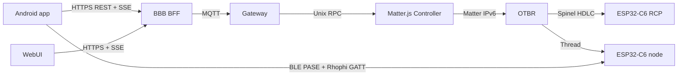
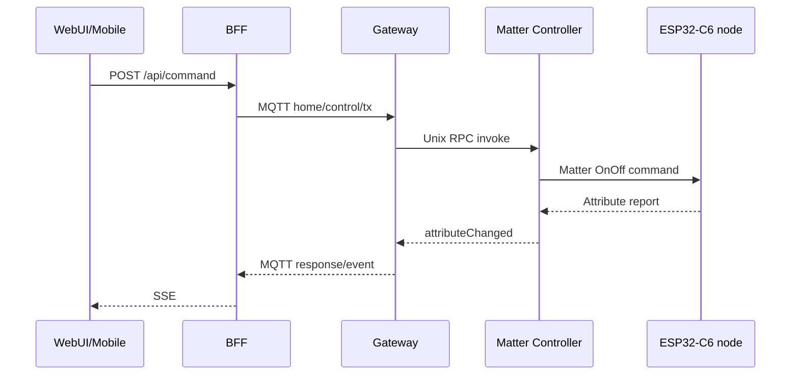

# Kiến trúc end-to-end

## Trạng thái

| Khối | Source | Deployed | HIL |
|---|---|---|---|
| Firmware node | Có | ESP32-C6 | Từng phần |
| Android app | Có | A101SH debug APK | Từng phần |
| BBB platform | Có | BBB systemd | Từng phần |
| Full commissioning | Có | Đang chạy thử | Đang debug |

## Topology

RCP chỉ cung cấp radio 802.15.4 cho OTBR. Nó không phải application node và không nhận JSON command.

## Trust boundary và dữ liệu

| Dữ liệu | Owner | Không được đi qua |
|---|---|---|
| Claim secret | Factory partition + encrypted BBB registry | Git, MQTT, log |
| Thread dataset | OTBR + protected provider + encrypted grant | UI, log, evidence |
| Mobile fabric key | Android CHIP storage | BFF/MQTT |
| BBB fabric key | Matter Controller storage | Browser/mobile |
| MQTT credential | Gateway/BFF | Browser |
| Inventory | Controller + BFF metadata | Static hard-code |

## On/Off round trip

Local button đi qua cùng `SwitchRuntime`, sau đó publish Matter attribute report nên UI phải hội tụ về cùng state.

## Process ownership

- `otbr-agent` là process duy nhất được sở hữu serial RCP.
- `matter-controller` sở hữu fabric storage và Unix socket.
- `matter-gateway` chuyển contract MQTT sang RPC.
- `matter-web-auth` giữ credential server-side và phục vụ REST/SSE/WebUI.
- Mosquitto chỉ là message transport, không sở hữu device state.

## Giới hạn

Commissioning chỉ được đánh HIL pass khi node còn duy nhất permanent BBB fabric, inventory xuất hiện và On/Off hoạt động hai chiều.