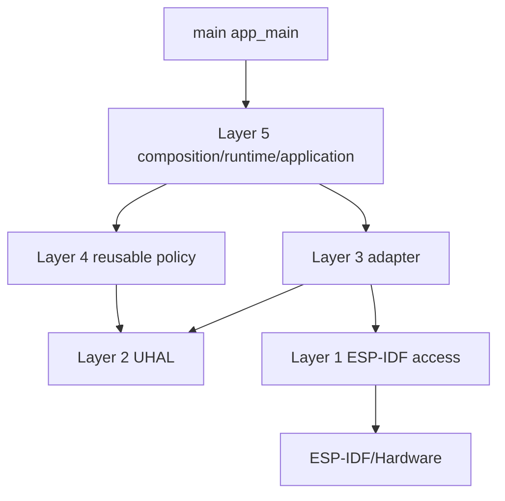
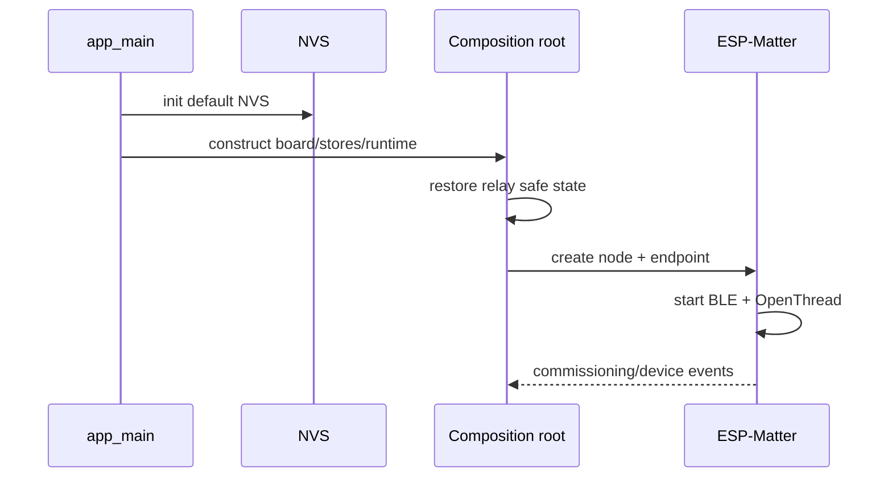

# Firmware ESP32-C6

## Trạng thái

| Hành vi | Source | Deployed | HIL |
|---|---|---|---|
| Relay/button/NVS | Có | Có | Có ở local profile |
| Matter endpoint OnOff | Có | Có | Từng phần |
| Thread attach | Có | Có | Đã quan sát |
| Multi-fabric lifecycle | Có một phần | Có | Đang debug |

## Kiến trúc layer



`SmartDeviceApplication` không phụ thuộc ESP-IDF, FreeRTOS, board hoặc NVS. Composition root tạo board, stores, application, runtime và Matter node.

## Hardware profile

| Chức năng | Resource | Polarity |
|---|---:|---|
| Button | GPIO9 | active-low, pull-up |
| Relay | GPIO10 | active-high |
| Relay LED | GPIO2 | active-high |
| Status pixel | GPIO8 WS2812 | GRB |

GPIO9 là strapping pin; không giữ nút trong lúc reset nếu không muốn vào download mode.

## Runtime

`SwitchRuntime` dùng both-edge ISR, queue depth 8, task stack 3072, priority 5 và poll 5 ms khi nút active. ISR chỉ enqueue event. Short press đổi relay; commissioning/factory-reset press gọi lifecycle interface.

Gesture authoritative nằm ở `SwitchRuntime.hpp`/`ButtonInputConfig`; không dựa vào mô tả legacy.

## Matter data model

- Dynamic endpoint thường là endpoint 1.
- Device type On/Off Plug-in Unit `0x010A`.
- OnOff cluster `0x0006`.
- PRE_UPDATE callback enqueue semantic command vào runtime.
- Local change được schedule ngược vào Matter stack để report.

## Khả năng thêm vào Apple Home và Google Home

### Kết luận hiện tại

Node **chưa sẵn sàng cho người dùng phổ thông** thêm trực tiếp vào Apple Home hoặc Google Home. Phần Matter data model và Thread transport phù hợp về nền tảng, nhưng identity, attestation, onboarding và certification vẫn ở chế độ development.

| Môi trường | Trạng thái hiện tại | Điều kiện còn thiếu |
|---|---|---|
| Hệ sinh thái Rhophi/BBB | Đang tích hợp | Hoàn tất permanent fabric, cleanup, inventory và HIL |
| Google Home developer/field trial | Có thể phát triển thử nghiệm, chưa xác nhận pass | Developer Console integration khớp VID/PID, QR/manual code, Google Thread hub và test account |
| Google Home consumer | Chưa | Production VID/PID, CSA certification, Google certification/launch |
| Apple Home development | Có thể thử nghiệm, chưa xác nhận pass | QR/manual onboarding, Apple Thread Border Router và attestation tương thích |
| Apple Home consumer/badge | Chưa | CSA Matter certification/interoperability và quy trình Works with Apple Home |

### Bằng chứng từ firmware

Build hiện dùng:

```text
VID  = 0xFFF1
PID  = 0x8000
DAC  = example provider
Setup parameters = test
Factory Data Provider = chưa bật
```

`0xFFF1` là test VID và không được dùng cho consumer product. Example DAC/test setup parameters chỉ phù hợp lab. Firmware cũng chưa xuất QR/manual onboarding payload thành UX có thể scan từ Google Home hoặc Apple Home.

### Phần đã phù hợp

- Device type On/Off Plug-in Unit `0x010A` và OnOff cluster `0x0006` thuộc nhóm thiết bị outlet/switch phổ biến.
- ESP32-C6 có BLE và 802.15.4 Thread.
- Node hỗ trợ Matter fabric lifecycle làm nền cho Multi-Admin.
- Relay/button local behavior độc lập cloud.

### Hai đường tích hợp hệ sinh thái

1. **Direct commissioning** — Apple Home/Google Home scan QR của factory-new node và tự cấp Thread credentials/fabric.
2. **Multi-Admin sharing** — Rhophi/BBB commission trước, sau đó mở Enhanced Commissioning Window và hiển thị QR/manual code để Apple Home hoặc Google Home thêm fabric thứ hai.

Roadmap nên ưu tiên Multi-Admin sharing vì giữ BBB làm permanent controller của hệ thống Rhophi nhưng vẫn cho người dùng thêm cùng node vào ecosystem khác. Custom Rhophi claim không thay thế Matter QR/ECW và không được buộc ecosystem bên thứ ba hiểu custom GATT.

Nguồn tham khảo chính thức:

- [Google Home Matter get started](https://developers.home.google.com/matter/get-started)
- [Google Home pair Matter device](https://developers.home.google.com/matter/integration/pair)
- [Google Home certification](https://developers.home.google.com/matter/certification)
- [Apple Matter support](https://developer.apple.com/apple-home/matter/)
- [Works with Apple Home](https://developer.apple.com/apple-home/works-with-apple-home/)

## Boot và network



Thread dùng native radio và `HOST_CONNECTION_MODE_NONE`. Matter/claim state ở default NVS; claim material ở partition `fctry`.

## Partition

`partitions_matter.csv` chứa secure-cert, NVS, NVS keys, otadata, PHY, hai OTA slot 6 MiB, `fctry` và coredump. Flash app thông thường không tự flash `fctry`.

## Logging

Các tag chính là `agile-smart-device`, `matter-node`, `switch-runtime`, `chip[...]`, `OPENTHREAD`. Log không được chứa dataset, passcode hay claim secret.

## Hướng phát triển các node tương lai

### Giai đoạn 0 — Ổn định node On/Off hiện tại

- Hoàn tất clean HIL từ BLE PASE đến permanent BBB fabric.
- Xác nhận temporary fabric cleanup, inventory và On/Off hai chiều.
- Test reboot, mất Thread, mất BBB, remove/recommission và factory reset.
- Khóa GATT claim protocol v1 bằng test vector và compatibility test Android.
- Loại bỏ mọi dependency vào bundle/config thủ công không version hóa.

Đây là điều kiện bắt buộc trước khi mở rộng device type.

### Giai đoạn 1 — Development interoperability

- Sinh và hiển thị Matter QR/manual setup payload.
- Đưa unique discriminator/passcode vào factory data.
- Hoàn thiện Basic Information: vendor name, product name, model, serial, hardware/software version.
- Tạo Google Home Developer Console integration với test VID/PID khớp firmware.
- Chạy development pairing với Google Nest Thread hub.
- Chạy pairing với Apple HomePod mini/HomePod/Apple TV Thread Border Router.
- Ghi HIL riêng cho direct commissioning và Multi-Admin.

### Giai đoạn 2 — Multi-Admin product UX

- Thêm action `Share with Apple Home` và `Share with Google Home` trong mobile/WebUI.
- BBB mở ECW theo request có auth/authorization và timeout ngắn.
- API trả onboarding payload một lần, không log passcode.
- Hiển thị QR/manual code và trạng thái fabric add/remove.
- Đọc FabricList để xác nhận đúng ecosystem fabric thay vì suy đoán theo index.
- Cho phép revoke từng fabric mà không factory-reset node.

### Giai đoạn 3 — Production identity, security và certification

- Đăng ký CSA Vendor ID/Product ID thật.
- Provision DAC/PAI/CD và PAA trust chain production.
- Bật ESP32 Factory Data Provider hoặc custom provider được review.
- Bật secure boot, flash encryption, encrypted factory storage và anti-rollback.
- Implement signed Matter OTA requestor và release rollback policy.
- Thêm Diagnostic Logs, General Diagnostics và Thread Network Diagnostics theo yêu cầu interoperability.
- Chạy CSA Matter certification/interop; sau đó Google Home certification và Apple interoperability/badge process.

### Giai đoạn 4 — Dòng sản phẩm node

| Node tương lai | Matter model đề xuất | Hardware/firmware bổ sung |
|---|---|---|
| Công tắc nhiều kênh | nhiều OnOff endpoints | per-channel relay/LED/state store |
| Dimmer | Dimmable Plug/Light + LevelControl | zero-cross/triac hoặc PWM, transition |
| Ổ cắm đo điện | OnOff + Electrical Energy/Power Measurement | metering IC, calibration, safety |
| Rèm/cửa | Window Covering | motor driver, limit/calibration |
| Cảm biến môi trường | temperature/humidity/air quality | I2C sensor, reporting thresholds |
| Motion/contact | occupancy/contact sensor | debounce, event/reporting |
| Node pin | Sleepy End Device/ICD | low-power, check-in protocol, battery cluster |
| Bridge legacy | Matter Bridge + bridged endpoints | protocol adapter, dynamic endpoint lifecycle |

### Kiến trúc để scale nhiều node

- Giữ Layer 1–4 reusable; mỗi SKU chỉ thay board config, product composition và Matter endpoint catalog.
- Tạo `ProductProfile` rõ cho mỗi device type thay vì `#ifdef` lan rộng.
- Dùng capability/endpoint descriptor chung để WebUI/mobile render động.
- Tách manufacturing schema theo SKU nhưng giữ claim/registry envelope versioned.
- Chuẩn hóa OTA, diagnostics, telemetry và fault codes dùng chung.
- Mỗi node có resource budget flash/RAM/task/queue và HIL matrix riêng.

### Nguyên tắc product/ecosystem

- Rhophi app/BBB là một Matter ecosystem, không phải lớp thay thế tiêu chuẩn Matter.
- Apple Home và Google Home phải được thêm qua Matter standard commissioning/Multi-Admin.
- Không đưa custom claim secret hoặc Thread dataset vào cloud ecosystem.
- Không quảng bá logo Matter/Google/Apple trước certification và quyền sử dụng badge.

## Nguồn sự thật

- `main/main.cpp`
- `components/product_smart_device/src/composition/SmartDevice.cpp`
- `components/product_smart_device/src/runtime/SwitchRuntime.cpp`
- `components/product_smart_device/src/matter/MatterNode.cpp`
- `components/board_esp32c6/include/board/BoardPins.hpp`