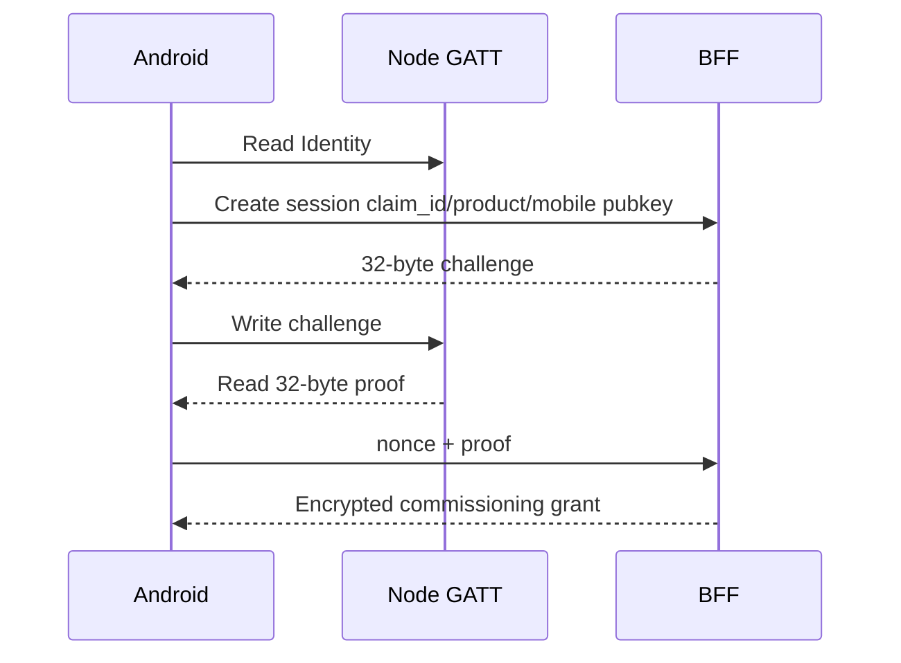

# Rhophi claim GATT

## Trạng thái

| Tính năng | Source | Deployed | HIL |
|---|---|---|---|
| Identity/challenge/proof | Có | Có | Có từng bước |
| Replay protection | Có | Có | Host test |
| Auto claim window | Có | Có | Boot log xác nhận |
| Backend rate limit | Có | Có | Unit test |

## UUID canonical

| Mục | UUID |
|---|---|
| Service | `9a7d5210-8e21-4f41-a131-52484f504849` |
| Identity | `9a7d5211-8e21-4f41-a131-52484f504849` |
| Challenge | `9a7d5212-8e21-4f41-a131-52484f504849` |
| Response | `9a7d5213-8e21-4f41-a131-52484f504849` |
| State | `9a7d5214-8e21-4f41-a131-52484f504849` |
| Identify | `9a7d5215-8e21-4f41-a131-52484f504849` |
| Cancel | `9a7d5216-8e21-4f41-a131-52484f504849` |

NimBLE `BLE_UUID128_INIT` nhận byte theo thứ tự lưu trữ little-endian; không copy chuỗi UUID canonical trực tiếp thành danh sách byte.

## Identity wire format

| Offset | Kích thước | Trường |
|---:|---:|---|
| 0 | 1 | protocol version |
| 1 | 2 | product ID little-endian |
| 3 | 16 | claim ID |
| 19 | 16 | nonce |
| 35 | 1 | flags |

Tổng kích thước là 36 byte. Challenge và proof đều 32 byte.

## Proof

```text
proof = HMAC-SHA256(claim_secret, nonce || challenge || claim_id)
```

Firmware dùng PSA Crypto, import HMAC key tạm thời, tính MAC rồi destroy key. Android không biết claim secret; nó chuyển proof tới BFF để xác minh constant-time.



Challenge được bind với một BLE connection; replay cache từ chối challenge đã dùng. Nonce được rotate sau proof.

## Window và rate limit

Khi Matter commissioning window mở và fabric count bằng 0, firmware tự mở Rhophi claim window. Physical commissioning gesture cũng mở cả hai window.

Device-side persistent lockout cũ đã bị loại bỏ vì node không biết backend chấp nhận proof hay không. Firmware xóa legacy counters lúc initialize. BFF giới hạn failed claim attempts và transaction conflict.

## Reset

Matter factory reset xóa fabric và claim state; factory claim material vẫn nằm ở `fctry`. Không erase hoặc ghi lại `fctry` trong recovery thông thường.

## Nguồn sự thật

- `components/product_smart_device/src/matter/RhophiClaimGatt.cpp`
- `components/product_smart_device/src/matter/RhophiClaimProtocol.cpp`
- `components/product_smart_device/src/matter/RhophiClaimPlatform.cpp`
- `tests/host/ClaimProtocolTests.cpp`
- `dashboard-reference/packages/provisioning/src/crypto.ts`