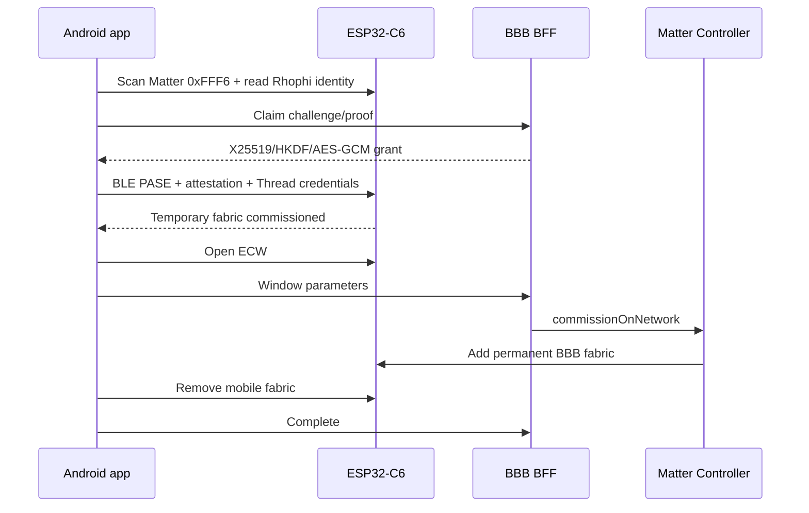

# Mobile commissioning

## Trạng thái

| Tính năng | Source | Deployed | HIL |
|---|---|---|---|
| Auth/SSE/inventory | Có | Có | Từng phần |
| Rhophi BLE claim | Có | Có | Đã xác minh |
| PASE/attestation/Thread | Có | Có | Đã đi qua các stage |
| BBB handoff/cleanup | Có | Có | Đang debug acceptance cuối |

## Kiến trúc

Ứng dụng dùng Ionic Vue, Capacitor, Pinia và TypeScript. Native plugin Kotlin là boundary duy nhất tới Android BLE, Keystore và ConnectedHomeIP.

## Commissioning sequence

## BLE/GATT lifecycle

- Scan lọc Matter service `0xFFF6`.
- Scan connection chỉ đọc identity rồi đóng để node advertise lại.
- Select reconnect và đọc identity mới, không dùng cache identity cũ.
- Khi characteristic thiếu do Android cache, plugin refresh cache, reconnect và thử lại một lần.
- MTU mục tiêu là 247.
- Cancel/reset đóng tất cả GATT session trước khi rescan.

## Grant crypto

Mobile tạo X25519 ephemeral key được bảo vệ bằng Android Keystore. BFF mã hóa grant bằng HKDF-SHA256/AES-256-GCM với transaction ID làm binding. Plugin kiểm tra version, transaction, expiry và zeroize plaintext/dataset.

## ConnectedHomeIP callbacks

- `onPairingComplete` xác nhận PASE.
- Attestation callback post `continueCommissioning` lên Android main thread.
- Intermediate `onCommissioningStatusUpdate` chỉ dùng log/progress.
- `onCommissioningComplete` là terminal callback.

## Permissions

Android 12+ cần `BLUETOOTH_SCAN` và `BLUETOOTH_CONNECT`; Android cũ cần location. Matter mDNS cần `CHANGE_WIFI_MULTICAST_STATE`. App cần route IPv6 tới Thread OMR prefix.

## State và recovery

Pinia state machine phân biệt success, failure và `CLEANUP_PENDING`. SSE không được ghi đè state khi local orchestration đang chạy. Call `scan`, `select`, `commission` có re-entry guard. Transaction sớm không đủ secret để resume sẽ bị cancel và bắt đầu lại; transaction sau BBB handoff phải ưu tiên cleanup.

## Build pin

`tools/android/chip.lock.json` và `build-chip-controller.sh` pin ConnectedHomeIP commit, SDK/NDK/JDK/ABI. Gradle fail-closed nếu không có `SHA256SUMS` staged artifact.

## Giới hạn

Debug APK cho phép tiếp tục khi development attestation thất bại. Release build phải dùng production attestation policy. Final HIL chỉ pass sau BBB-only fabric, inventory và On/Off.

## Nguồn sự thật

- `mobileapp-reference/apps/mobile/src/stores/commissioning.ts`
- `mobileapp-reference/apps/mobile/src/services/realtime.ts`
- `mobileapp-reference/packages/commissioning-plugin/android/src/main/java/uk/rhophi/commissioning/`
- `mobileapp-reference/tools/android/`