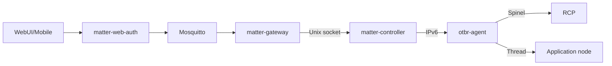

# BBB Gateway, Controller và WebUI

## Trạng thái

| Khối | Source | Deployed | HIL |
|---|---|---|---|
| OTBR/RCP | Có | Active | Thread attach quan sát được |
| Matter Controller | Có | Matter.js 0.17.9 | RPC health pass |
| Gateway/BFF | Có | Active | REST/MQTT từng phần |
| Provisioning/inventory | Có | Enabled | Handoff cuối đang debug |

## Process graph

## OTBR

`otbr-agent` là owner duy nhất của RCP serial và tạo `wpan0`. Gateway/Controller không mở RCP. Dataset và Thread master key không đi qua MQTT hoặc WebUI.

## Matter Controller RPC

Socket mặc định `/run/matter-controller/controller.sock` dùng JSON-lines request/response và async `attributeChanged` event.

| Method | Chức năng |
|---|---|
| `health` | readiness/version/node list |
| `listNodes` | commissioned Node IDs |
| `commissionOnNetwork` | BBB fabric qua ECW/IP |
| `removeNode` | decommission/remove local state |
| `describeNode` | endpoint/capability inventory |
| `read` | attribute read |
| `subscribe` | attribute/event subscription |
| `invoke` | Matter command |

Source method không đủ để kết luận deployed bundle có method; luôn chạy RPC health và một compatibility probe sau deploy.

## Gateway/MQTT

Gateway validate envelope, normalize 64-bit Node ID, endpoint, cluster/command và correlation ID. QoS 1 có thể deliver duplicate; command handler phải idempotent theo request ID khi cần.

## BFF

BFF cung cấp web cookie + CSRF và mobile bearer auth, CORS allowlist, REST command/devices/commissioning, SSE và static WebUI. MQTT credential chỉ tồn tại server-side.

## Provisioning persistence

- Encrypted file registry dùng AES-256-GCM.
- Registry key và Thread dataset file có permission chặt.
- Transaction snapshot chỉ lưu non-secret recovery state bằng atomic rename.
- Matter Controller storage là source of truth cho commissioned fabrics.

## WebUI

WebUI gọi `/api/devices`, render capability thật và hiện chỉ tạo OnOff control cho endpoint có cluster `0x0006`. SSE provisioning event refresh inventory sau complete.

## Recovery

Không xóa `/var/lib/matter-controller` trong deploy thường. Bundle/env phải backup trước cutover. Gateway có thể rollback mode nhưng production acceptance yêu cầu `matterjs`.

## Nguồn sự thật

- `dashboard-reference/packages/matter-controller/src/`
- `dashboard-reference/packages/gateway/src/`
- `dashboard-reference/packages/webui-bff/src/`
- `dashboard-reference/packages/provisioning/src/`
- `dashboard-reference/deploy/systemd/`