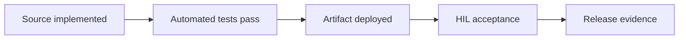

# Testing, HIL và evidence

## Gate model

Không bỏ qua gate. `Source: Có` không tự động nâng `Deployed` hoặc `HIL`.

## Test hiện có

| Codebase | Test |
|---|---|
| Firmware | host CTest, claim vector/replay/window, application composition, layer checker, manufacturing tools |
| Dashboard | contracts, provisioning crypto/persistence, auth/routes, gateway unit/MQTT integration, WebUI component |
| Mobile | API, SSE, state machine, catalog, mock wizard, connection component; Gradle native compile |

## HIL matrix

| Luồng | Source | Deployed | HIL |
|---|---|---|---|
| Boot/relay/button | Có | Có | Có từng phần |
| Claim identity/proof | Có | Có | Có từng bước |
| BLE PASE/attestation | Có | Có | Có từng bước |
| Thread attach + Android route | Có | Có | Có từng bước |
| ECW + BBB AddNOC | Có | Có | Đang debug |
| Remove temporary fabric | Có | Có | Chưa xác nhận cuối |
| Dynamic inventory | Có | Có | Chưa sau handoff cuối |
| On/Off UI → relay | Có | Có | Chưa sau handoff cuối |
| Button → subscription → UI | Có | Có | Chưa sau handoff cuối |
| Restart/remove/recommission | Có một phần | Có một phần | Chưa |

## Evidence tối thiểu

- Build/test output với commit/working-tree state.
- ESP serial log đã redact.
- Android logcat chỉ các tag cần thiết, không chứa grant/token.
- BBB `systemctl is-active`, controller RPC health và inventory response đã redact.
- OTBR state/route; không lưu dataset.
- Before/after UI screenshot không chứa credential hoặc dữ liệu cá nhân.

## Acceptance commissioning

1. Mobile claim đúng node.
2. PASE/attestation và Thread attach thành công.
3. BBB permanent fabric được AddNOC qua `commissionOnNetwork`.
4. Mobile fabric bị xóa; node còn đúng permanent fabric.
5. `/api/devices` có node và endpoint OnOff.
6. UI command đổi relay; physical button cập nhật UI.
7. Restart node/controller vẫn phục hồi.

## Failure policy

Mỗi failure phải ghi stage, error code, component owner và recovery. Không đổi trạng thái HIL sang pass chỉ vì một lần vượt qua stage trung gian.

## Nguồn sự thật

- `tests/host/`
- `tests/hil/README.md`
- `dashboard-reference/**/test/`
- `mobileapp-reference/**/test/`