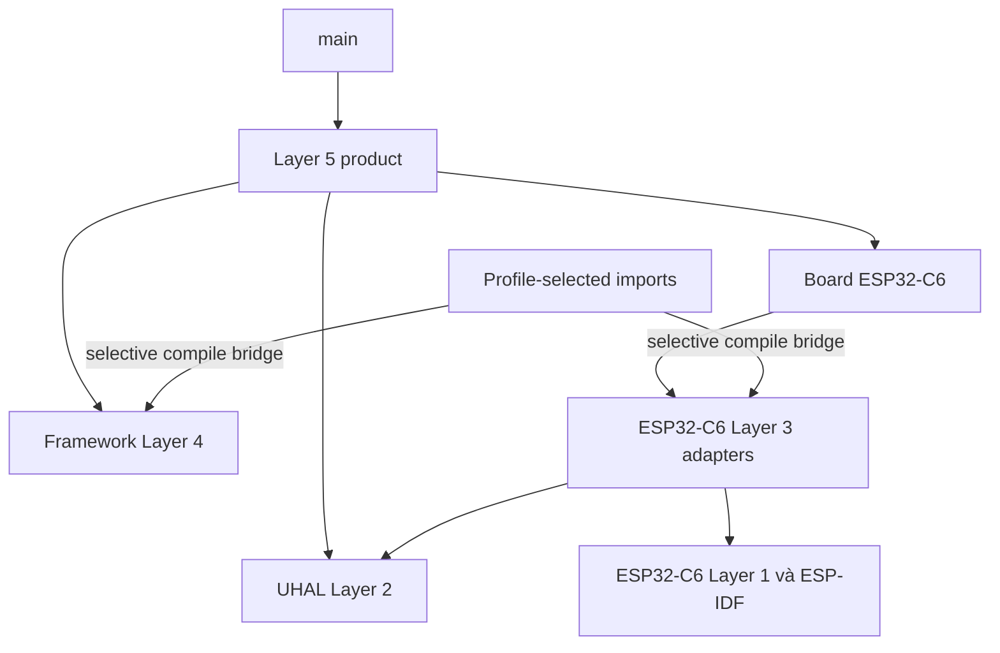

# Cấu trúc repository `agile-smart-device`

> **LEGACY / NON-AUTHORITATIVE.** Dùng [repository authoritative](../13-thuat-ngu-ownership-repository.md).

Tài liệu này mô tả cấu trúc repository theo góc nhìn kiến trúc. Mục tiêu là trả lời bốn câu hỏi cho từng nhóm thư mục:

1. Thành phần đó dùng để làm gì?
2. Vì sao nó được tạo?
3. Vì sao hoặc trong điều kiện nào nó tồn tại?
4. Ai sở hữu và nó tham gia build như thế nào?

Đây là bản đồ định hướng, không phải danh sách mọi file sinh trong `build/`. Trạng thái thực thi của từng capability phải được xác nhận từ CMake, source và test, không được suy ra chỉ từ việc thư mục tồn tại.

## 1. Quy ước trạng thái

| Nhãn | Ý nghĩa |
|---|---|
| **Active source** | Source hiện được build hoặc được product sử dụng. |
| **Profile-selected** | Chỉ được ESP-IDF discover/compile khi profile tương ứng được chọn. |
| **Optional** | Chỉ tham gia khi một option, target hoặc integration cụ thể được bật. |
| **Generated/local** | Cache, build output hoặc cấu hình sinh trên máy; không phải source of truth. |
| **Roadmap/draft/partial** | Contract hoặc một phần cấu trúc đã tồn tại nhưng implementation chưa hoàn chỉnh. |
| **Legacy/reference-only** | Chỉ dùng để đối chiếu hoặc migration; không thuộc dependency graph hiện hành. |

## 2. Cây thư mục tổng thể

Cây dưới đây mở rộng đến mức có ý nghĩa kiến trúc. Các thư mục build/cache được gom lại vì nội dung của chúng thay đổi theo máy và toolchain.

```text
agile-smart-device/
├─ main/                                      # ESP-IDF entry point
│  ├─ CMakeLists.txt
│  └─ main.cpp
├─ components/                                # Component do product repository sở hữu
│  ├─ board_esp32c6/
│  │  ├─ include/board/
│  │  │  ├─ Board.hpp
│  │  │  └─ BoardPins.hpp
│  │  ├─ src/Board.cpp
│  │  ├─ CMakeLists.txt
│  │  └─ README.md
│  └─ product_smart_device/
│     ├─ include/smart_device/
│     │  ├─ SmartDevice.hpp
│     │  └─ SmartDeviceApplication.hpp
│     ├─ src/
│     │  ├─ application/SmartDeviceApplication.cpp
│     │  ├─ composition/SmartDevice.cpp
│     │  ├─ runtime/
│     │  │  ├─ SwitchRuntime.hpp
│     │  │  └─ SwitchRuntime.cpp
│     │  ├─ adapters/
│     │  │  ├─ NvsBinaryStateStore.hpp
│     │  │  └─ NvsBinaryStateStore.cpp
│     │  └─ matter/                         # matter_node profile only
│     │     ├─ MatterNode.hpp
│     │     └─ MatterNode.cpp
│     ├─ idf_component.yml                  # pinned LED-strip dependency
│     ├─ CMakeLists.txt
│     └─ README.md
├─ imports/                                   # ESP-IDF bridge chọn source từ framework
│  ├─ common/components/
│  │  ├─ framework_uhal_core/
│  │  ├─ framework_uhal_interfaces/
│  │  └─ framework_platform_esp32c6/
│  ├─ local_switch/components/
│  │  ├─ framework_button/
│  │  └─ framework_binary_switch/
│  └─ gateway_node/components/
│     ├─ framework_libraries/
│     ├─ framework_services_types/
│     ├─ framework_configuration/
│     ├─ framework_security_policy/
│     ├─ framework_network_manager/
│     ├─ framework_provisioning/
│     ├─ framework_indication/
│     ├─ framework_messaging/
│     ├─ framework_mqtt_contract/
│     ├─ framework_offline_queue/
│     ├─ framework_telemetry/
│     ├─ framework_command_dispatcher/
│     ├─ framework_time_sync/
│     ├─ framework_diagnostics/
│     └─ framework_health_monitor/
├─ dashboard-reference/                       # Git submodule, Gateway/WebUI reference-only
├─ external/
│  └─ agile-firmware-framework/               # Git submodule, reusable Layers 1–4
│     ├─ components/
│     │  ├─ uhal/
│     │  ├─ platform/
│     │  ├─ libraries/
│     │  ├─ devices/
│     │  ├─ protocols/
│     │  └─ services/
│     ├─ docs/
│     ├─ examples/
│     ├─ products/
│     ├─ tests/
│     ├─ tools/
│     ├─ config/
│     ├─ CMakeLists.txt
│     └─ README.md
├─ docs/
│  ├─ README.md                               # Documentation hub/onboarding
│  ├─ handbook/                               # 13 chương toàn hệ thống
│  │  ├─ 00-bat-dau.md
│  │  ├─ 01-san-pham-va-use-case.md
│  │  ├─ 02-kien-truc-toan-he-thong.md
│  │  ├─ 03-phan-cung-node.md
│  │  ├─ 04-firmware-node.md
│  │  ├─ 05-matter-thread.md
│  │  ├─ 06-bbb-gateway-webui.md
│  │  ├─ 07-build-va-phat-trien.md
│  │  ├─ 08-flash-commission-deploy.md
│  │  ├─ 09-kiem-thu-va-bang-chung.md
│  │  ├─ 10-security-ota-san-xuat.md
│  │  ├─ 11-van-hanh-va-xu-ly-su-co.md
│  │  └─ 12-glossary-va-ownership.md
│  ├─ architecture/
│  │  ├─ repository-structure.md              # Tài liệu này
│  │  ├─ matter-node.md                       # Matter/Thread profile và gates
│  │  ├─ local-gateway-cloud.md
│  │  ├─ mqtt-contract.md
│  │  └─ node-service-catalog.md
│  ├─ rules/
│  │  ├─ architecture.md
│  │  ├─ coding-standards.md
│  │  └─ dependencies.md
│  └─ checklists/
│     └─ level5-change.md
├─ tests/
│  ├─ host/
│  │  ├─ BinarySwitchCompositionTests.cpp
│  │  ├─ CMakeLists.txt
│  │  └─ build/                               # Generated/local
│  ├─ architecture/test_layer_checker.py
│  └─ hil/README.md
├─ tools/check_layer_boundaries.py
├─ .github/workflows/ci.yml
├─ reference/                                 # Legacy/reference-only submodule
│  ├─ application/
│  ├─ domain/
│  ├─ middleware/
│  ├─ platform/
│  ├─ docs/
│  ├─ web_src/
│  ├─ main/
│  └─ các script/config cũ
├─ CMakeLists.txt                              # Chọn PRODUCT_PROFILE, khởi tạo ESP-IDF
├─ sdkconfig.defaults                          # Default cấu hình được review
├─ sdkconfig                                   # Generated/local cấu hình build hiện tại
├─ AGENTS.md                                   # Chỉ dẫn làm việc trong repository
├─ README.md                                   # Onboarding và trạng thái tổng quan
├─ Refactor_plan.md                            # Kế hoạch/refactor proposal
├─ build/                                      # Generated/local ESP-IDF output
├─ .cache/                                     # Generated/local tool cache
└─ .embedder/                                  # Generated/local metadata của Embedder
```

## 3. Quan hệ ownership và dependency



Ownership được chia như sau:

- **Parent repository** sở hữu product, board/SKU, lựa chọn profile, composition root và persistence schema.
- **Framework submodule** sở hữu capability tái sử dụng thuộc Layers 1–4.
- **`imports/`** không sở hữu business logic. Nó chỉ làm cầu nối build giữa ESP-IDF component model và source trong framework.
- **`reference/`** không sở hữu kiến trúc hiện hành.

Layer được thể hiện bằng dependency và CMake target, không phải bằng prefix `L1_`, `L2_` trong tên thư mục.

## 4. Parent project

### 4.1. `main/`

**Trạng thái:** Active source.

`main/main.cpp` là entry point do ESP-IDF yêu cầu. Nó chỉ gọi public API `smart_device::start()` và chuyển quyền điều khiển sang composition root.

Thư mục này được tạo vì ESP-IDF cần một application component/entry point. Nó được giữ tối thiểu để:

- không tạo concrete service trong `main`;
- không cho entry point biết chi tiết board, FreeRTOS task, NVS hoặc Layer 4;
- tránh biến `main.cpp` thành một composition root thứ hai.

`main/` tồn tại trong mọi product profile vì `local_switch`, compile-only `gateway_node` và production-oriented `matter_node` đều cần entry point firmware.

### 4.2. `components/board_esp32c6/`

**Trạng thái:** Active source, parent-owned.

Đây là board component cho PCB/SKU ESP32-C6 hiện tại.

| Thành phần | Vai trò | Lý do tồn tại |
|---|---|---|
| `include/board/BoardPins.hpp` | Khai báo pin và polarity của button, relay, LED. | Pin mapping là board fact, không phải capability dùng chung. |
| `include/board/Board.hpp` | Public board object/API cho composition root. | Cung cấp boundary có kiểu thay vì rải GPIO number trong product code. |
| `src/Board.cpp` | Tạo/nối concrete GPIO objects của board. | Chỉ board layer được phép biết wiring vật lý. |
| `CMakeLists.txt` | Đăng ký board như ESP-IDF component. | Để dependency của product lên board được khai báo rõ. |
| `README.md` | Ghi wiring và cảnh báo phần cứng. | Một số ràng buộc như GPIO9 là strapping pin không thể hiện đầy đủ bằng type. |

Board hiện khai báo button GPIO9 active-low với pull-up, relay GPIO10 active-high và status LED GPIO2 active-high. Thư mục này tồn tại vì product đang nhắm tới board ESP32-C6 cụ thể. Một SKU mới phải có component `board_<sku>` riêng thay vì sửa framework.

### 4.3. `components/product_smart_device/`

**Trạng thái:** Active source, Layer 5, parent-owned.

Đây là component sở hữu hành vi và hạ tầng riêng của sản phẩm smart device.

```text
product_smart_device/
├─ include/smart_device/               public API và application API
└─ src/
   ├─ application/                     use case vendor-neutral
   ├─ composition/                     tạo và nối object graph
   ├─ runtime/                         task, queue, ISR handoff, debounce pump
   └─ adapters/                        product-specific vendor infrastructure
```

#### `include/smart_device/`

- `SmartDevice.hpp` là public boundary mà `main` được phép gọi.
- `SmartDeviceApplication.hpp` khai báo các use case semantic như initialize, short press, explicit switch command và state query.

Public headers tồn tại để giới hạn phần product được component khác nhìn thấy. Internal runtime/adapter headers không được đưa vào public include path.

#### `src/application/`

Chứa `SmartDeviceApplication.cpp`, phần Layer 5 vendor-neutral. Nó gọi policy Layer 4 qua API có kiểu và không include ESP-IDF, FreeRTOS, board hoặc NVS.

Tách thư mục này để use case có thể host-test mà không cần target hardware. Nó tồn tại chừng nào hành vi đó là đặc thù sản phẩm nhưng không phải hạ tầng nền tảng.

#### `src/composition/`

Chứa `SmartDevice.cpp`, composition root duy nhất của product. Nó khởi tạo NVS, tạo board, persistence adapter, `BinarySwitchService`, application và runtime theo startup order.

Composition root tồn tại vì concrete dependencies phải được tạo ở một nơi rõ ràng. Cách này thay cho singleton, service locator hoặc hidden global construction.

#### `src/runtime/`

Chứa `SwitchRuntime`, nơi sở hữu FreeRTOS task, queue, ISR handoff và button sampling/debounce. Runtime chuyển semantic event tới application thay vì gọi trực tiếp nhiều concrete Layer 4 service.

Thư mục này tồn tại vì scheduling và concurrency là product infrastructure, không phải reusable synchronous use case.

#### `src/adapters/`

Chứa `NvsBinaryStateStore`, adapter triển khai port `services::IBinaryStateStore` bằng ESP-IDF NVS. Persistence schema hiện thuộc product với namespace `smartdev`, schema key `schema` version `1` và state key `relay_on`.

Adapter nằm ở Layer 5 vì schema và lifecycle của dữ liệu thuộc sản phẩm. Layer 4 chỉ sở hữu abstract port và không biết NVS.

### 4.4. `imports/`

**Trạng thái:** Active build infrastructure, profile-selected.

Framework dùng standalone CMake targets, trong khi ESP-IDF chỉ discover component được đăng ký bằng `idf_component_register()`. Mỗi thư mục dưới `imports/*/components` là một bridge mỏng:

- trỏ đến source/include trong framework submodule;
- khai báo explicit `SRCS`, include paths và `REQUIRES`;
- không copy source framework;
- không chứa product behavior.

Cách tổ chức theo profile ngăn ESP-IDF discover và compile toàn bộ capability catalog.

#### `imports/common/components/`

Luôn được thêm vào `EXTRA_COMPONENT_DIRS`.

| Bridge | Source/capability được cung cấp |
|---|---|
| `framework_uhal_core` | Kiểu trạng thái/kết quả nền tảng-neutral của UHAL. |
| `framework_uhal_interfaces` | Contract GPIO, clock và các UHAL interface được chọn. |
| `framework_platform_esp32c6` | Vertical slice ESP32-C6 đang dùng, gồm GPIO, system timer, watchdog và adapters tương ứng. |

Sự tồn tại của `framework_platform_esp32c6` không có nghĩa mọi peripheral ESP32-C6 trong catalog đã hoàn thiện.

#### `imports/local_switch/components/`

Luôn được thêm cùng `common` vì `local_switch` là profile mặc định và cũng là nền capability hiện đang được product sử dụng.

| Bridge | Vai trò |
|---|---|
| `framework_button` | Compile bounded `ButtonInput` library. |
| `framework_binary_switch` | Compile reusable on/off policy và state-store port. |

Profile này giữ local button-to-relay operation độc lập với network, cloud hoặc gateway.

#### `imports/gateway_node/components/`

Chỉ được thêm khi cấu hình `PRODUCT_PROFILE=gateway_node`.

| Nhóm bridge | Thành phần |
|---|---|
| Foundation | `framework_libraries`, `framework_services_types` |
| Configuration/security | `framework_configuration`, `framework_security_policy` |
| Connectivity/provisioning | `framework_network_manager`, `framework_provisioning` |
| User indication | `framework_indication` |
| Messaging | `framework_messaging`, `framework_mqtt_contract`, `framework_offline_queue`, `framework_telemetry`, `framework_command_dispatcher` |
| Operations | `framework_time_sync`, `framework_diagnostics`, `framework_health_monitor` |

Các bridge này tồn tại để kiểm tra compile integration và chuẩn bị capability cho Gateway profile. Chúng **không** chứng minh rằng product đã có Wi-Fi station, TLS transport, MQTT client, SoftAP provisioning, SNTP, cloud, Matter hay 4G hoàn chỉnh. Capability Layer 4 vẫn cần concrete target adapters và composition trước khi hoạt động trên thiết bị.

#### `matter_node` profile

`matter_node` không có thư mục bridge MQTT riêng. Profile này giữ `common` + `local_switch` cho hardware/local policy, sau đó root CMake chọn ESP-Matter/ConnectedHomeIP từ `ESP_MATTER_PATH` đã pin. Matter integration nằm trong `product_smart_device/src/matter` vì endpoint, commissioning lifecycle và state synchronization thuộc Layer 5 product infrastructure. MQTT/JSON Gateway components không được chọn vào Matter node image.

### 4.5. Root `CMakeLists.txt` và cấu hình

**Trạng thái:** Active build control.

Root `CMakeLists.txt`:

1. định nghĩa `PRODUCT_PROFILE` với ba giá trị `local_switch`, `gateway_node` và `matter_node`;
2. luôn thêm bridge `common` và `local_switch`;
3. chỉ thêm bridge `gateway_node` cho compile-only Gateway catalog;
4. với `matter_node`, xác nhận `ESP_MATTER_PATH` và thêm ESP-Matter/CHIP components nhưng không thêm Gateway bridges;
5. từ chối profile không hỗ trợ;
6. sau đó mới nạp ESP-IDF `project.cmake`.

`local_switch` là profile mặc định. `gateway_node` mở rộng compile-only catalog. `matter_node` là target Matter-over-Thread và dùng toolchain riêng đã ghi trong `matter-node.md`.

- `sdkconfig.defaults` là default có thể review và tái tạo cho local profile.
- `sdkconfig.defaults.matter_node` và `partitions_matter.csv` sở hữu Thread/Matter cùng dual-slot OTA defaults.
- `sdkconfig` là cấu hình được sinh/điều chỉnh cho build local hiện tại.
- `build/` chứa binary, map, object, CMake metadata và `project_description.json`; không chỉnh tay và không dùng làm tài liệu kiến trúc.

### 4.6. `docs/`

**Trạng thái:** Active governance/documentation.

| Thư mục | Dùng để làm gì | Vì sao tồn tại |
|---|---|---|
| `docs/README.md` | Documentation hub và lộ trình onboarding. | Cho người mới một điểm bắt đầu/source-of-truth map. |
| `docs/handbook/` | 13 chương bao phủ product, hardware, firmware, BBB, development, operations, test và security. | Giải thích toàn hệ thống theo thứ tự học thay vì buộc đọc source rời rạc. |
| `docs/architecture/` | Mô tả topology, contract, service catalog và cấu trúc repository. | Ghi các quyết định/blueprint xuyên nhiều component. |
| `docs/rules/` | Quy tắc architecture, coding và dependencies có tính bắt buộc. | Tránh để rule nằm rải rác trong prompt hoặc knowledge cá nhân. |
| `docs/checklists/` | Gate review cho thay đổi, hiện có Layer 5 checklist. | Biến rule thành các bước kiểm tra lặp lại được. |
| `docs/full-context/` | Shared snapshot của WebUI/BBB/node context. | Hỗ trợ handoff cross-repository; sibling `agile-dashboard` vẫn authoritative cho as-built Gateway. |

Tài liệu không thay thế executable checker. Khi tài liệu và source/CMake mâu thuẫn, phải kiểm tra implementation và cập nhật tài liệu hoặc code theo quyết định kiến trúc đã được phê duyệt.

### 4.7. `tests/`

**Trạng thái:** Mixed.

| Thư mục | Trạng thái | Vai trò |
|---|---|---|
| `tests/host/` | Active | Build/test application và `BinarySwitchService` trên host; đăng ký architecture gates. |
| `tests/host/build/` | Generated/local | CMake cache, object và test executable; có thể stale, không phải source. |
| `tests/architecture/` | Active | Fixture test để xác nhận boundary checker bắt đúng vi phạm và tránh regression. |
| `tests/hil/` | Hardware-dependent | Mô tả acceptance matrix; chỉ có ý nghĩa khi có board và explicit flash/test workflow. |

Việc `tests/hil/` tồn tại không đồng nghĩa HIL đã chạy hoặc phần cứng đã được chấp nhận.

### 4.8. `tools/`

**Trạng thái:** Active governance tooling.

`tools/check_layer_boundaries.py` kiểm tra vendor/RTOS leakage, dependency không hợp lệ, dynamic/unbounded allocation, catalog/CMake completeness và public boundary. Nó tồn tại để dependency rules được thực thi tự động thay vì chỉ dựa vào code review.

### 4.9. `.github/workflows/`

**Trạng thái:** Active CI definition.

`ci.yml` định nghĩa các bước checkout submodule, framework/parent tests, architecture checks và build profile. Workflow tồn tại để mô tả gate trên clean runner. Sự tồn tại của file workflow không tự chứng minh một commit cụ thể đã pass; kết quả phải được đọc từ CI run tương ứng.

### 4.10. Các file điều phối khác

| File | Vai trò |
|---|---|
| `AGENTS.md` | Hướng dẫn tác nhân/cộng tác viên làm việc trong repository. |
| `README.md` | Điểm bắt đầu để hiểu product, build, test và trạng thái hiện tại. |
| `Refactor_plan.md` | Proposal/kế hoạch refactor; không thay thế rules authoritative. |
| `.gitignore` | Loại generated/local artifacts khỏi source control. |
| `LICENSE` | Điều khoản sử dụng repository. |

## 5. Framework submodule

`external/agile-firmware-framework/` là Git submodule chứa capability catalog C++17 tái sử dụng. Nó không sở hữu pin mapping, product SKU, smart-device composition hoặc persistence schema.

```text
external/agile-firmware-framework/
├─ components/
│  ├─ uhal/
│  │  ├─ core/                             # Layer 2 common types
│  │  └─ interfaces/                       # Layer 2 contracts, gồm draft APIs
│  ├─ platform/
│  │  ├─ fake/                             # Host-test adapters
│  │  ├─ esp32c6/esp_idf/
│  │  │  ├─ low_level/                     # Layer 1
│  │  │  └─ adapters/                      # Layer 3
│  │  └─ stm32/
│  │     ├─ stm32h5/                       # Optional/catalog, chưa hoàn chỉnh
│  │     └─ stm32l4/nucleo_l476rg/         # Optional reference slice
│  ├─ libraries/
│  │  ├─ button/
│  │  ├─ ring_buffer/
│  │  ├─ retry/
│  │  ├─ serialization/
│  │  └─ include/libraries/                # CRC, EventBus, StateMachine
│  ├─ devices/
│  │  └─ sht3x/
│  ├─ protocols/
│  │  ├─ frame/
│  │  ├─ modbus-rtu/
│  │  └─ mqtt/
│  └─ services/
│     ├─ types/
│     ├─ binary_switch/
│     ├─ configuration/
│     ├─ security_policy/
│     ├─ network_manager/
│     ├─ provisioning/
│     ├─ indication/
│     ├─ messaging/
│     ├─ offline_queue/
│     ├─ telemetry/
│     ├─ command_dispatcher/
│     ├─ time_sync/
│     ├─ diagnostics/
│     ├─ health_monitor/
│     ├─ ota_manager/
│     └─ environment_monitor/
├─ docs/
│  ├─ architecture/
│  ├─ integration/
│  ├─ roadmap/
│  ├─ catalog.md
│  └─ testing.md
├─ examples/local_switch/
├─ products/env_monitor/
├─ tests/
│  ├─ unit/
│  └─ integration/
├─ tools/
├─ config/
├─ CMakeLists.txt
├─ README.md
└─ build/                                  # Generated/local
```

### 5.1. `components/uhal/` — Layer 2

- `core/` chứa các kiểu nền tảng-neutral như status/result.
- `interfaces/` chứa contract nhỏ cho GPIO, I2C, SPI, UART, CAN, clock, storage và capability khác.
- `interfaces/include/draft/` chứa API đang thiết kế; có file không đồng nghĩa API đã sẵn sàng.

UHAL tồn tại để Layer 4 phụ thuộc vào semantics ổn định thay vì ESP-IDF, STM32 HAL, register hoặc RTOS cụ thể.

### 5.2. `components/platform/` — Layers 1 và 3

- `low_level/` sở hữu vendor calls, register/IRQ primitives và SDK-specific operations của Layer 1.
- `adapters/` ánh xạ configured resources sang UHAL semantics ở Layer 3.
- `fake/` cung cấp test doubles cho host tests, không được dùng thay target adapter trong firmware production.

ESP32-C6 catalog có nhiều nhóm peripheral, nhưng parent bridge hiện chỉ compile vertical slice GPIO, system timer và watchdog cùng adapters tương ứng. STM32H5 chủ yếu là optional/catalog chưa hoàn chỉnh. Nucleo L476RG là reference slice tùy chọn cho sample product.

### 5.3. `components/libraries/` — Layer 4 algorithms

Chứa thuật toán/data structure bounded và platform-neutral:

- button input state handling;
- fixed ring buffer;
- retry/backoff và deadline;
- bounded byte/JSON serialization;
- CRC, EventBus và StateMachine headers.

Libraries tồn tại khi logic có thể tái sử dụng mà không cần board, SDK hoặc product policy. Việc có EventBus không có nghĩa mọi local call phải đi qua event bus; direct call vẫn ưu tiên cho synchronous one-producer/one-consumer flow.

### 5.4. `components/devices/` — Layer 4 device drivers

Chứa driver theo part/device, hiện có `sht3x`. Driver phụ thuộc UHAL contract, không phụ thuộc trực tiếp target SDK. Catalog đánh dấu SHT3x là **Partial**, vì vậy không được coi là complete production driver chỉ vì source và CMake target tồn tại.

### 5.5. `components/protocols/` — Layer 4 protocols

- `frame/` cung cấp bounded frame codec.
- `modbus-rtu/` cung cấp phần Modbus RTU master và đang ở trạng thái Partial.
- `mqtt/` chứa topic/session contract policy, không phải concrete MQTT network transport.

Protocols tồn tại để tách wire/application contract khỏi socket, radio hoặc cloud SDK cụ thể.

### 5.6. `components/services/` — Layer 4 policies

Services chứa reusable policy và abstract ports. Theo [framework catalog](../../external/agile-firmware-framework/docs/catalog.md), trạng thái gồm Ready, Beta, Partial, Policy-only hoặc Sample.

| Nhóm | Thành phần | Ý nghĩa tồn tại |
|---|---|---|
| Local control | `binary_switch` | Reusable on/off policy và state-store port. |
| Configuration/security | `configuration`, `security_policy` | Policy và ports, không sở hữu product NVS schema/key material. |
| Connectivity | `network_manager`, `provisioning` | Host-tested policy; target adapters/integration còn cần hardening. |
| Indication | `indication` | Chuyển semantic state thành indicator port. |
| Messaging | `messaging`, `offline_queue`, `telemetry`, `command_dispatcher` | Contract, bounded queue và policies tại external command/data boundary. |
| Operations | `time_sync`, `diagnostics`, `health_monitor` | Policy thông qua abstract clock/watchdog/recovery ports. |
| OTA | `ota_manager` | Policy-only; không có ESP-IDF firmware/crypto/boot adapter trong framework. |
| Sample | `environment_monitor` | Sample service dùng minh họa composition/test, không phải smart-device product. |

### 5.7. Framework `docs/`, `examples/`, `products/`, `tests/`, `tools/`, `config/`

| Thư mục | Vai trò và lý do tồn tại |
|---|---|
| `docs/architecture/` | Mô tả layers và design patterns của framework. |
| `docs/integration/` | Hướng dẫn nối framework với ESP-IDF hoặc STM32 CubeIDE. |
| `docs/roadmap/` | Giữ capability chưa đủ implementation ngoài active source tree. |
| `docs/catalog.md` | Source of truth về trạng thái Ready/Beta/Partial/Policy-only/Sample. |
| `docs/testing.md` | Quy ước và lệnh kiểm thử framework. |
| `examples/local_switch/` | Host example nhỏ minh họa cách ghép capability; không phải firmware product hiện tại. |
| `products/env_monitor/` | Sample composition cho host/STM32 reference; không thuộc smart-device production image. |
| `tests/unit/` | Host unit tests cho UHAL, libraries, protocols và services. |
| `tests/integration/` | Hiện chủ yếu là vùng định hướng/tài liệu, không nên tuyên bố target integration coverage hoàn chỉnh. |
| `tools/` | Script build/format hỗ trợ framework standalone. |
| `config/` | Vùng dành cho shared toolchain/CMake configuration khi có use case cụ thể. |
| `build/` | Generated CMake/CTest artifacts; có thể stale và không phản ánh CMake source tree hiện tại. |

## 6. `reference/` legacy

**Trạng thái:** Legacy/reference-only Git submodule.

```text
reference/
├─ application/       legacy application organization
├─ domain/            legacy device/mesh/repository/scene domains
├─ middleware/        legacy connectivity và services
├─ platform/          legacy platform ports/adapters
├─ docs/              tài liệu các phase/worklog cũ
├─ web_src/           legacy web assets/source
├─ main/              legacy ESP-IDF entry
└─ scripts/config     flash scripts, partitions và sdkconfig cũ
```

Thư mục này tồn tại để:

- đối chiếu hành vi của firmware cũ;
- tìm migration evidence;
- kiểm tra contract hoặc feature đã từng có.

Nó không phải nơi thêm feature mới và không thuộc dependency graph active. Các claim, version SDK, coding mode, script flash và architecture bên trong `reference/` không phải source of truth cho product hiện tại.

## 7. Generated và local-only directories

| Path | Nội dung | Cách xử lý |
|---|---|---|
| `build/` | ESP-IDF output, binary, map, compile database, CMake metadata. | Có thể tái tạo; không chỉnh tay. |
| `tests/host/build/` | Host test executable, object và CMake cache. | Có thể stale; không dùng làm inventory source. |
| `external/.../build/` | Framework host build/CTest artifacts. | Không phải framework source. |
| `.cache/` | clangd/tool indexes. | Local-only. |
| `.embedder/` | Metadata và plan của công cụ Embedder. | Local workflow data, không phải firmware architecture. |
| `sdkconfig` | Cấu hình build local được ESP-IDF/Kconfig sinh hoặc cập nhật. | So sánh với reviewed defaults trước khi chia sẻ thay đổi. |

Một artifact cũ có thể vẫn tồn tại sau khi source/target đã bị xóa. Vì vậy inventory phải lấy từ source tree và CMake hiện tại, không lấy từ executable/object trong build directory.

## 8. Đặt code mới ở đâu?

| Nhu cầu | Vị trí phù hợp |
|---|---|
| Thêm/chỉnh GPIO, polarity, wiring hoặc board peripheral instance | `components/board_<sku>/` |
| Thêm product use case vendor-neutral | `components/product_smart_device/src/application/` |
| Thêm composition/startup order/concrete object wiring | `components/product_smart_device/src/composition/` |
| Thêm FreeRTOS task, ISR handoff, queue hoặc scheduling | `components/product_smart_device/src/runtime/` |
| Thêm NVS hoặc vendor-specific product infrastructure | `components/product_smart_device/src/adapters/` |
| Thêm reusable bounded algorithm | `external/agile-firmware-framework/components/libraries/` |
| Thêm reusable device driver | `external/agile-firmware-framework/components/devices/` |
| Thêm wire/application protocol | `external/agile-firmware-framework/components/protocols/` |
| Thêm reusable policy và abstract ports | `external/agile-firmware-framework/components/services/` |
| Thêm vendor register/SDK primitive | Framework `platform/<target>/.../low_level/` |
| Ánh xạ target implementation sang UHAL | Framework `platform/<target>/.../adapters/` |
| Cho ESP-IDF compile capability framework đã chọn | `imports/<profile>/components/framework_<capability>/` |
| Thêm architecture rule/checklist/blueprint | `docs/rules/`, `docs/checklists/` hoặc `docs/architecture/` |
| Thêm automated architecture gate | `tools/` và fixture tương ứng trong `tests/architecture/` |
| Thêm hardware acceptance procedure | `tests/hil/`, kèm board/setup/evidence cụ thể |
| Ý tưởng chưa đủ contract/implementation | Framework `docs/roadmap/`, không tạo fake source component |

## 9. Tài liệu liên quan

### Parent project

- [Kiến trúc local node, gateway và cloud](local-gateway-cloud.md)
- [Matter-over-Thread node](matter-node.md)
- [MQTT contract](mqtt-contract.md)
- [Node service catalog](node-service-catalog.md)
- [Architecture rules](../rules/architecture.md)
- [Coding standards](../rules/coding-standards.md)
- [Dependency rules](../rules/dependencies.md)
- [Layer 5 change checklist](../checklists/level5-change.md)
- [Board ESP32-C6](../../components/board_esp32c6/README.md)
- [Smart-device product](../../components/product_smart_device/README.md)

### Framework

- [Framework README](../../external/agile-firmware-framework/README.md)
- [Framework layers](../../external/agile-firmware-framework/docs/architecture/layers.md)
- [Framework component catalog](../../external/agile-firmware-framework/docs/catalog.md)
- [ESP-IDF integration](../../external/agile-firmware-framework/docs/integration/esp-idf.md)
- [Framework testing](../../external/agile-firmware-framework/docs/testing.md)
- [Services roadmap](../../external/agile-firmware-framework/docs/roadmap/services.md)
- [Protocols roadmap](../../external/agile-firmware-framework/docs/roadmap/protocols.md)
- [Devices roadmap](../../external/agile-firmware-framework/docs/roadmap/devices.md)
- [Libraries roadmap](../../external/agile-firmware-framework/docs/roadmap/libraries.md)
