# Kiến trúc toàn hệ thống Agile Smart Home

> **LEGACY / NON-AUTHORITATIVE.** Dùng [kiến trúc end-to-end](../01-kien-truc-end-to-end.md).

## 1. Mục đích và phạm vi

Tài liệu này là bản đồ canonical ở cấp toàn hệ thống. Nó trả lời các câu hỏi sau.

- Hệ thống có những thành phần nào và mỗi thành phần chạy ở đâu.
- Các tầng phần mềm, process và thiết bị phụ thuộc nhau như thế nào.
- Command, state, authentication, commissioning và telemetry đi qua những hop nào.
- Protocol, port, credential và persistent state thuộc owner nào.
- Phần nào đang chạy thật, phần nào chỉ có source, phần nào còn mock hoặc planned.
- Một lỗi ở từng thành phần ảnh hưởng đến phần còn lại ra sao.

Chi tiết nội bộ của từng miền vẫn thuộc các tài liệu chuyên biệt.

- [Matter node](matter-node.md)
- [Firmware node](../handbook/04-firmware-node.md)
- [Matter và Thread](../handbook/05-matter-thread.md)
- [BBB Gateway và WebUI](../handbook/06-bbb-gateway-webui.md)
- [MQTT contract đang dùng](../full-context/03-contract-mqtt-gateway.md)
- [Cấu trúc repository](repository-structure.md)
- [Mobile implementation context](../../mobileapp-reference/mobile-app/context.md)

## 2. Quy ước trạng thái

| Nhãn | Ý nghĩa | Bằng chứng yêu cầu |
|---|---|---|
| **Deployed — verified** | Đang chạy trên BBB hoặc thiết bị và đã probe | HTTP response, artifact hash, systemd output hoặc hardware log |
| **Implemented — verified** | Source tồn tại và đã qua build/test hoặc boot | Source, test, build hoặc serial log |
| **Implemented — chưa HIL** | Source compile được nhưng chưa nối end-to-end với phần cứng thật | Build/test, chưa có acceptance evidence |
| **Mock/static** | Có đường chạy phục vụ UI hoặc integration nhưng không điều khiển Matter node thật | Config/runtime evidence |
| **Source-only** | Code/contract tồn tại nhưng chưa chứng minh đã deploy | Source và unit/integration test |
| **Planned** | Thiết kế hoặc roadmap, chưa có implementation hoàn chỉnh | Architecture/roadmap document |
| **Legacy/reference-only** | Còn dùng để đối chiếu hoặc đang chờ cutover | Reference snapshot hoặc service cũ |

Trong các sơ đồ dưới đây, đường liền biểu diễn hop đang tồn tại trong runtime hiện tại. Đường nét đứt biểu diễn hop source-only, mock-to-real cutover hoặc planned.

## 3. Bản đồ hệ thống tổng thể

```mermaid
flowchart LR
    subgraph Client["Client devices"]
        WEB["Browser WebUI"]
        MOBILE["Rhophi Mobile<br/>Ionic + Capacitor"]
    end

    subgraph Edge["Public edge"]
        CF["Cloudflare Tunnel<br/>dashboard.rhophi.uk:443"]
    end

    subgraph BBB["BeagleBone Black Gateway"]
        BFF["matter-web-auth<br/>127.0.0.1:8082"]
        LEGACY["Legacy static WebUI<br/>0.0.0.0:8080"]
        MQTT["Mosquitto<br/>127.0.0.1:1883<br/>WebSocket :9001"]
        GW["matter-gateway"]
        CTRL["matter-controller<br/>matter.js 0.17.9"]
        OTBR["otbr-agent<br/>wpan0"]
        SOCK["Unix JSON-lines RPC<br/>controller.sock"]
    end

    subgraph Radio["Radio boundary"]
        RCP["ESP32-C6 RCP<br/>OpenThread radio only"]
        THREAD["Thread IPv6 mesh"]
    end

    subgraph Node["ESP32-C6 application node"]
        MATTER["Matter OnOff server"]
        APP["SmartDeviceApplication"]
        IO["Relay GPIO10<br/>LED GPIO2<br/>Button GPIO9<br/>WS2812 GPIO8"]
        NVS["NVS product + CHIP state"]
    end

    WEB -->|"HTTPS 443"| CF
    MOBILE -->|"HTTPS REST + SSE 443"| CF
    CF -->|"HTTP loopback 8082"| BFF
    WEB -.->|"legacy LAN HTTP 8080"| LEGACY
    LEGACY -.->|"legacy MQTT WS 9001"| MQTT
    BFF -->|"MQTT QoS 1 1883"| MQTT
    MQTT -->|"home/control/tx"| GW
    GW -->|"home/control/rx + status"| MQTT
    GW -.->|"real-controller cutover"| SOCK
    SOCK --> CTRL
    CTRL -.->|"Matter CASE over IPv6"| OTBR
    OTBR -->|"Spinel HDLC USB 460800"| RCP
    RCP --> THREAD
    THREAD -.->|"Matter over Thread"| MATTER
    MATTER --> APP
    APP --> IO
    APP --> NVS
```

### 3.1 Điều quan trọng khi đọc sơ đồ

- Cloudflare là public ingress, không phải cloud application backend hay nơi lưu device state.
- Mobile và public WebUI không biết MQTT credential. BFF giữ credential và bridge REST/SSE sang MQTT nội bộ.
- Mosquitto và Gateway hiện hoạt động, nhưng Gateway production vẫn dùng `CONTROLLER_MODE=mock` khi chưa có application node được commission.
- `matter-controller`, fabric storage, Unix RPC và OTBR đã tồn tại. Hop Controller → application node chưa đạt end-to-end acceptance.
- ESP32-C6 RCP chỉ là radio coprocessor. Nó không có endpoint, cluster, relay hoặc Matter product logic.
- ESP32-C6 application node là thiết bị sản phẩm. Nó không chạy MQTT, JSON, Cloudflare hoặc WebUI protocol.

## 4. Các plane chức năng

### 4.1 Presentation và remote-access plane

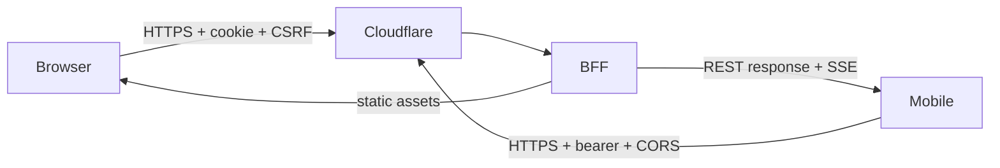

**Deployed — verified** cho mobile gồm CORS preflight từ origin `https://localhost`, bearer login, session restore, authenticated SSE và Android navigation smoke test. Web cookie flow tiếp tục dùng exact Origin/Host và CSRF token.

### 4.2 Message và command plane

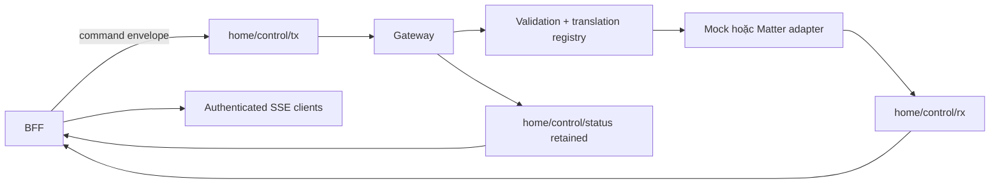

MQTT là boundary giữa BFF/WebUI và Gateway. MQTT không đi xuống node Matter và không được dùng cho BLE commissioning.

### 4.3 Matter và Thread plane

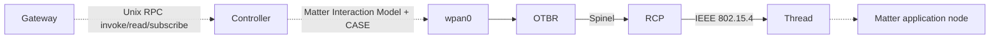

OTBR chạy OpenThread host stack. RCP cung cấp radio IEEE 802.15.4. Matter Controller sở hữu fabric/CASE, còn node sở hữu endpoint behavior.

### 4.4 Local-control plane

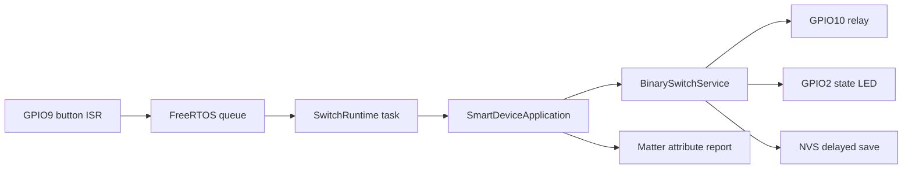

Đường local không phụ thuộc BBB, Internet, Cloudflare, MQTT, Controller hoặc Thread. Đây là local-first invariant của sản phẩm.

### 4.5 Commissioning plane mục tiêu

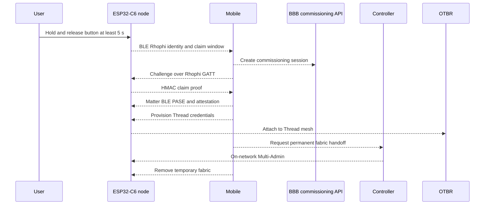

Toàn bộ sequence này là **planned/source-partial**. Firmware node đã có physical window, Rhophi claim source và Matter commissioning window. Mobile production vẫn dùng `UnavailableCommissioningService`; BBB chưa có commissioning/Multi-Admin RPC hoàn chỉnh.

## 5. Inventory thành phần

| Thành phần | Runtime/artifact | Owner/path | Trách nhiệm | Trạng thái |
|---|---|---|---|---|
| Browser WebUI | Vue + Pinia | sibling `agile-dashboard/apps/webui` | Dashboard, command UX, state rendering | Implemented; public path qua BFF |
| Rhophi Mobile | Ionic Vue + Capacitor Android | `mobileapp-reference/apps/mobile` | Login, dashboard controls, SSE, Add Device UX | Deployed/smoke-tested |
| Mobile client SDK | TypeScript package | `mobileapp-reference/packages/client-sdk` | REST, SSE parser, stores, contracts, static catalog | Implemented — verified |
| Android secure session | Capacitor Kotlin plugin | `SecureSessionPlugin.kt` | AES-256-GCM token persistence bằng Android Keystore | Build/smoke-tested; chưa instrumentation |
| Cloudflare Tunnel | `cloudflared` | BBB deployment | TLS/public ingress tới BFF | Deployed — verified |
| Web auth BFF | Node.js bundle | `agile-dashboard/packages/webui-bff` | Web/mobile auth, REST, SSE, MQTT bridge | Deployed — verified |
| Mosquitto | Linux service | `agile-dashboard/deploy/mosquitto` | Internal message bus, auth, ACL, persistence | Deployed — verified |
| Matter Gateway | Node.js service | `agile-dashboard/packages/gateway` | Validate contract, dispatch, normalize response | Deployed, controller mode mock |
| Matter Controller | matter.js service | `agile-dashboard/packages/matter-controller` | Fabric, CASE, node session, invoke, persistence | Deployed; API còn thiếu |
| Controller RPC | Unix socket JSON-lines | `/run/matter-controller/controller.sock` | Process boundary Gateway ↔ Controller | Implemented/deployed |
| OTBR | `otbr-agent` | BBB platform | Thread host stack, routing, dataset, `wpan0` | Deployed — verified leader |
| ESP32-C6 RCP | `ot_rcp` firmware | Separate RCP image | 802.15.4 radio qua Spinel | Deployed — verified |
| ESP32-C6 app node | ESP-IDF + ESP-Matter | `components/product_smart_device` | Matter server và local product behavior | Build/flash/boot verified; chưa BBB HIL |
| Board component | ESP-IDF component | `components/board_esp32c6` | Pin map và hardware composition | Active source |
| Product composition | `SmartDevice.cpp` | `product_smart_device/src/composition` | Tạo object graph và startup order | Active source |
| Product application | `SmartDeviceApplication` | `product_smart_device/src/application` | Semantic switch behavior | Active source |
| Runtime adapter | `SwitchRuntime` | `product_smart_device/src/runtime` | ISR queue, task và event serialization | Active source |
| State adapter | `NvsBinaryStateStore` | `product_smart_device/src/adapters` | Relay state schema và delayed commit | Active source |
| Matter adapter | `MatterNode` | `product_smart_device/src/matter` | Endpoint, Thread, commissioning, report | `matter_node` profile only |
| Reusable framework | C/C++ Layers 1–4 | `external/agile-firmware-framework` | UHAL, adapters, libraries, services | Active submodule |
| Reference snapshots | Source/docs copy | `dashboard-reference`, `reference` | Cross-reference/migration | Reference-only |

## 6. Mô hình layer

### 6.1 Firmware ESP32-C6

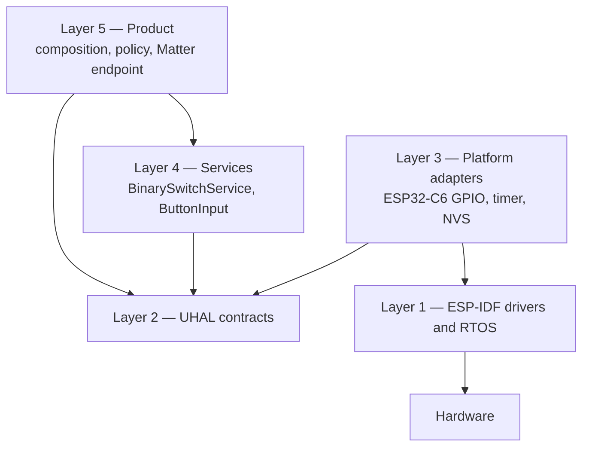

Dependency đi từ product xuống abstractions/adapters, không đi ngược từ framework vào product. `tools/check_layer_boundaries.py`, architecture tests và profile-gated CMake bảo vệ boundary này.

### 6.2 BBB Gateway

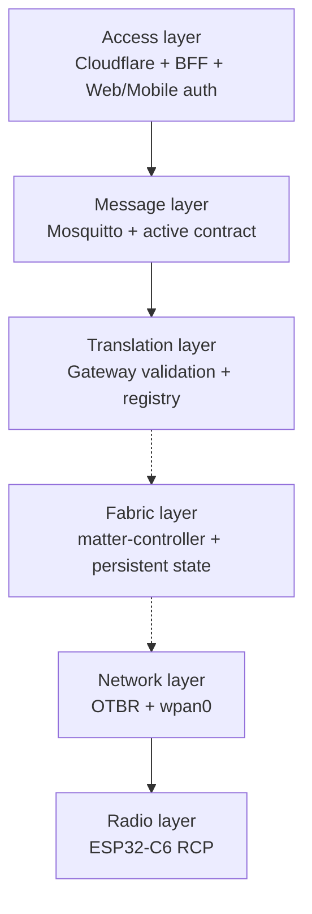

Process separation cho phép restart BFF, Gateway, Controller hoặc OTBR độc lập. Mỗi process chỉ sở hữu credential và device interface cần cho responsibility của nó.

## 7. Luồng dữ liệu end-to-end

### 7.1 Mobile login và session restore

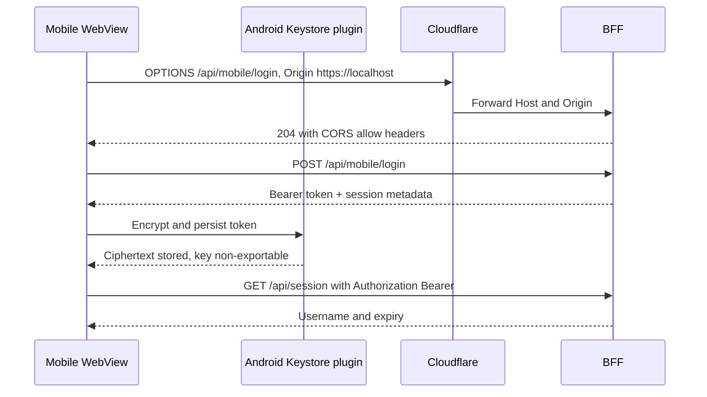

BFF chỉ lưu digest của bearer token trong session store. Raw token nằm trong Android Keystore-backed storage phía điện thoại và trong memory của request path.

### 7.2 Command từ client tới Gateway hiện tại

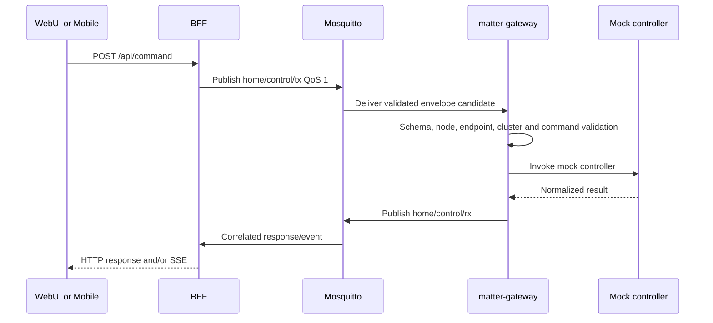

Đây là đường đang hoạt động nhưng kết quả vẫn là mock. Không được xem response hiện tại là bằng chứng relay thật đã đổi trạng thái.

### 7.3 Command path sau real-controller cutover

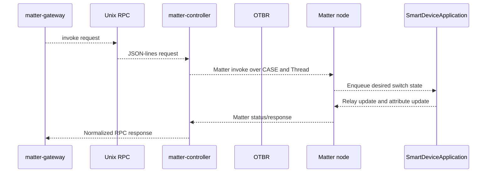

Các hop nét đứt chưa đạt HIL hoàn chỉnh. RPC hiện có `health`, `listNodes`, `invoke`; commissioning, remove, explicit read và subscription/event APIs còn thiếu.

### 7.4 Local button và unsolicited state

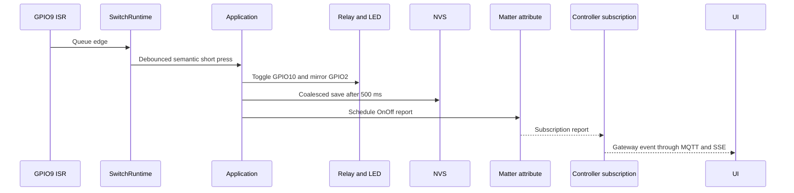

GPIO → relay/NVS/Matter attribute đã implement. Controller subscription → Gateway event → client vẫn là gap quan trọng nhất để UI biết local changes.

### 7.5 Boot và recovery

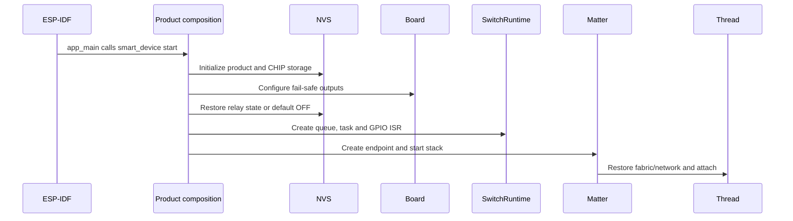

NVS, board, application hoặc runtime init failure làm startup fail. WS2812 init failure chỉ giảm khả năng indication, không được làm mất local relay control.

## 8. Protocol, port và authentication matrix

| Hop | Protocol/address | Authentication | Delivery/limit | Trạng thái |
|---|---|---|---|---|
| Browser → Cloudflare | HTTPS `dashboard.rhophi.uk:443` | Web cookie, CSRF, exact Origin/Host | Request/response + SSE | Deployed |
| Mobile → Cloudflare | HTTPS `:443`, origin `https://localhost` | Bearer token + CORS allowlist | REST + fetch-stream SSE | Deployed/verified |
| Cloudflare → BFF | HTTP `127.0.0.1:8082` | Tunnel token; original Host preserved | Local ingress | Deployed |
| Legacy browser → static UI | HTTP BBB `:8080` | LAN boundary | Static assets | Legacy |
| Legacy browser → broker | MQTT over WebSocket `:9001` | MQTT username/password | QoS contract | Legacy/direct path |
| BFF → Mosquitto | MQTT TCP `127.0.0.1:1883` | Dedicated MQTT account + ACL | QoS 1 command/response | Deployed |
| Gateway → Mosquitto | MQTT TCP `127.0.0.1:1883` | Dedicated Gateway account + ACL | TX read, RX/status write | Deployed |
| Gateway → Controller | Unix socket `/run/matter-controller/controller.sock` | Unix owner/group mode | JSON-lines RPC | Implemented/deployed |
| Controller → node | Matter UDP/IPv6 over `wpan0` | Fabric credentials + CASE | Interaction Model | Chưa HIL |
| OTBR → RCP | Spinel HDLC UART 460800 | Device ownership/systemd isolation | USB serial | Deployed |
| RCP → node | IEEE 802.15.4 Thread | Thread network keys | IPv6 mesh | OTBR verified; app node chưa joined |
| Phone → node | BLE GATT + Matter BTP | Physical window, claim proof, PASE/attestation | Commissioning only | Planned/source-partial |

BFF SSE dùng keepalive và reconnect. Client hỗ trợ `Last-Event-ID`, parser theo chunk boundary và exponential retry; server chưa cung cấp durable replay log.

## 9. Data ownership và contract boundaries

### 9.1 MQTT

Active topics gồm `home/control/tx`, `home/control/rx` và retained `home/control/status`. Payload/schema chi tiết thuộc [active MQTT contract](../full-context/03-contract-mqtt-gateway.md).

- Client public không publish MQTT trực tiếp.
- Gateway validate mọi envelope trước dispatch.
- Request ID dùng để correlate response.
- QoS 1 có thể redeliver, nên command path cần idempotency policy hoàn chỉnh.
- Namespace `asd/v1/...` trong [MQTT catalog note](mqtt-contract.md) không phải production Matter path.

### 9.2 Matter

| Item | Giá trị hiện tại |
|---|---|
| Root endpoint | 0 |
| Application endpoint | dynamic, hiện thường là 1 |
| Device type | On/Off Plug-in Unit `0x010A` |
| Server cluster | OnOff `0x0006` |
| State attribute | OnOff `0x0000` |
| Commands | Off, On, Toggle |

Gateway phải discover Descriptor/endpoint inventory; không được hard-code endpoint 1 cho mọi SKU tương lai.

### 9.3 Mobile REST/SSE

| Endpoint | Mục đích | Auth |
|---|---|---|
| `POST /api/mobile/login` | Tạo mobile bearer session | Public route + accepted origin |
| `GET /api/session` | Restore session | Bearer hoặc web cookie |
| `POST /api/logout` | Revoke session | Bearer; web cần CSRF |
| `POST /api/command` | Gửi typed command | Bearer hoặc web cookie/CSRF |
| `GET /api/events` | Authenticated SSE | Bearer hoặc web session |
| `GET /api/health` | BFF/MQTT health summary | Public operational status |

## 10. Trust boundaries và secret ownership

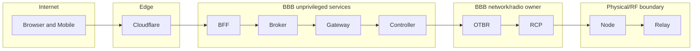

| Secret/state | Owner/storage | Ai được đọc | Không được xuất hiện ở đâu |
|---|---|---|---|
| Admin password | Chỉ hash scrypt trong BFF env | BFF | Git, logs, client storage |
| Web session | BFF store + HttpOnly Secure cookie | BFF/browser cookie jar | MQTT payload, logs |
| Mobile bearer | Digest trong BFF; encrypted token trên Android | BFF và Android app | SharedPreferences plaintext, logs |
| MQTT credentials | Root-owned env/credential files | BFF/Gateway tương ứng | Browser/mobile, Git |
| Matter fabric keys | `/var/lib/matter-controller` | Controller service | BFF, Gateway logs, MQTT |
| Thread dataset | OTBR/Thread state | OTBR và authorized commissioner | MQTT, firmware hard-code, logs |
| Device claim secret | Factory NVS `fctry/rhophi` | Node claim implementation | BLE plaintext response, Git, logs |
| DAC private key | Secure production provisioning target | Matter attestation implementation | Source tree, logs |
| Cloudflare tunnel token | Root-owned deployment secret | cloudflared | WebUI, Git, application logs |

Security invariants quan trọng.

- Browser/mobile không truy cập Controller socket hoặc fabric storage.
- Gateway không mở RCP serial.
- `otbr-agent` là owner duy nhất của RCP.
- Node không parse WebUI JSON hoặc MQTT payload.
- Commissioning credential không đi qua MQTT.
- Local relay phải tiếp tục hoạt động khi remote stack lỗi.

## 11. Persistence và state ownership

| Path/storage | Owner | Nội dung | Mất dữ liệu gây ra |
|---|---|---|---|
| `/var/lib/matter-web-auth` | BFF | Web/mobile session state | User phải login lại |
| `/etc/matter-web-auth/*.env` | root/BFF group | BFF, MQTT và admin config | BFF không start hoặc mất auth config |
| `/var/lib/mosquitto` | Mosquitto | Broker persistence | Retained status/session tùy config mất |
| `/var/lib/matter-controller` | Controller | Fabric, node metadata, CASE state | Có thể phải recommission node |
| `/var/lib/thread` | OTBR | Thread dataset/runtime state | Thread network mất hoặc phải restore dataset |
| `/run/matter-controller/controller.sock` | systemd/runtime | Ephemeral RPC socket | Tự tạo lại sau restart |
| Android Keystore + app storage | Mobile app | Encryption key, token ciphertext/IV | Mobile phải login lại |
| ESP32 NVS `smartdev` | Product firmware | Schema và `relay_on` | Relay restore về safe OFF |
| ESP32 CHIP/OpenThread NVS | Matter stack | Fabric/network/session state | Node factory-new hoặc phải commission lại |
| ESP32 factory `fctry/rhophi` | Manufacturing | Product ID, claim ID/secret | Claim/commissioning không hoạt động |

Backup phải bảo vệ credential và quyền file. Không copy fabric, dataset hoặc claim secret vào tài liệu, issue, CI log hay artifact công khai.

## 12. Startup, deployment và process ownership

### 12.1 BBB startup dependency

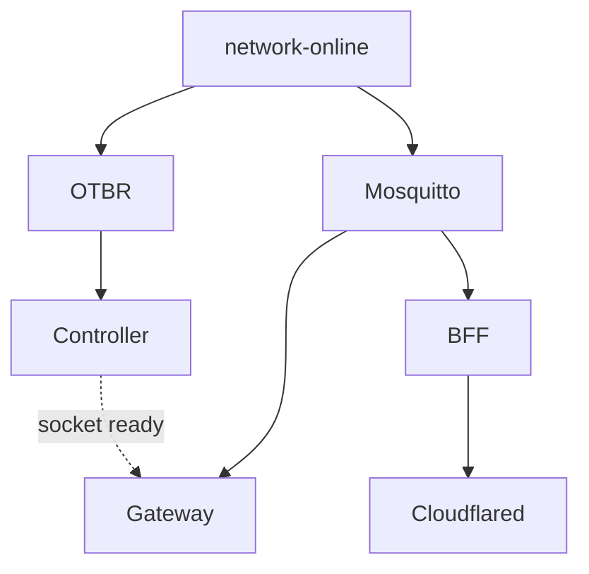

Systemd tách service users cho Mosquitto, Gateway, Controller và Web auth. Controller socket dùng group boundary `matter-rpc`. Service restart không được đòi reboot toàn BBB.

Các deployment entry point nằm trong sibling `agile-dashboard/deploy`.

- `install-production.sh`
- `install-web-auth.sh` và `update-web-auth.sh`
- `install-matter-controller.sh`
- `verify-production.sh`
- systemd units, Mosquitto config/ACL và Cloudflare config

### 12.2 Firmware build profiles

| Profile | Mục đích | Matter/Thread |
|---|---|---|
| `local_switch` | Local relay/button regression baseline | Không |
| `matter_node` | ESP32-C6 Matter-over-Thread product | Có |
| `gateway_node` | Framework-connected alternative profile | Không phải active Matter product path |

Matter build dùng ESP-IDF/ESP-Matter/ConnectedHomeIP pin được ghi trong [matter-node.md](matter-node.md), `sdkconfig.defaults.matter_node` và `partitions_matter.csv`. Local và Matter builds phải chạy tuần tự vì dùng chung generated `managed_components/`.

## 13. Observability

| Signal | Nơi phát | Cách đọc | Giới hạn |
|---|---|---|---|
| BFF health | `/api/health` | HTTPS/curl/app | Chỉ phản ánh BFF/MQTT, không chứng minh Matter ready |
| SSE connected | BFF + mobile store | Badge `Live` | Không chứng minh node thật online khi Gateway mock |
| Gateway status | retained MQTT status/LWT | Broker subscriber/BFF | Cần phân biệt mock/real mode |
| Controller health | Unix RPC `health` | `matter-rpc-health.mjs` | RPC surface còn hẹp |
| BBB service state | systemd | `systemctl`, `journalctl` | Process active không đồng nghĩa HIL pass |
| Thread state | OTBR | `ot-ctl state`, child table | Leader với empty child table không có app node |
| RCP ownership | Linux | `fuser` trên serial path | USB re-enumeration cần stable udev path |
| Node startup | ESP-IDF logs | UART/USB serial | Cần lưu reset reason và heap evidence |
| Product actions | firmware tags | Serial logs/HIL probes | Không log secret |

Blind spots hiện tại gồm subscription restoration, node reachability, command queue high-water mark, ISR queue drop counter, durable SSE replay và health tổng hợp Matter/Thread.

## 14. Failure modes và blast radius

| Sự cố | Phát hiện | Ảnh hưởng | Hành vi yêu cầu/hiện tại |
|---|---|---|---|
| Cloudflare down | Public HTTPS fail | Remote access mất | Local BBB và node vẫn chạy |
| BFF down | `/api/health` fail | Public Web/Mobile mất | Broker/Gateway/node không bị dừng |
| Mosquitto down | BFF health/LWT | Command/event bus mất | BFF/Gateway reconnect; local relay vẫn chạy |
| Gateway down | retained status/log | Không dispatch command | Controller/OTBR/node độc lập |
| Controller down | RPC health fail | Matter command path mất | Gateway báo typed error; local relay vẫn chạy |
| Controller storage mất | Fabric/node list thay đổi | CASE/fabric mất | Có thể cần recommission; không tự tạo fabric tùy tiện |
| OTBR hoặc RCP down | `ot-ctl`, child table, serial owner | Thread partition | Node local control còn; remote Matter mất |
| App node offline | reachability/subscription timeout | Một device unavailable | Không block các node khác |
| Matter command queue full | Matter write rejected | Command đơn lẻ fail | Không silent drop |
| GPIO ISR queue full | Chưa có counter đầy đủ | Có thể mất local edge | Cần telemetry/HIL và bounded recovery |
| Product NVS corrupt/missing | Restore log | Relay state history mất | Safe OFF default |
| WS2812 init fail | Warning log | Mất lifecycle indication | Không làm mất relay/Matter core |
| Mobile token mất | Session restore 401 | Một client logout | Login lại, không ảnh hưởng fabric |
| Duplicate MQTT QoS 1 | Repeated request ID | Có thể invoke lặp | Cần idempotency/dedup end-to-end |
| Claim replay/brute force | Claim error/attempt count | Commissioning bị chặn | Reject replay, bounded attempts, không lộ secret |

## 15. Trạng thái end-to-end hiện tại

### 15.1 Đã xác nhận

- BBB chạy OTBR leader với ESP32-C6 RCP.
- Mosquitto, Gateway, Controller, BFF và Cloudflare public path tồn tại.
- Mobile bearer auth/CORS, session restore và authenticated SSE hoạt động trên Android thật.
- Node Matter profile build, flash, boot, tạo OnOff endpoint và start OpenThread/Matter server.
- Local button/relay/state ownership có host tests và source boundary rõ ràng.
- Fabric/controller storage và Unix RPC tồn tại.

### 15.2 Đang mock hoặc static

- Gateway production vẫn dispatch qua mock Controller.
- Mobile device catalog hard-code Phase A node/endpoints.
- UI controls có thể phản hồi mock state, không phải hardware evidence.

### 15.3 Chưa hoàn thành

- Commission application node vào fabric BBB chính thức.
- `commission`, `removeNode`, `read`, `subscribe`, event forwarding và subscription restore RPC.
- Local button → Matter report → Controller → Gateway → SSE end-to-end.
- Native Android BLE/Matter commissioning, PASE/attestation và Multi-Admin handoff.
- Production attestation material, unique identity, secure boot, flash/NVS encryption và debug policy.
- Signed OTA, rollback/anti-rollback, power-cycle, Thread outage, brownout và soak testing.
- Dynamic inventory và production release/distribution cho mobile.

## 16. Nguyên tắc phát triển tiếp theo

1. Không đưa MQTT hoặc WebUI JSON xuống Matter node.
2. Không dùng RCP như application node.
3. Không đánh dấu UI/mock response là HIL pass.
4. Commissioning phải dùng Matter PASE/attestation và Thread credential flow chuẩn.
5. Local control luôn độc lập với remote stack.
6. Mọi cross-process payload phải bounded, validated và redacted.
7. Gateway phải discover endpoint/cluster, không hard-code endpoint 1 cho SKU mới.
8. Unsolicited state/subscription là requirement, không chỉ command-response.
9. Source tồn tại không đồng nghĩa đã deploy; mọi status phải ghi bằng chứng.
10. Secret không đi qua Git, logs, MQTT hoặc tài liệu.

## 17. Source of truth

Khi thông tin mâu thuẫn, dùng thứ tự ưu tiên sau.

1. Source, build config, tests, live BBB probe và hardware evidence.
2. Tài liệu architecture trong thư mục này.
3. Handbook.
4. `docs/full-context/` như shared snapshot.
5. `dashboard-reference/` và `reference/` chỉ để đối chiếu.

Canonical repositories và context.

- `agile-smart-device` sở hữu firmware application node, board, product composition và HIL contract.
- Sibling `C:\Users\lesli\WS\agile-dashboard` sở hữu WebUI, contracts, Gateway, Controller và BBB deployment.
- `mobileapp-reference` chứa Mobile Phase A source/context trong workspace hiện tại.
- `external/agile-firmware-framework` sở hữu reusable firmware Layers 1–4.

Tài liệu này phải được cập nhật khi thay đổi endpoint/cluster, MQTT contract, BFF route/auth, Controller RPC, Thread topology, persistent state, firmware profile hoặc deployment path.
