# Kiến trúc hệ thống

> Đây là shared snapshot. Bản đồ canonical cập nhật về Mobile, Cloudflare, BFF, MQTT, Gateway, Controller, OTBR/RCP và Matter node nằm tại [kiến trúc toàn hệ thống](../architecture/system-overview.md).

## Sơ đồ end-to-end mục tiêu

```mermaid
flowchart LR
  UI["Vue WebUI"] -->|"MQTT over WebSocket 9001"| MQ["Mosquitto on BBB"]
  MQ -->|"home/control/tx"| GW["Node.js Gateway"]
  GW --> TL["Translation Registry"]
  TL --> MC["Matter Controller adapter"]
  MC --> IP["IPv6 interface from OTBR"]
  IP --> OTBR["otbr-agent"]
  OTBR -->|"Spinel/HDLC USB"| RCP["ESP32-C6 RCP"]
  RCP -->|"IEEE 802.15.4 Thread"| NODE["ESP32-C6 Matter application node"]
  NODE -->|"Matter attribute/event"| MC
  GW -->|"home/control/rx"| MQ
  MQ --> UI
```

## Ba loại ESP32-C6 không được nhầm

### RCP

- firmware `ot_rcp`
- radio-only role
- không có Smart Home endpoint
- không commission như Matter device
- giao tiếp BBB bằng Spinel

### Application node

- firmware ESP-Matter device
- có discriminator, passcode và device attestation
- join Thread network
- có endpoint, cluster, attribute và command
- giao tiếp bằng Matter Interaction Model qua IPv6

### Development/debug board

Một board có thể được dùng build/flash/probe trong lab, nhưng production role phải rõ. Không giả định một C6 vừa làm RCP vừa làm application node.

## Boundary và ownership

| Tài nguyên | Owner |
|---|---|
| USB RCP device | `otbr-agent` |
| Thread dataset và routing | OTBR/OpenThread host |
| Matter fabric credentials | Matter Controller service |
| MQTT topics | Mosquitto + gateway policy |
| JSON validation | shared contracts + gateway |
| Endpoint behavior | ESP32-C6 application firmware |
| UI state | Pinia, cập nhật từ response/event |

## Luồng command

1. Widget tạo envelope có request ID.
2. WebUI publish TX.
3. Gateway validate JSON, IDs và payload.
4. Registry chọn cluster handler.
5. Matter Controller adapter invoke node/endpoint/cluster/command.
6. Node thực thi và cập nhật attribute.
7. Controller nhận invoke response hoặc subscription report.
8. Gateway publish normalized RX.
9. Pinia merge attributes và Vue render.

## Luồng unsolicited state

Node có thể thay đổi do local button, sensor, timer hoặc safety logic. Firmware phải update Matter attribute và tạo report. Gateway không được chỉ biết trạng thái từ command do WebUI gửi.

## Trạng thái implementation hiện tại

Matter.js Controller 0.17.9 service và persistent fabric storage đã được triển khai trên BBB. Unix RPC hiện expose `health`, `listNodes` và `invoke`. Gateway production vẫn giữ mock mode khi chưa có application node được commission.

Các ranh giới còn thiếu trước HIL/final cutover:

- commissioning và remove/decommission API
- explicit read và subscription/event streaming
- inventory/subscription restoration đã kiểm chứng
- CASE/invoke/read/subscribe với node thật
- timeout và Matter status mapping end-to-end
- node discovery/reachability/reconnect acceptance

Node team không chờ JSON/UART protocol. Họ xây Matter server chuẩn để bất kỳ Matter Controller tương thích nào cũng điều khiển được.
