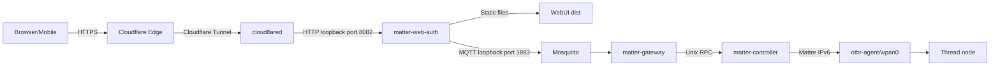

# Vận hành production trên BeagleBone Black Debian 11

Tài liệu này là hướng dẫn vận hành chính thức cho BBB đang phục vụ domain `https://dashboard.rhophi.uk/`. Tài liệu [BBB command appendix](04-beaglebone-black-operations.md) chỉ là phụ lục tra cứu lệnh chi tiết.

## 1. Trạng thái as-built đã xác minh

| Hạng mục | Giá trị as-built |
|---|---|
| OS | Debian GNU/Linux 11 Bullseye |
| Kernel | TI 5.10.168-ti-r72 |
| CPU architecture | ARM/armv7l |
| Public domain | `https://dashboard.rhophi.uk/` |
| Public ingress | Cloudflare Tunnel token mode |
| Tunnel origin | `http://127.0.0.1:8082` |
| BFF/WebUI | `matter-web-auth`, bind `127.0.0.1:8082` |
| Matter Controller | Matter.js 0.17.9, Unix RPC |
| Gateway | MQTT → Unix RPC, `CONTROLLER_MODE=matterjs` |
| Thread | `otbr-agent`, `wpan0`, ESP32-C6 RCP |
| MQTT | Mosquitto 1883 loopback; legacy WS 9001 all interfaces |
| Legacy WebUI | Python static server 8080, vẫn đang active |
| Nginx | Default HTTP site port 80, không phục vụ domain production tunnel |

Public verification ngày 2026-08-19:

```text
GET https://dashboard.rhophi.uk/          -> HTTP 200
GET https://dashboard.rhophi.uk/api/health -> ok=true, mqtt_connected=true
```

## 2. Production request path



`nginx:80`, `matter-webui:8080` và MQTT WebSocket `:9001` không nằm trên đường production mới. Chúng là legacy compatibility surface.

## 3. BBB có source code cần lưu không?

### Kết luận

BBB **không được coi là source-code repository authoritative**. Source chuẩn phải nằm trong Git trên workstation/server source control. BBB hiện chứa ba loại dữ liệu khác nhau:

1. **Artifact có thể rebuild** — `.cjs`, static WebUI, Node binary.
2. **Cấu hình triển khai phải version hóa dạng template và backup** — systemd, env schema, Mosquitto, OTBR, radvd, cloudflared unit.
3. **State/secret không thể rebuild từ source** — Matter fabric, Thread state/dataset, registry key, provisioning registry, admin hash/token.

### Phân loại cụ thể

| Path | Loại | Bắt buộc backup | Có thể rebuild | Ghi chú |
|---|---|---:|---:|---|
| `/opt/matter-controller/matter-controller.cjs` | artifact | Có để rollback nhanh | Có | Build từ `dashboard-reference` |
| `/opt/matter-gateway/gateway.cjs` | artifact | Có để rollback nhanh | Có | Không phải source |
| `/opt/matter-web-auth/webui-bff.cjs` | artifact | Có để rollback nhanh | Có | Không phải source |
| `/opt/matter-web-auth/public/` | artifact | Không bắt buộc | Có | WebUI static dist |
| `/opt/node20/` | runtime | Không nếu có installer | Có | Phải đúng ARM |
| `/etc/systemd/system/matter-*.service` | config | Có | Có từ deploy templates | Active service definition |
| `/etc/matter-gateway/gateway.env` | config + secret | **Có, mã hóa** | Không hoàn toàn | Có MQTT password |
| `/etc/matter-web-auth/webui.env` | config + secret | **Có, mã hóa** | Không hoàn toàn | Có MQTT password/path |
| `/etc/matter-web-auth/admin.env` | auth state | **Có, mã hóa** | Có thể rotate | Chứa username/password hash |
| `/etc/matter-provisioning/registry.key` | secret | **Critical** | Không | Mất key không giải mã registry |
| `/etc/matter-provisioning/devices.registry.enc` | manufacturing registry | **Critical** | Chỉ rebuild từ manufacturing source | Per-device records đã mã hóa |
| `/etc/matter-provisioning/thread-dataset.hex` | Thread secret | **Critical** | Có thể lấy từ OTBR nếu state còn | Không được cat/log |
| `/var/lib/matter-controller/` | permanent fabric state | **Critical** | Không | Mất sẽ mất BBB controller identity/fabrics |
| `/var/lib/thread/` | OTBR/Thread state | **Critical** | Không an toàn để tái tạo tùy tiện | Network dataset/state |
| `/var/lib/matter-web-auth/` | session/transaction state | Nên backup | Có thể tái tạo một phần | Commissioning recovery |
| `/etc/cloudflared/token` | tunnel secret | **Critical/rotatable** | Chỉ từ Cloudflare | Mode 0600 root |
| Cloudflare hostname route | cloud-side config | **Critical documentation** | Không nằm trên BBB | Mapping domain → origin |
| `/etc/default/otbr-agent` | RCP config | Có | Có nếu biết by-id URL |
| `/etc/radvd.conf` | Android OMR route workaround | Có | Có | Có link-local phone lab |
| `/etc/sysctl.d/90-otbr-routing.conf` | IPv6 forwarding | Có | Có | Network behavior |
| `/etc/mosquitto/passwd` | credential DB | **Có, mã hóa** | Có thể rotate | Không cat |
| `/etc/mosquitto/aclfile` | ACL | Có | Có từ template | Authorization policy |

## 4. Staging directories hiện tại

BBB hiện có:

```text
/home/leslie/agile-dashboard/      khoảng 12 MiB
/home/debian/rhophi-deploy/        khoảng 7.4 MiB
```

Các thư mục này chứa bundles, scripts và bản copy provisioning files. Chúng **không phải source authoritative**.

### Nội dung cần giữ tạm

- Installer/update/verify scripts đang dùng trong operation.
- Bundle hiện tại và bundle rollback cho tới khi release được archive ở nơi khác.
- Manifest checksum/version của artifact deployed.

### Nội dung không nên lưu lâu trên staging

- `registry.key`.
- Thread dataset.
- Plaintext login/password file.
- Duplicate encrypted registry nếu không cần rollback.

Sau khi deployment được xác minh và backup bảo mật đã tồn tại, xóa duplicate secret khỏi staging:

```bash
sudo find /home/leslie/agile-dashboard /home/debian/rhophi-deploy \
  -maxdepth 2 -type f \
  \( -name 'registry.key' -o -name 'thread-dataset.hex' -o -name 'webui-login.txt' \) \
  -ls
```

Lệnh trên **chỉ liệt kê**, chưa xóa. Review output trước.

Xóa từng file đã xác nhận:

```bash
sudo shred -u /home/debian/rhophi-deploy/registry.key
```

- `shred -u` overwrite rồi unlink; trên flash/eMMC journaling không đảm bảo xóa vật lý tuyệt đối.
- Cách đúng vẫn là hạn chế tạo duplicate ngay từ đầu và rotate secret nếu nghi lộ.

Không dùng wildcard rộng với secret cleanup.

## 5. Cấu trúc production trên BBB

```text
/opt/
├── node20/
├── matter-controller/
│   └── matter-controller.cjs
├── matter-gateway/
│   └── gateway.cjs
└── matter-web-auth/
    ├── webui-bff.cjs
    └── public/

/etc/
├── default/otbr-agent
├── matter-gateway/gateway.env
├── matter-web-auth/{webui.env,admin.env}
├── matter-provisioning/{devices.registry.enc,registry.key,thread-dataset.hex}
├── cloudflared/token
├── mosquitto/{passwd,aclfile,conf.d/matter.conf}
├── radvd.conf
├── sysctl.d/90-otbr-routing.conf
└── systemd/system/

/var/lib/
├── matter-controller/
├── matter-web-auth/
└── thread/
```

## 6. Dịch vụ production và mục đích

| Service | User | Port/socket | Mục đích |
|---|---|---|---|
| `cloudflared` | root | outbound tunnel | Domain HTTPS → BFF 8082 |
| `matter-web-auth` | matter-webui | 127.0.0.1:8082 | BFF, REST, SSE, static WebUI |
| `mosquitto` | mosquitto | 127.0.0.1:1883 | Internal MQTT |
| `matter-gateway` | matter-gateway | MQTT + Unix socket | Contract bridge |
| `matter-controller` | matter-controller | `/run/matter-controller/controller.sock` | Permanent Matter fabric |
| `otbr-agent` | root | wpan0/RCP | Thread Border Router |
| `radvd` | root | ICMPv6 RA | Android OMR route workaround |
| `matter-webui` | matter-webui | 0.0.0.0:8080 | **Legacy static UI** |
| `nginx` | www-data | 0.0.0.0:80 | **Default site, không dùng bởi domain tunnel** |

## 7. Cloudflare Tunnel và domain

### As-built

Systemd unit chạy:

```text
/usr/local/bin/cloudflared --no-autoupdate tunnel run --token-file /etc/cloudflared/token
```

Token tunnel nằm local; hostname route `dashboard.rhophi.uk` được quản lý ở Cloudflare dashboard/API và trỏ origin:

```text
http://127.0.0.1:8082
```

Không có `config.yml` local trong token mode hiện tại.

### Kiểm tra từ bên ngoài

```bash
curl -I https://dashboard.rhophi.uk/
curl -fsS https://dashboard.rhophi.uk/api/health | jq
```

- `curl -I` kiểm HTTP headers/CSP/cache mà không tải body.
- `-f` fail với HTTP >=400.
- `-sS` giảm output nhưng vẫn hiện lỗi.
- `jq` format health JSON.

Expected:

```json
{"ok":true,"mqtt_connected":true,"sse_clients":0}
```

`sse_clients` thay đổi theo số browser/mobile đang online.

### Kiểm tra origin local

```bash
curl -fsS http://127.0.0.1:8082/api/health | jq
curl -I http://127.0.0.1:8082/
```

Nếu origin local pass nhưng public fail, lỗi thuộc cloudflared/DNS/Cloudflare route. Nếu local fail, lỗi thuộc BFF/MQTT.

### Điều khiển cloudflared

```bash
sudo systemctl status cloudflared --no-pager --full
sudo journalctl -u cloudflared --since '10 minutes ago' --no-pager
sudo systemctl restart cloudflared
```

- Restart tunnel ngắt public dashboard ngắn nhưng không dừng Matter/Thread.
- Log `stream ... canceled by remote` tại `/api/events` thường xuất hiện khi browser đóng SSE; chỉ coi là sự cố nếu reconnect/health cũng fail.

### Token

```bash
sudo stat /etc/cloudflared/token
```

Chỉ xem metadata. Không `cat` token. Token phải mode 0600 root. Nếu lộ, rotate từ Cloudflare và cập nhật file bằng secure channel.

### Cloud-side config cần ghi lại ngoài BBB

- Account/zone owner.
- Tunnel name/ID.
- Public hostname `dashboard.rhophi.uk`.
- Origin `http://127.0.0.1:8082`.
- Access policy/WAF/TLS settings.
- Quy trình rotate token.

BBB backup không tự backup phần cấu hình Cloudflare này.

## 8. WebUI production path

BFF phục vụ cả API và static files từ:

```text
/opt/matter-web-auth/public
```

BFF bind:

```text
127.0.0.1:8082
```

Đây là thiết kế đúng: không expose origin trực tiếp; Cloudflare Tunnel là public ingress.

Kiểm file deployed:

```bash
sudo find /opt/matter-web-auth/public -maxdepth 2 -type f \
  -printf '%M %u:%g %s %p\n'
```

Expected có `index.html` và hashed assets.

Kiểm hash artifact trước/sau deploy:

```bash
sha256sum /opt/matter-web-auth/webui-bff.cjs
find /opt/matter-web-auth/public -type f -print0 | sort -z | xargs -0 sha256sum
```

Lưu manifest hash, không lưu secret.

## 9. Legacy surfaces cần migration

### `matter-webui` port 8080

Hiện service chạy Python static server bind mọi interface:

```text
python3 -m http.server 8080 --bind 0.0.0.0 --directory /opt/matter-webui
```

Domain production không dùng service này. Sau khi xác minh BFF WebUI đầy đủ:

```bash
sudo systemctl stop matter-webui
sudo systemctl disable matter-webui
```

- `stop` đóng port 8080 ngay.
- `disable` ngăn chạy sau reboot.

Rollback:

```bash
sudo systemctl enable --now matter-webui
```

### Nginx port 80

Nginx hiện phục vụ default `/var/www/html`, không proxy domain production. Nếu không có workload khác:

```bash
sudo systemctl stop nginx
sudo systemctl disable nginx
```

Trước khi tắt:

```bash
sudo nginx -T
sudo ss -ltnp | grep ':80 '
```

Nếu Nginx được dùng cho workload khác, giữ lại và document server block thật.

### MQTT WebSocket port 9001

Mosquitto đang listen `9001` trên mọi interface. BFF WebUI mới không cần browser direct MQTT. Kiểm client legacy trước khi bỏ.

Tìm connection:

```bash
sudo ss -tnp | grep ':9001'
sudo journalctl -u mosquitto --since '1 hour ago' --no-pager
```

Sau migration, xóa/comment listener 9001 trong `/etc/mosquitto/conf.d/matter.conf`, validate và restart:

```bash
sudo mosquitto -c /etc/mosquitto/mosquitto.conf -t
sudo systemctl restart mosquitto
```

Giữ listener 1883 loopback cho BFF/Gateway.

## 10. Source, artifact và deployment workflow

### Source authoritative

Source phải ở Git trên workstation/CI:

```text
agile-smart-device/dashboard-reference/
```

Không sửa trực tiếp `.cjs` trong `/opt`. Mọi fix phải:

1. sửa TypeScript/Vue source,
2. test/build trên Ubuntu 24.04,
3. tạo artifact,
4. stage lên BBB,
5. backup artifact cũ,
6. install/restart/verify,
7. lưu manifest/version.

### BBB không cần full repository để chạy

Runtime chỉ cần:

- Node ARM runtime.
- `.cjs` bundles.
- static WebUI.
- systemd/config/state/secrets.

Giữ full Git checkout trên BBB chỉ khi có operational requirement rõ; nếu có, phải pin commit và không chứa secret untracked.

## 11. Build release trên Ubuntu 24.04

```bash
cd "$PROJECT_DIR/dashboard-reference"
npm ci
npm run typecheck
npm test -- --run
npm run build
```

Tạo bundles:

```bash
export RELEASE_DIR="$HOME/releases/agile-dashboard/$(date +%Y%m%d-%H%M%S)"
mkdir -p "$RELEASE_DIR/webui"

npx esbuild packages/matter-controller/src/main.ts \
  --bundle --platform=node --format=cjs --external:bun:sqlite \
  --outfile="$RELEASE_DIR/matter-controller.cjs"

npx esbuild packages/gateway/src/main.ts \
  --bundle --platform=node --format=cjs \
  --outfile="$RELEASE_DIR/gateway.cjs"

npx esbuild packages/webui-bff/src/main.ts \
  --bundle --platform=node --format=cjs \
  --outfile="$RELEASE_DIR/webui-bff.cjs"

rsync -a apps/webui/dist/ "$RELEASE_DIR/webui/"
```

Tạo manifest:

```bash
find "$RELEASE_DIR" -type f -print0 | sort -z | xargs -0 sha256sum \
  > "$RELEASE_DIR/SHA256SUMS"
```

Lưu thêm:

```bash
git rev-parse HEAD > "$RELEASE_DIR/SOURCE_COMMIT"
node --version > "$RELEASE_DIR/BUILD_NODE_VERSION"
```

Không đưa env/secret vào release artifact directory.

## 12. Stage release lên BBB

```bash
ssh "$BBB_USER@$BBB_HOST" 'mkdir -p ~/releases/incoming'
rsync -av --delete "$RELEASE_DIR/" \
  "$BBB_USER@$BBB_HOST:~/releases/incoming/"
```

- `-a` archive mode.
- `-v` verbose.
- `--delete` xóa file remote không còn trong release; chỉ dùng trong directory incoming riêng.

Xác minh trên BBB:

```bash
ssh "$BBB_USER@$BBB_HOST" \
  'cd ~/releases/incoming && sha256sum -c SHA256SUMS'
```

## 13. Backup trước deploy

### Backup critical state và config

```bash
sudo install -d -m 0700 /var/backups/agile-smart-device
BACKUP="/var/backups/agile-smart-device/bbb-$(date +%Y%m%d-%H%M%S).tar.gz"

sudo tar -C / -czf "$BACKUP" \
  etc/default/otbr-agent \
  etc/matter-gateway \
  etc/matter-web-auth \
  etc/matter-provisioning \
  etc/cloudflared \
  etc/mosquitto \
  etc/radvd.conf \
  etc/sysctl.d/90-otbr-routing.conf \
  etc/systemd/system/matter-controller.service \
  etc/systemd/system/matter-gateway.service \
  etc/systemd/system/matter-gateway.service.d \
  etc/systemd/system/matter-web-auth.service \
  etc/systemd/system/cloudflared.service \
  var/lib/matter-controller \
  var/lib/matter-web-auth \
  var/lib/thread

sudo chmod 0600 "$BACKUP"
```

Archive chứa secret và fabric key. Chuyển nó sang encrypted backup store; không commit/upload công khai.

Kiểm archive:

```bash
sudo tar -tzf "$BACKUP"
```

### Backup artifact rollback

```bash
STAMP="$(date +%Y%m%d-%H%M%S)"
sudo cp -a /opt/matter-controller/matter-controller.cjs \
  "/opt/matter-controller/matter-controller.cjs.$STAMP"
sudo cp -a /opt/matter-gateway/gateway.cjs \
  "/opt/matter-gateway/gateway.cjs.$STAMP"
sudo cp -a /opt/matter-web-auth/webui-bff.cjs \
  "/opt/matter-web-auth/webui-bff.cjs.$STAMP"
```

## 14. Deploy theo dependency order

### 14.1 Controller

```bash
sudo install -m 0644 ~/releases/incoming/matter-controller.cjs \
  /opt/matter-controller/matter-controller.cjs
sudo systemctl restart matter-controller
```

Đợi socket:

```bash
sudo timeout 300 bash -c '
  until test -S /run/matter-controller/controller.sock; do
    read -t 2 || true
  done
'
```

Health RPC:

```bash
printf '%s\n' '{"id":"deploy-health","method":"health"}' | \
  sudo -u matter-gateway socat - UNIX-CONNECT:/run/matter-controller/controller.sock | jq
```

Không deploy Gateway tiếp nếu controller chưa `ready=true`.

### 14.2 Gateway

```bash
sudo install -m 0644 ~/releases/incoming/gateway.cjs \
  /opt/matter-gateway/gateway.cjs
sudo systemctl restart matter-gateway
sudo systemctl is-active matter-gateway
```

Kiểm env mode thật:

```bash
sudo grep '^CONTROLLER_MODE=' /etc/matter-gateway/gateway.env
```

Expected `matterjs`.

### 14.3 BFF và WebUI

```bash
sudo install -m 0644 ~/releases/incoming/webui-bff.cjs \
  /opt/matter-web-auth/webui-bff.cjs
sudo rsync -a --delete ~/releases/incoming/webui/ \
  /opt/matter-web-auth/public/
sudo chown -R root:root /opt/matter-web-auth/public
sudo systemctl restart matter-web-auth
```

- `--delete` bảo đảm asset hash cũ không tồn tại.
- static files không cần writable bởi service user.

### 14.4 Verify local/public

```bash
curl -fsS http://127.0.0.1:8082/api/health | jq
curl -fsS https://dashboard.rhophi.uk/api/health | jq
```

Sau đó login, inventory, SSE và OnOff smoke test.

## 15. Rollback release

Nếu controller/Gateway/BFF fail:

```bash
sudo cp -a /opt/matter-controller/matter-controller.cjs.<STAMP> \
  /opt/matter-controller/matter-controller.cjs
sudo cp -a /opt/matter-gateway/gateway.cjs.<STAMP> \
  /opt/matter-gateway/gateway.cjs
sudo cp -a /opt/matter-web-auth/webui-bff.cjs.<STAMP> \
  /opt/matter-web-auth/webui-bff.cjs

sudo systemctl restart matter-controller
sudo systemctl restart matter-gateway matter-web-auth
```

Không restore `/var/lib/matter-controller` trừ khi migration đã thay state và có quyết định rollback state riêng.

## 16. Restore BBB mới từ backup

### 16.1 Cài OS/tools

- Flash Debian 11 image phù hợp BBB.
- Cấu hình SSH key, hostname, clock/NTP.
- Cài Mosquitto, OTBR, Node ARM, cloudflared, socat, jq, radvd.

### 16.2 Restore config/state khi services đang dừng

```bash
sudo systemctl stop cloudflared matter-web-auth matter-gateway matter-controller otbr-agent mosquitto
sudo tar -C / -xzf /secure/path/<backup>.tar.gz
sudo systemctl daemon-reload
```

### 16.3 Restore artifacts

Install bundles/static UI từ release archive, không từ random staging directory.

### 16.4 Start theo thứ tự

```bash
sudo systemctl start mosquitto
sudo systemctl start otbr-agent
sudo systemctl start matter-controller
sudo systemctl start matter-gateway
sudo systemctl start matter-web-auth
sudo systemctl start cloudflared
```

### 16.5 Verify

- OTBR state/OMR.
- Controller fabric/node list.
- BFF local health.
- Public domain health.
- Inventory và OnOff.

## 17. Daily operations

### Một lệnh tổng quan

```bash
systemctl is-active \
  mosquitto otbr-agent matter-controller matter-gateway matter-web-auth cloudflared
systemctl --failed
```

### Health

```bash
sudo ot-ctl state
ip -6 addr show wpan0
curl -fsS http://127.0.0.1:8082/api/health | jq
curl -fsS https://dashboard.rhophi.uk/api/health | jq
```

### Disk/RAM

```bash
df -h
free -h
sudo du -sh /var/lib/matter-controller /var/lib/thread /var/lib/matter-web-auth
```

### Logs

```bash
sudo journalctl \
  -u otbr-agent \
  -u matter-controller \
  -u matter-gateway \
  -u matter-web-auth \
  -u cloudflared \
  --since '30 minutes ago' --no-pager
```

## 18. Weekly operations

- Verify encrypted backup can be listed/decrypted.
- Check disk growth and journal usage.
- Check failed/restart counts.
- Verify Cloudflare token and DNS ownership contacts.
- Record deployed artifact SHA/source commit.
- Run one OnOff command and one local-button subscription test.
- Confirm no secret duplicates remain in staging.

Commands:

```bash
systemctl show matter-controller matter-gateway matter-web-auth \
  -p NRestarts -p ActiveEnterTimestamp
journalctl --disk-usage
sha256sum \
  /opt/matter-controller/matter-controller.cjs \
  /opt/matter-gateway/gateway.cjs \
  /opt/matter-web-auth/webui-bff.cjs
```

## 19. Start, stop và maintenance mode

### Stop public access nhưng giữ Matter/Thread

```bash
sudo systemctl stop cloudflared
```

BFF local vẫn chạy; public domain offline.

### Stop UI/API nhưng giữ device control backend

```bash
sudo systemctl stop cloudflared matter-web-auth
```

Gateway/Controller/Thread vẫn chạy.

### Stop Gateway command bridge nhưng giữ fabric

```bash
sudo systemctl stop matter-gateway
```

Matter Controller storage và Thread vẫn giữ.

### Stop Controller

```bash
sudo systemctl stop matter-controller
```

Permanent fabric state giữ trên disk nhưng command/subscription offline.

### Stop Thread Border Router

```bash
sudo systemctl stop otbr-agent
```

Thread routing offline; local node behavior vẫn phải hoạt động.

### Start toàn production path

```bash
sudo systemctl start mosquitto otbr-agent matter-controller
sudo systemctl start matter-gateway matter-web-auth cloudflared
```

## 20. Quản lý node

### Trước khi thêm node

```bash
sudo ot-ctl state
printf '%s\n' '{"id":"pre-add","method":"health"}' | \
  sudo -u matter-gateway socat - UNIX-CONNECT:/run/matter-controller/controller.sock | jq
```

Phải ready trước mobile commissioning.

### Thêm node

BBB không có BLE; Android làm claim/BLE PASE/Thread, sau đó BFF gọi `commissionOnNetwork` qua ECW. Không cố commission BLE trực tiếp từ BBB.

### Xem node

```bash
printf '%s\n' '{"id":"nodes","method":"listNodes"}' | \
  sudo -u matter-gateway socat - UNIX-CONNECT:/run/matter-controller/controller.sock | jq
```

### Describe/read/subscribe/invoke/remove

Dùng command đầy đủ trong [phụ lục BBB](04-beaglebone-black-operations.md#13-matter-controller-rpc). Luôn dùng Node ID dạng hex string 64-bit.

### Sau khi thêm

1. Node có trong `listNodes`.
2. `/api/devices` có descriptor.
3. Read OnOff pass.
4. Subscribe pass.
5. UI On/Off đổi relay.
6. Local button cập nhật UI.
7. Temporary mobile fabric đã xóa.
8. Restart Controller/node vẫn hoạt động.

## 21. Security findings và hành động

### Đang đúng

- BFF bind loopback.
- MQTT 1883 bind loopback.
- Cloudflare token mode 0600 root.
- Provisioning directory 0700, key/dataset mode 0400.
- Matter services có system users và sandbox.

### Cần xử lý

1. Default Debian credential phải đổi/tắt.
2. Chuyển SSH sang key-only.
3. Disable legacy WebUI 8080 sau migration.
4. Disable Nginx default port 80 nếu không dùng.
5. Disable MQTT WS 9001 nếu không còn client legacy.
6. Xóa duplicate provisioning secrets trong staging.
7. Bật encrypted off-device backup.
8. Document/backup Cloudflare cloud-side route và access policy.
9. Thiết lập log rotation và alert health.

## 22. Checklist backup bắt buộc

- [ ] `/var/lib/matter-controller`
- [ ] `/var/lib/thread`
- [ ] `/var/lib/matter-web-auth`
- [ ] `/etc/matter-provisioning`
- [ ] `/etc/matter-gateway`
- [ ] `/etc/matter-web-auth`
- [ ] `/etc/default/otbr-agent`
- [ ] `/etc/mosquitto`
- [ ] `/etc/cloudflared/token`
- [ ] `/etc/radvd.conf`
- [ ] `/etc/sysctl.d/90-otbr-routing.conf`
- [ ] systemd units/drop-ins
- [ ] deployed artifact hash/source commit
- [ ] Cloudflare tunnel/hostname/access configuration record

## 23. Điều kiện production healthy

```text
cloudflared active
matter-web-auth active, local/public health OK
mosquitto active, mqtt_connected=true
matter-gateway active, matterjs mode
matter-controller ready, Unix socket available
otbr-agent leader/router, wpan0 configured
permanent node inventory consistent
OnOff command/report operational
critical encrypted backup recent and restorable
legacy public listeners removed hoặc có lý do documented
```

BBB không chỉ là máy cài tool: nó là nơi giữ Thread network, permanent Matter controller state, provisioning registry và public WebUI origin. Mất BBB mà không có backup state/secret có thể buộc factory-reset và recommission toàn bộ node.