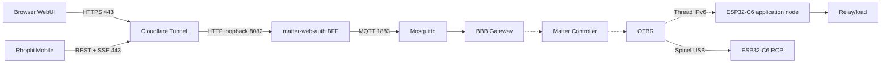
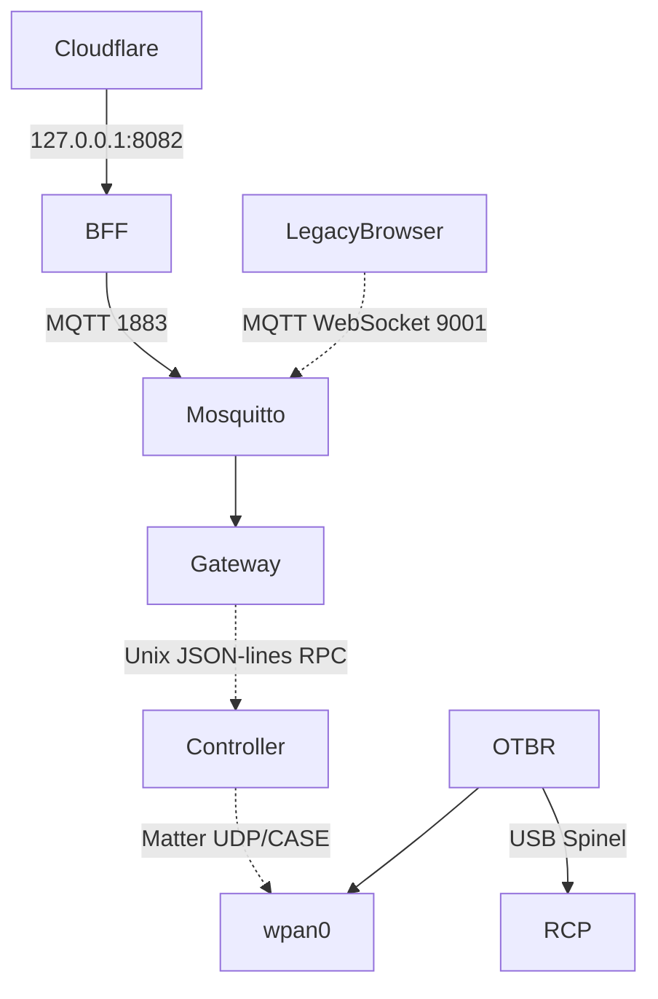

# 02 — Kiến trúc toàn hệ thống

Bản đồ canonical chi tiết về Mobile, Cloudflare, BFF, MQTT, Gateway, Controller, OTBR/RCP, Matter node, protocol/port, trust boundary, persistence và failure modes xem [kiến trúc end-to-end](../architecture/system-overview.md).

## System context

## Trạng thái từng hop

| Hop | Trạng thái |
|---|---|
| Web/Mobile → Cloudflare → BFF | **Verified deployed**, web cookie/CSRF và mobile bearer/CORS/SSE. |
| BFF → Mosquitto | **Verified deployed**, MQTT credential chỉ nằm phía BBB. |
| Mosquitto → Gateway | **Verified deployed**, contract validation và mock responses. |
| Gateway → Controller | Controller adapter/RPC tồn tại; production Gateway vẫn mock khi chưa có node. |
| Controller → node | **Pending**, RPC thiếu commissioning/read/subscription. |
| OTBR/RCP | **Verified**, `wpan0` up và role leader. |
| Node Matter server | **Verified build/flash/boot**, chưa commission vào BBB fabric. |

## Không nhầm ba vai trò ESP32-C6

| Thiết bị | Vai trò | Firmware |
|---|---|---|
| Application node | Matter server, relay/button/LED | Repository này. |
| RCP | IEEE 802.15.4 radio coprocessor | OpenThread RCP; không có application endpoint. |
| Future independent node | SKU/application node khác | Product composition riêng. |

RCP không được commission như Matter device. `otbr-agent` là process duy nhất mở RCP serial.

## BBB process topology

Các product service active gồm Cloudflare Tunnel, authenticated BFF, Mosquitto, Gateway, Matter Controller, legacy WebUI và OTBR. Public Web/Mobile đi qua BFF port 8082. Python static WebUI port 8080 và browser MQTT WebSocket port 9001 là đường LAN/legacy, không phải public mobile path. Các product service chạy bằng systemd và user riêng theo responsibility.

## Ownership

| Thành phần | Sở hữu |
|---|---|
| Web presentation/state | `agile-dashboard/apps/webui` |
| MQTT schema/topics | `agile-dashboard/packages/contracts` |
| Validation/registry/dispatch | `agile-dashboard/packages/gateway` |
| Fabric/CASE/node sessions | `agile-dashboard/packages/matter-controller` |
| Broker/auth/ACL/deploy | `agile-dashboard/deploy` |
| OTBR/RCP/runtime network | BBB operations/platform |
| Product behavior/hardware | `agile-smart-device/components` |
| Reusable Layers 1–4 | `external/agile-firmware-framework` |

## Trust và process boundaries

- Browser không được truy cập Controller socket/fabric storage.
- Mosquitto dùng authentication và per-user ACL.
- Gateway chỉ giao tiếp Controller qua Unix socket group `matter-rpc`.
- Controller sở hữu `/var/lib/matter-controller`.
- OTBR sở hữu RCP và Thread dataset.
- Node không nhận WebUI JSON trực tiếp.
- Secret không được đưa vào logs hoặc Git.

## Persistent và runtime state

| Path | Ý nghĩa |
|---|---|
| `/var/lib/matter-controller` | Fabric/controller/node metadata. |
| `/var/lib/mosquitto` | Broker persistence. |
| `/var/lib/thread` | OTBR Thread state/dataset. |
| `/run/matter-controller/controller.sock` | Ephemeral Unix socket. |
| ESP32 NVS `smartdev` | Product relay schema/state. |
| ESP32 CHIP/NVS namespaces | Matter fabric/session/network state. |

## Failure isolation

- WebUI lỗi không được dừng broker/Gateway/node.
- Gateway lỗi không được ảnh hưởng local relay.
- Controller/Thread lỗi không được gây node reboot loop.
- Node lỗi không được khiến Gateway mở RCP serial.
- Mất `/run` sau reboot là bình thường; systemd tạo lại socket.

Chi tiết repository xem [repository structure](../architecture/repository-structure.md).
