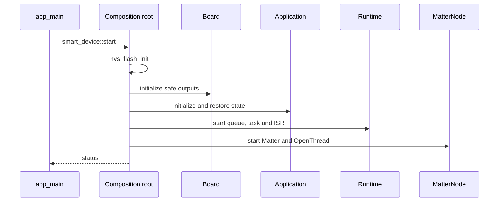
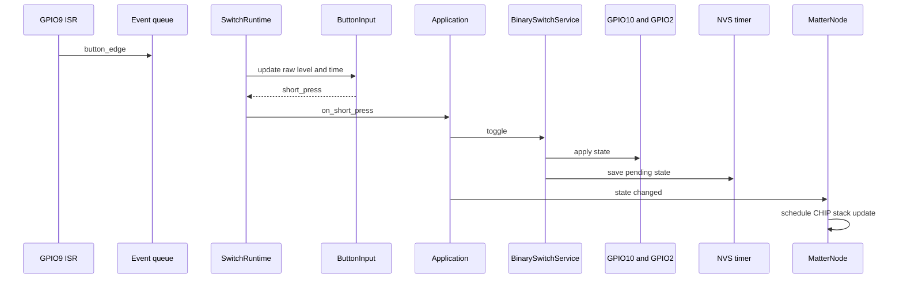
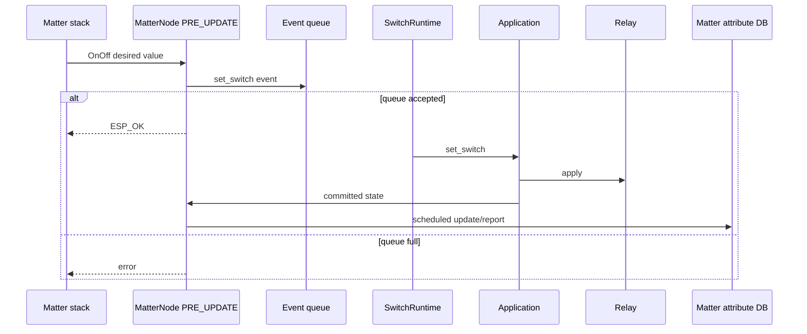

# 04 — Kiến trúc firmware node

## Layer và ownership

```text
Layer 5  product application, composition, runtime, adapters, Matter endpoint
Layer 4  reusable services, protocols, device drivers, bounded libraries
Layer 3  UHAL adapters
Layer 2  platform-neutral UHAL contracts
Layer 1  ESP-IDF/vendor low-level implementation
```

Layer được enforce bằng dependency/CMake/checker, không bằng prefix thư mục.

## Startup



`main/main.cpp` không tạo concrete service. Composition root nằm tại `src/composition/SmartDevice.cpp`.

## Object graph

```text
Board
├─ relay OutputPin
├─ relay LED OutputPin
├─ button InputPin/PinInterrupt
└─ Clock

NvsBinaryStateStore
  -> BinarySwitchService(relay, relay LED, store)
      -> SmartDeviceApplication(service, state observer)
          -> SwitchRuntime(board, application, lifecycle actions)
              -> MatterNode(observer + lifecycle, matter_node only)
```

## Responsibility

| Class | Trách nhiệm |
|---|---|
| `Board` | Pin/polarity và concrete hardware objects. |
| `BinarySwitchService` | Apply authoritative boolean tới relay/LED và persistence port. |
| `SmartDeviceApplication` | Product use case, idempotency và state notification. |
| `SwitchRuntime` | FreeRTOS queue/task, ISR handoff, sampling, local/remote event serialization. |
| `NvsBinaryStateStore` | Product NVS schema và delayed commit. |
| `MatterNode` | Endpoint, callbacks, Thread/Matter lifecycle, WS2812 và attribute reporting. |

## Local button flow



## Remote Matter flow



Matter callback không được trực tiếp gọi GPIO/NVS. Event queue là điểm serialize local và remote commands.

## Queue và task

| Resource | Giá trị |
|---|---:|
| Task | `switch_ctrl` |
| Priority | 5 |
| Stack | 3072 bytes |
| Queue depth | 8 events |
| Active button poll | 5 ms |
| Debounce | 25 ms |
| Short press | ≤1000 ms |
| Commissioning hold | ≥5000 ms |
| Factory-reset hold | ≥10000 ms |

ISR dùng non-blocking `xQueueSendFromISR`. Hiện queue-full ISR event chưa có drop counter, đây là known reliability gap.

## State và persistence

NVS schema:

```text
namespace smartdev
schema    = 1
relay_on  = 0 or 1
```

- Missing/wrong schema → OFF.
- Restore apply lỗi → startup lỗi.
- Save chỉ schedule one-shot timer 500 ms.
- Nhiều thay đổi trong 500 ms chỉ commit state cuối.
- Duplicate desired state không ghi lại.
- Commit failure được log nhưng hardware state đã apply không rollback.

## Matter state reporting

`SmartDeviceApplication` gọi `ISwitchStateObserver` khi state thay đổi. `MatterNode` dùng atomic pending state và `PlatformMgr().ScheduleWork()` để chạy `attribute::update()` đúng Matter stack context. Coalescing tránh xếp nhiều report giống nhau.

## Error/degraded behavior

- WS2812 init lỗi chỉ warning; local/Matter core tiếp tục.
- NVS init failure làm startup fail; trường hợp no-free-pages/new-version hiện erase default NVS partition rồi init lại, cần review production data-loss policy.
- Matter command queue full bị reject.
- Local ISR queue full hiện có thể mất event im lặng.
- `app_main` log startup result nhưng không tự recovery loop.

## Diagnostics

Matter startup log gồm endpoint, reset reason, free heap và minimum free heap. Các lỗi runtime ghi tag `switch-runtime`, persistence dùng `state-store`, Matter dùng `matter-node`.

Chưa có đầy đủ queue high-water, task watermark, Thread role và fault-history telemetry; đây là hardening scope.

## Đặt code mới

- Product behavior → `src/application`.
- Task/ISR/queue → `src/runtime`.
- NVS/vendor product adapter → `src/adapters`.
- Matter product endpoint → `src/matter`.
- Board wiring → `components/board_*`.
- Reusable policy/library → framework Layer 4.

Xem [rules](../rules/architecture.md) và [repository structure](../architecture/repository-structure.md).
