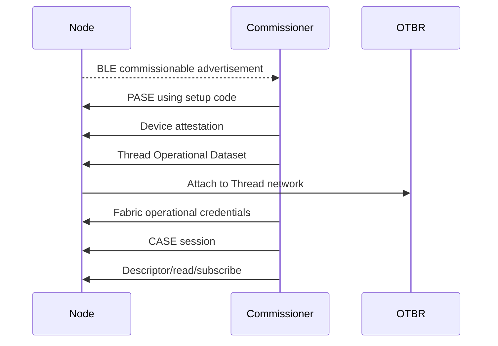

# 05 — Matter và Thread

## Vai trò trong sản phẩm

Matter định nghĩa application data model, security/fabric, commands, reads và subscriptions. Thread cung cấp IPv6 mesh transport. BLE chỉ dùng cho commissioning ban đầu.

Node không triển khai MQTT. BBB Gateway chuyển MQTT contract thành Matter Interaction Model.

## Data model

| Item | Giá trị |
|---|---|
| Root endpoint | 0 |
| Application endpoint | Dynamic, hiện log là 1 |
| Device type | On/Off Plug-in Unit `0x010A`; revision phải lấy từ Descriptor của build đã commission |
| Server cluster | OnOff `0x0006` |
| Attribute | OnOff `0x0000` boolean |
| Commands | Off `0x00`, On `0x01`, Toggle `0x02` |

Gateway phải discover Descriptor/inventory; không hard-code endpoint 1 cho mọi SKU.

## Identity

- MAC không phải operational Node ID.
- Node ID 64-bit do fabric/controller cấp.
- Một device có thể có identity khác trên fabric khác.
- Endpoint ID là local trong node.
- VID/PID development hiện là test values, không phải production identity.

## Commissioning flow



### Preconditions

- RCP hoạt động và chỉ do `otbr-agent` sở hữu.
- `wpan0` up, OTBR attached/leader/router.
- Active Thread dataset tồn tại và không bị log/commit.
- Controller storage persistent.
- Node factory-new và commissioning window mở.
- BLE adapter/commission API có thật trên Controller.

Hiện BBB đạt OTBR leader nhưng Controller RPC chưa expose commission/remove/read/subscription, nên final flow còn blocked.

## PASE và CASE

- **PASE** dùng setup passcode trong commissioning, trước khi node thuộc fabric.
- **CASE** dùng operational certificates sau commissioning.
- Setup passcode không phải MQTT password.
- Thread Network Key không phải Matter fabric key.
- Không log bất kỳ secret nào.

## Thread node configuration

Firmware dùng native radio:

```text
radio_mode              RADIO_MODE_NATIVE
host_connection_mode    HOST_CONNECTION_MODE_NONE
storage_partition       nvs
netif_queue_size         10
task_queue_size          10
```

Application node không chạy OTBR role.

## Subscription và local event

Controller phải subscribe OnOff attribute. Khi local button thay đổi state, node cập nhật attribute trên Matter stack và subscription report quay về Controller. Gateway chuyển report thành MQTT unsolicited event có `request_id: null`.

Code reporting đã implement/compile; end-to-end subscription chưa HIL vì Controller RPC/event forwarding còn thiếu.

## Lifecycle

| Event | Firmware action/indication |
|---|---|
| Commissioning window open | Amber WS2812. |
| Commissioning complete | Green. |
| Thread/IP interface change | Blue. |
| Fail-safe timeout | Red. |
| Fabric removed | Amber. |
| Identify | White. |

Short press luôn dành cho relay. Hold 5/10 giây dùng lifecycle actions. Visual confirmation cuối cùng cần HIL approval.

## Factory reset policy

`esp_matter::factory_reset()` xóa Matter/fabric/network state và reboot. Product namespace `smartdev` hiện được giữ, nên relay restore policy tồn tại qua Matter factory reset. Thay đổi policy này phải có migration và safety review.

## Toolchain pin

| Dependency | Revision |
|---|---|
| ESP-IDF | v5.5.5 / `b774170ff46c393eeb5e495ea37936038d3f4f4f` |
| ESP-Matter | release/v1.6 / `c91ddfbb08ccc74bb73dd6eca7422178f48b75e1` |
| ConnectedHomeIP | `93abd8e6891bb578ea63254fb29d099936f345c8` |

Không tự nâng một dependency riêng lẻ. Upgrade phải chạy upstream reference, product clean build, flash, commission, read/write/subscribe và storage migration gates.

## Development so với production

Development image dùng example/test commissioning và attestation material. Production bắt buộc có unique discriminator/passcode, VID/PID, DAC, PAI, Certification Declaration, protected private key và manufacturing process.

## Evidence hiện tại

**Verified**

- Upstream ESP32-C6 Thread example build/flash/boot.
- Product Matter clean build/flash/boot.
- Endpoint 1, OpenThread start, Matter server và CHIPoBLE window trong logs.

**Pending**

- BBB commissioning vào đúng fabric.
- CASE invoke/read.
- Subscription report về Gateway/WebUI.
- Remove/recommission.
- Thread outage/recovery/soak.

Xem [Matter node architecture](../architecture/matter-node.md) và [commissioning context](../full-context/05-thread-commissioning.md).
