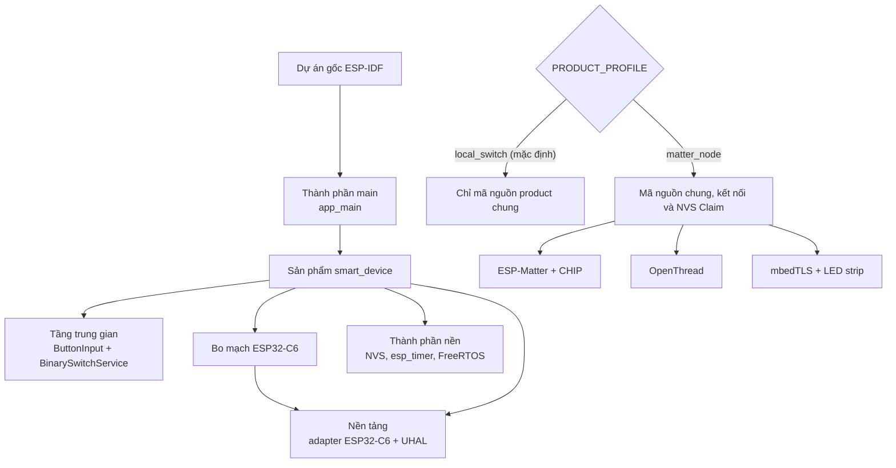
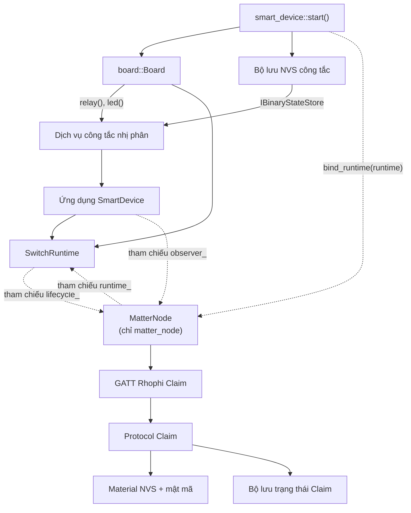

# Cấu trúc Build và Lắp ghép Hệ thống

> Trạng thái: Theo mã nguồn hiện tại, đối chiếu cấu trúc CMake và Dependency Injection trong hệ thống. `local_switch` là hồ sơ mặc định; `matter_node` là hồ sơ kết nối thông minh.

## 1. Thành phần cấu phần theo Hồ sơ (Compile-time Profiles)

Hệ thống sử dụng biến cấu hình compile-time `PRODUCT_PROFILE` thông qua CMake để phân tách rạch ròi dung lượng firmware và tài nguyên phần cứng.

### Bảng phân rã thành phần đăng ký trong hệ thống Build:

| Nhóm Thành Phần | Tên thành phần trong Build | Vai trò và Ý nghĩa kỹ thuật |
| :--- | :--- | :--- |
| **Cả hai hồ sơ** | `main`, `product_smart_device`, `board_esp32c6`, `platform`, `middleware` | Định hình luồng xử lý điều khiển công tắc cục bộ dùng chung. |
| **Cả hai hồ sơ** | `ButtonInput.cpp`, `BinarySwitchService.cpp` | Hai lớp triển khai lõi của tầng trung gian, đăng ký trực tiếp. |
| **Hồ sơ `matter_node`** | `MatterNode`, `RhophiClaimGatt`, `NvsClaimStateStore`, mbedTLS, ESP-Matter, OpenThread | Chỉ được kéo vào và biên dịch khi kích hoạt hồ sơ kết nối Matter. |
| **Chưa xác nhận** | Các thư mục service/protocol khác dưới `components/middleware` | Chỉ tồn tại dưới dạng mã nguồn thô, chưa được liên kết lắp ghép vào firmware. |

---

## 2. Sơ đồ Object Graph tại Điểm Lắp Ghép (Static Dependency Injection)

Hàm `smart_device::start()` đóng vai trò là **Composition Root** (Điểm lắp ghép gốc), thực hiện khởi tạo tĩnh các đối tượng để tối ưu hóa bộ nhớ Heap, chống phân mảnh DRAM trên chip ESP32-C6.

### Quy tắc liên kết đối tượng:
*   **Hồ sơ `local_switch`:** Khởi tạo `SmartDeviceApplication` và `SwitchRuntime` với các con trỏ quan hệ kết nối mạng hướng sang `nullptr`. Thiết bị hoạt động như một công tắc độc lập truyền thống.
*   **Hồ sơ `matter_node`:** Tạo thực thể `MatterNode`, thực hiện liên kết chéo thông qua các Interface trừu tượng (đường nét đứt biểu diễn quan hệ Observer/Lifecycle Actions phụ thuộc lỏng).
*   **Tính độc lập của Core Application:** Lớp `SmartDeviceApplication` giao tiếp phần cứng qua `IBinaryStateStore`, hoàn toàn độc lập, không phụ thuộc trực tiếp vào các hàm API của ESP-IDF, FreeRTOS hay phân vùng NVS.
