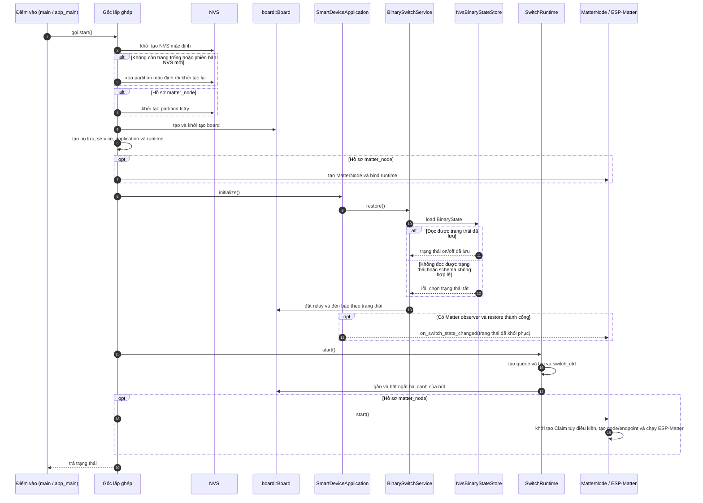

# Trình tự Khởi động và Nhánh lỗi Fail-Safe

> Trạng thái: Theo mã nguồn hiện tại. Hàm điểm vào `app_main()` chỉ làm nhiệm vụ duy nhất là chuyển tiếp quyền điều khiển sang điểm lắp ghép `smart_device::start()`. Toàn bộ quá trình khởi tạo phân vùng dữ liệu NVS thuộc về khối lắp ghép.

## 1. Trình tự Khởi động Hệ thống (Startup Sequence)

---

## 2. Chiến lược xử lý khi Khởi động lỗi (Error Handling Boundaries)

Hệ thống xử lý lỗi theo từng giai đoạn độc lập. Cần lưu ý các điểm lỗi pha cuối **không có cơ chế Rollback tự động toàn phần** nếu mã nguồn chưa được cài đặt:

| Giai đoạn Khởi động | Hành vi chi tiết của Hệ thống | Chiến lược Dọn dẹp / Khôi phục |
| :--- | :--- | :--- |
| **Khởi tạo NVS mặc định** | Chỉ tự động xóa sạch partition để làm lại khi gặp mã lỗi `ESP_ERR_NVS_NO_FREE_PAGES` hoặc `ESP_ERR_NVS_NEW_VERSION_FOUND`. Lỗi hệ thống khác sẽ trả về `io_error`. | **Dừng khẩn cấp:** Dừng toàn bộ luồng khởi động hệ thống. |
| **Khởi tạo NVS `fctry`** | Chỉ kích hoạt tại hồ sơ `matter_node`. Mọi lỗi phát sinh trong khâu nạp vùng bảo mật này trả về `io_error`. | **Dừng khẩn cấp:** Dừng toàn bộ luồng khởi động hệ thống. |
| **Khởi tạo phần cứng Bo mạch** | Kiểm tra kết nối cấu hình chân GPIO. Thất bại trả về `io_error`. | **Dừng khẩn cấp:** Dừng toàn bộ luồng khởi động hệ thống. |
| **Khôi phục Ứng dụng** | `BinarySwitchService` sẽ ép trạng thái mặc định là TẮT (OFF) nếu đọc lỗi. Lỗi cấu trúc schema làm hàm Init ứng dụng thất bại. | **Dừng luồng:** Hệ thống dừng trước khi khởi chạy tác vụ `SwitchRuntime`. |
| **Khởi động Runtime** | Đăng ký hàng đợi Queue, Task FreeRTOS và hàm ngắt GPIO hai cạnh. Nếu lỗi phát sinh sau khi cấp phát nửa chừng, `SwitchRuntime` tự giải phóng tài nguyên cục bộ. | **Trả mã lỗi:** Điểm lắp ghép thu hồi mã lỗi, hủy bỏ hoàn toàn việc khởi động pha kết nối Matter tiếp theo. |
| **Nạp Material / GATT Claim** | Đọc dữ liệu từ phân vùng bảo mật nhà máy. Thất bại ghi log cảnh báo; hạ cờ `claim_ready_ = false`. | **Bỏ qua lỗi mềm:** Toàn bộ ngăn xếp Matter phía sau vẫn tiếp tục được kích hoạt chạy. |
| **Tạo Node / Endpoint Matter** | Cấp phát cây thực thể thuộc tính của Matter. Trả về mã lỗi `no_resources` nếu handle rỗng. | **Lỗi không đồng bộ:** Tác vụ Runtime cơ học đã chạy từ trước vẫn sẽ tiếp tục chạy độc lập, không bị thu hồi. |
| **Khởi động lõi ESP-Matter** | Kích hoạt vòng lặp mạng của CHIP/Matter. Đổi tất cả lỗi hệ thống thành mã `io_error`. | **Lỗi không đồng bộ:** Tác vụ Runtime cơ học trước đó vẫn hoạt động đóng ngắt tại chỗ, không có cơ chế rollback. |
