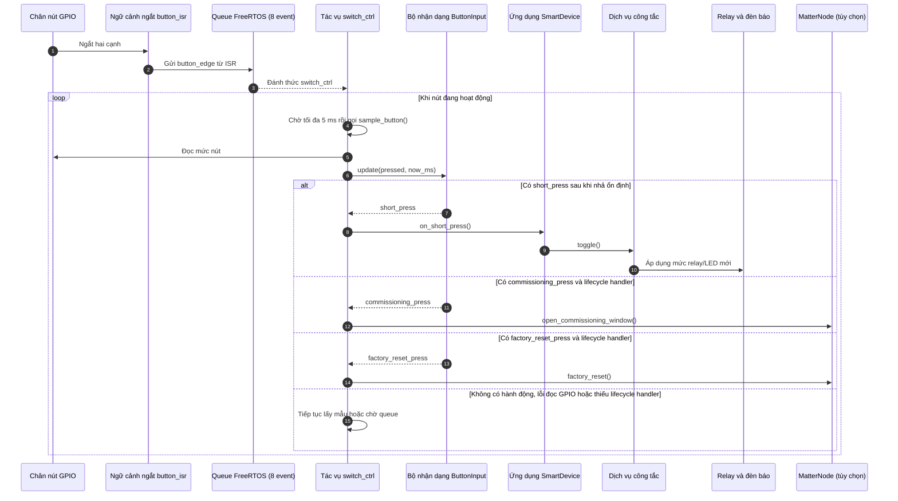
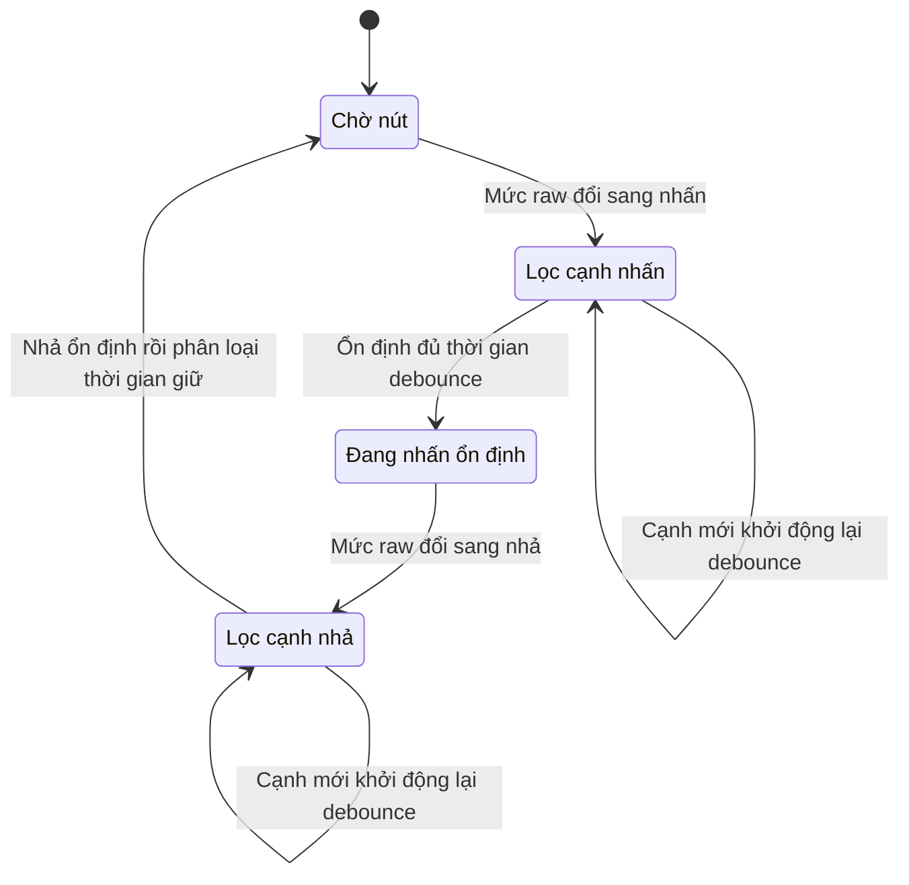

# Điều khiển Cục bộ, Lọc nhiễu và Nút bấm

> Trạng thái: Áp dụng đồng thời cho cả hai hồ sơ. Khác biệt cốt lõi ở ranh giới vòng đời: Hồ sơ `local_switch` truyền con trỏ hành động lifecycle trỏ về `nullptr`; hồ sơ `matter_node` truyền thực thể điều phối `MatterNode`.

## 1. Luồng sự kiện Nút bấm qua Tác vụ Runtime (Asynchronous Event Processing)

Hàm ngắt `button_isr` thực hiện theo mô hình tối giản cách ly ngữ cảnh ngắt: Chỉ bắn tín hiệu thô `button_edge` vào hàng đợi, nhường toàn bộ việc tính toán thời gian và lọc nhiễu cho Tác vụ `switch_ctrl`.

---

## 2. Máy Trạng thái Debounce Hồi vị và Phân loại Nhấn giữ (Button State Machine)

Hệ thống triển khai bộ lọc nhiễu cơ học theo mô hình **Re-triggerable Debounce** (Xung nhiễu lặp lại sẽ khởi động lại bộ đếm thời gian). Sự kiện nhấn giữ chỉ được phát ra **sau khi trạng thái nhả nút đã hoàn toàn ổn định** đưa máy trạng thái về `Idle`.

### Các thông số cấu hình ngưỡng hiệu lực thực tế (`SwitchRuntime.hpp`):
*   **Thời gian Lọc nhiễu cơ học (Debounce):** `25 ms` (Khóa đứng yên logic ở cả hai cạnh nhấn và nhả).
*   **Nhấn ngắn (`short_press`):** Giữ nút tối đa `1000 ms` (1 giây). Thực hiện đảo trạng thái relay (`toggle`) cục bộ vô điều kiện ở cả hai hồ sơ.
*   **Nhấn giữ mở mạng (`commissioning_press`):** Giữ nút liên tục từ `3000 ms` (3 giây). Lớp Runtime ghi đè chặt chẽ giá trị mặc định `5000 ms` của file header thư viện `ButtonInput.hpp`. Chỉ hoạt động khi con trỏ `lifecycle_` khác null.
*   **Nhấn giữ đặt lại nhà máy (`factory_reset_press`):** Giữ nút liên tục từ `10000 ms` (10 giây). Kích hoạt quy trình xóa bộ nhớ khi nhả nút ổn định.
