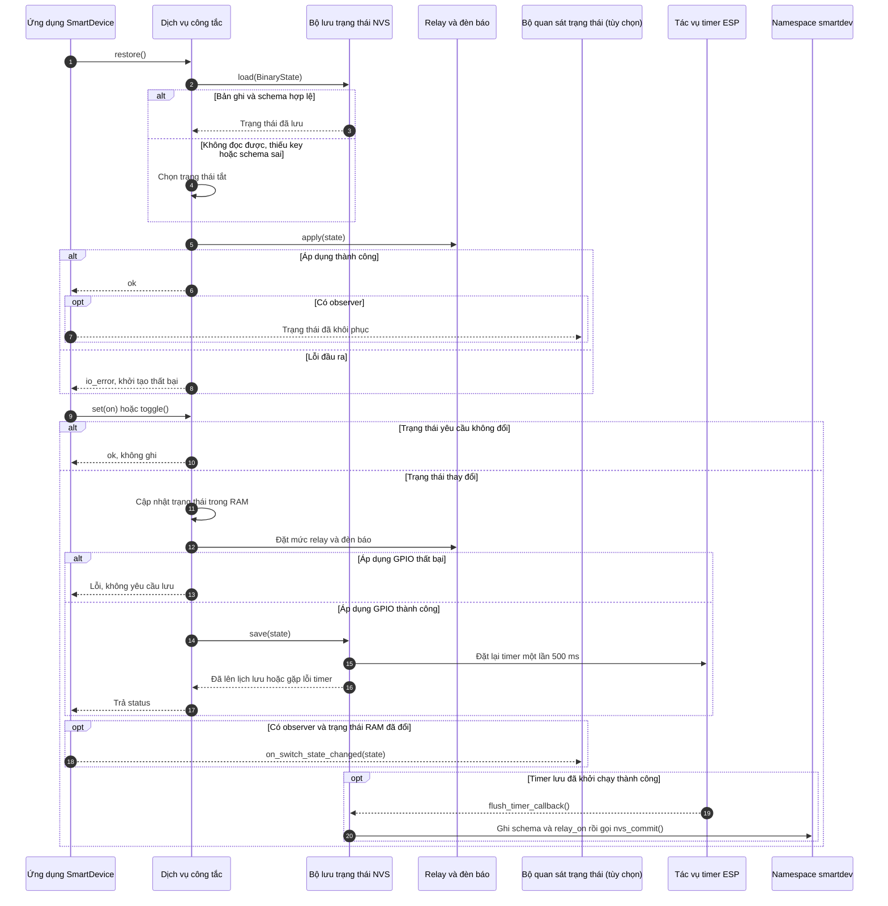

# Cơ chế Lưu trữ và Ranh giới Trạng thái Công tắc

> Trạng thái: Áp dụng đồng thời cho cả hai hồ sơ. Hệ thống dời tiến trình ghi Flash một khoảng trễ 500 ms thông qua một `esp_timer` chạy bất đồng bộ để tránh hiện tượng mài mòn bộ nhớ ô nhớ của chip khi bật/tắt liên tục.

## 1. Luồng khôi phục và Thay đổi trạng thái dữ liệu (Write-Debounce Loop)

---

## 2. Bảng phân định Ranh giới Lưu trữ thực tế (Storage Boundaries)

Mã nguồn thực hiện thay đổi giá trị trong RAM và kích hoạt thông báo cho Observer phát đi *trước khi* kiểm tra cam kết ghi thực tế xuống phân vùng cứng, tạo ra các ranh giới bất đối xứng kỹ thuật:

| Thời điểm / Sự kiện | Điều CHẮC CHẮN kết luận | Điều CHƯA THỂ kết luận |
| :--- | :--- | :--- |
| **`BinarySwitchService` cập nhật state** | Giá trị runtime của biến trạng thái đã thay đổi cục bộ trong bộ nhớ RAM. | Chân phần cứng GPIO đã nhảy hoặc thông tin đã được lưu xuống phân vùng NVS. |
| **Hàm `apply()` trả về thành công** | Mức điện áp vật lý trên chân điều khiển Relay và đèn LED trạng thái đã thay đổi. | Phân vùng bộ nhớ NVS đã thực hiện lệnh `nvs_commit()`. |
| **`NvsBinaryStateStore::save()` trả `ok`** | Bộ định thời `esp_timer` đã được lên lịch thành công để đếm lùi 500 ms trước khi xả kho. | Tiến trình commit Flash phía sau chắc chắn thành công (Nếu lỗi, callback chỉ ghi log ghi đè). |
| **Lệnh `nvs_commit()` chạy thành công** | Dữ liệu trạng thái đã nằm bền vững trong Flash tại namespace `smartdev` (các key `schema`/`relay_on`). | Không có bảo đảm an toàn dữ liệu nếu mạch bị mất điện vật lý đột ngột trước khi bộ đếm 500 ms kịp về 0. |

*Lưu ý luồng lỗi:* Trong kiến trúc hiện tại, lớp ứng dụng vẫn kích hoạt lệnh thông báo `notify_if_changed()` phát trạng thái mới ra ngoài cho các Observer (bao gồm cả thực thể kết nối mạng) dù quá trình thay đổi điện áp chân GPIO vật lý gặp lỗi phần cứng.
