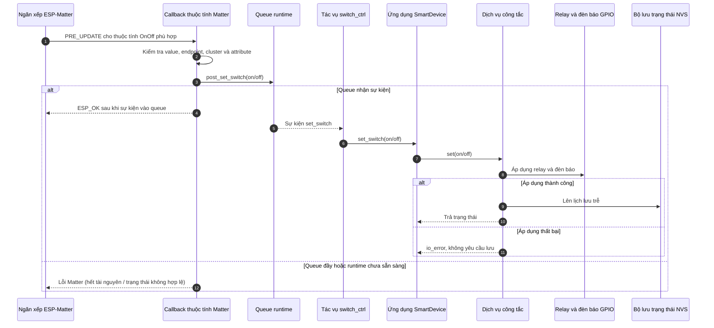
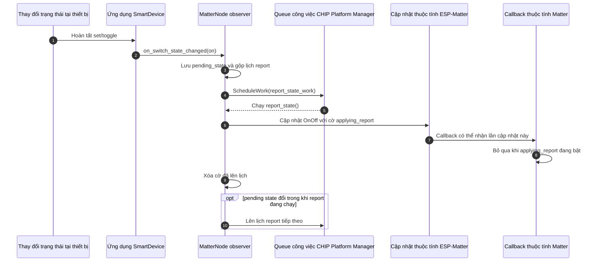

# Giao thức Nhận lệnh Matter và Báo cáo Trạng thái

> Trạng thái: Chỉ kích hoạt cấu hình biên dịch khi chọn hồ sơ `PRODUCT_PROFILE=matter_node`. Mọi tiến trình nhận tin và phát trạng thái được bọc tách thông qua hàng đợi bất đồng bộ để tránh hiện tượng nghẽn luồng xử lý mạng chính của CHIP.

## 1. Chiều Downlink: Lệnh điều khiển Matter lọt vào Thiết bị (Inbound Command)

Ngăn xếp áp dụng mô hình **Phản hồi sớm**: Chấp nhận trả trạng thái `ESP_OK` về cho Controller mạng ngay khi bản tin lọt vào hàng đợi Runtime thành công, hoàn toàn tách biệt với tiến trình nhảy của lá đồng Relay cơ khí phía sau.

*   **Giới hạn phần cứng:** Hàng đợi Queue chứa tối đa **8 phần tử**. Nếu người dùng nhấn nút cơ liên tục gây đầy nghẽn hàng đợi, hàm `post_set_switch` trả trạng thái `busy`, lúc này lệnh điều khiển từ xa qua mạng lập tức bị từ chối thẳng từ vòng ngoài (`PRE_UPDATE`) và ánh xạ thành lỗi `ESP_ERR_NO_MEM` đẩy về cho Controller.

---

## 2. Chiều Uplink: Phát bản tin báo cáo trạng thái từ Thiết bị về mạng Matter (Outbound Reporting)

Để triệt tiêu hoàn toàn vòng lặp phản hồi vô hạn (Feedback Loop) sinh ra do việc cập nhật thuộc tính tự kích hoạt ngược lại hàm callback `PRE_UPDATE`, hệ thống triển khai một cờ hiệu bọc ngoài mang tên `applying_report`.

### Cơ chế Gom cụm dữ liệu báo cáo (Debounce Reporting):
*   Khi có thay đổi trạng thái liên tục tại cục bộ, `MatterNode` không bắn tin liên tiếp lên mạng Thread. Nó gộp trạng thái cuối cùng vào biến `pending_state` và xếp hàng xử lý thông qua lệnh `ScheduleWork` của `CHIP Platform Manager`.
*   Nếu quá trình cập nhật thuộc tính lỗi, hệ thống hủy cờ và ghi log cảnh báo; lệnh truyền lại (Retry) chỉ kích hoạt ngay lập tức nếu phát hiện giá trị `pending_state` bị thay đổi đột ngột đúng vào thời điểm luồng tác vụ đang thực thi.
