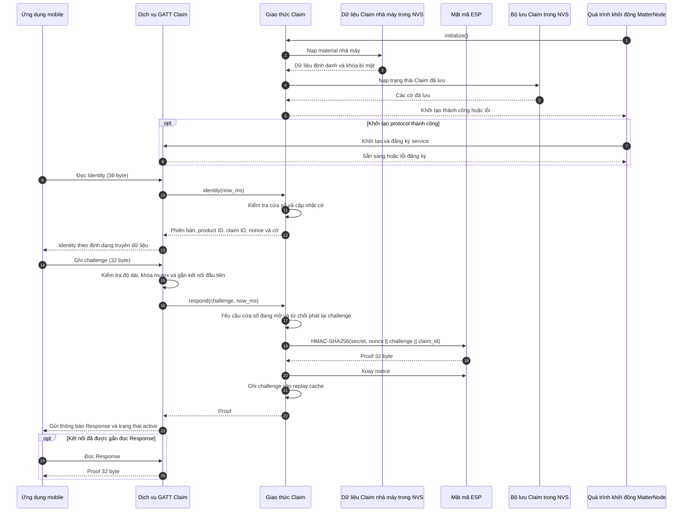
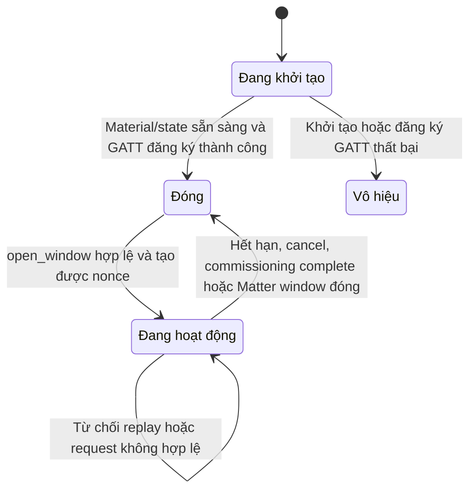
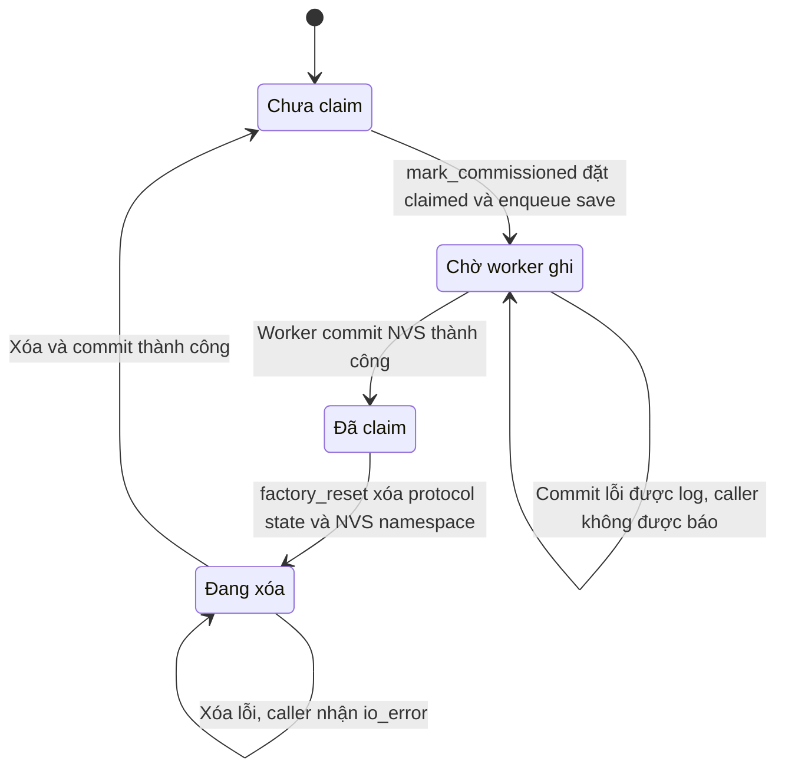

# Giao thức Xác thực Rhophi Claim và Ranh giới Tin cậy

> Trạng thái: Chỉ khả dụng trên hồ sơ `matter_node`. Lớp phần cứng đóng vai trò thuần túy là thực thể chứng minh (Prover): Tạo bằng chứng số (Proof) khi có thách thức hợp lệ thông qua thuật toán mật mã đối xứng, hoàn toàn cách ly, không tự thực hiện kết nối ra ngoài Internet.

## 1. Chu trình Thử thách - Phản hồi (Challenge-Response) qua cổng GATT BLE

---

## 2. Quản lý Cửa sổ Giao thức và Cơ chế Chống tấn công phát lại (Replay Guard)

Hệ thống bảo vệ an ninh lớp vật lý thông qua việc kiểm soát chặt chẽ máy trạng thái của Cửa sổ Protocol và phân vùng lưu trữ bền vững:

### Máy trạng thái Cửa sổ giao thức (Protocol Window State):

### Máy trạng thái Cờ quyền sở hữu bền vững (Persisted Ownership State):

### Các quy tắc quản lý an ninh tầng thấp:
*   **Đánh giá trễ thời hạn Cửa sổ (Lazy Evaluation):** Cửa sổ Protocol Claim không chạy một bộ định thời (Timer) độc lập. Trạng thái hết hạn chỉ được phát hiện một cách thụ động khi hàm `is_active(now_ms)` được kích hoạt bởi một yêu cầu truy cập GATT từ bên ngoài.
*   **Chống phát lại (Anti-Replay Cache):** Chuỗi Thách thức (`Challenge`) sau khi được xử lý thành công sẽ bị khóa chặt vào bộ đệm Replay Cache có dung lượng giới hạn. Bộ đệm này chỉ được làm sạch khi một chu kỳ mở cửa sổ mới được thiết lập.
*   **Ranh giới Bypass kiểm thử (`RHOPHI_CLAIM_DEV_BYPASS`):** Khi bật cờ biên dịch này trong môi trường phòng Lab, hàm `respond()` sẽ tự động bỏ qua thuật toán mã hóa đối xứng và trả về chuỗi Proof chứa toàn số 0. Bản tin này không có giá trị xác minh tính chính hãng trên BFF thực tế.
