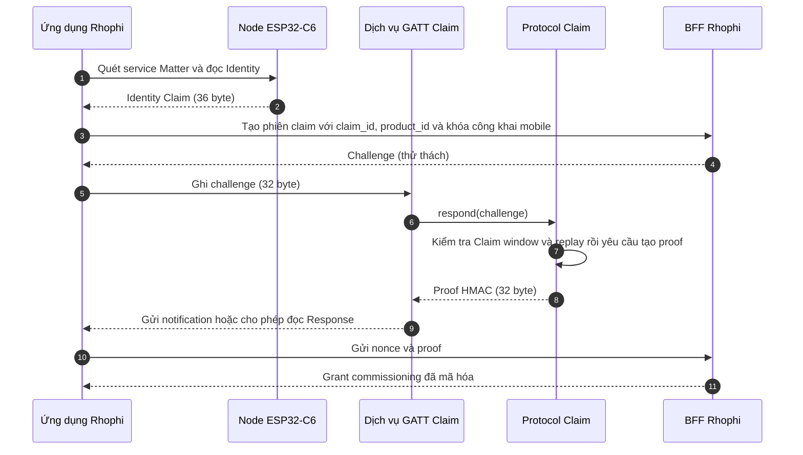
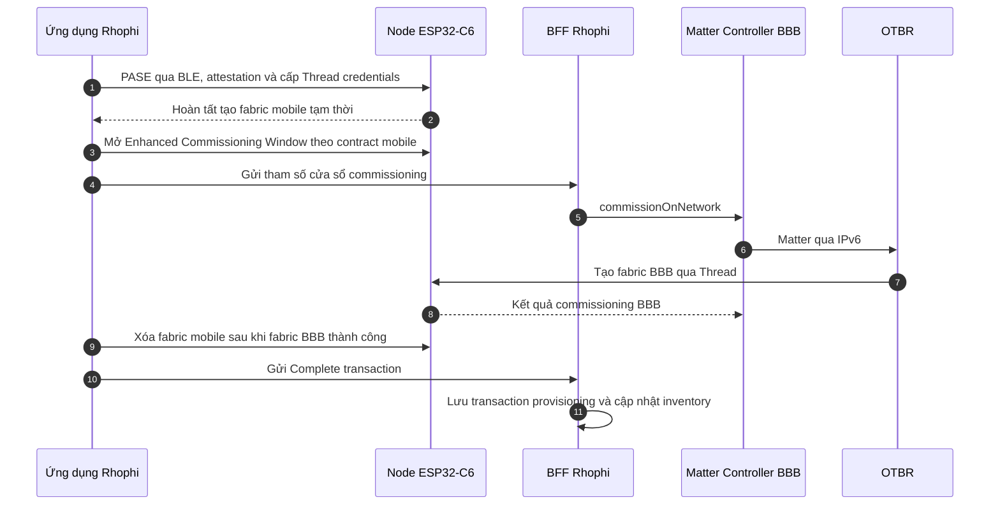
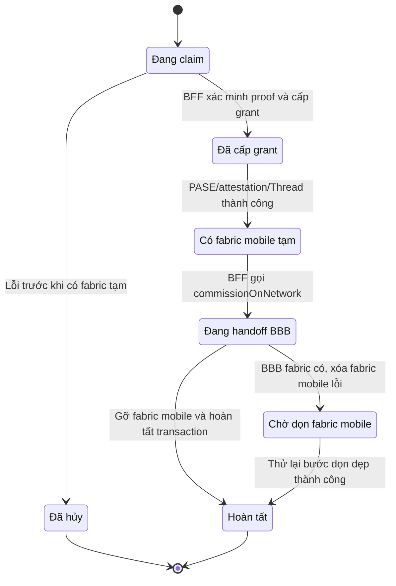

# Quy trình Provisioning Hệ thống Kép và Bản đồ Dữ liệu

> Phạm vi thiết kế: Định hình hợp đồng hệ thống (System Contracts) kết nối luồng xử lý phần sụn thiết bị (Firmware Node) với các cấu phần ngoài mạch bao gồm Ứng dụng di động (Mobile App), Đám mây trung gian (BFF Rhophi) và Cục điều khiển Gateway (BBB Matter Controller).

## 1. Chu trình Ủy quyền Xác thực và Bàn giao Mạng lớp kép (Two-Stage Commissioning)

Hệ thống triển khai mô hình **Hệ sinh thái Kép (Hybrid Ecosystem)**: Thiết bị vừa được đăng ký quyền sở hữu chính hãng vào danh mục của Rhophi, vừa được cấp mạng vận hành chuẩn Matter quốc tế.

### Chặng 1: Xác thực sở hữu chính hãng vật lý (Rhophi Claim qua BLE)

### Chặng 2: Bàn giao hạ tầng quản lý (Fabric Handoff từ Di động sang Gateway BBB)

---

## 2. Máy trạng thái Quản lý Giao dịch (Transaction States) và Phục hồi lỗi

Vòng đời của một phiên đăng ký thiết bị được giám sát chặt chẽ trên BFF thông qua tệp cấu trúc khôi phục lưu trữ.

*   **Ranh giới Kẹt trạng thái dọn dẹp (`CLEANUP_PENDING`):** Trạng thái xảy ra khi Fabric chính thức của BBB đã kết nối mạng thông suốt, nhưng App di động bị lỗi/ngắt kết nối nửa chừng khi đang gỡ bỏ Fabric tạm thời của mình. Quy định bắt buộc: **Hệ thống cấm không được tạo thêm một BBB Fabric mới**. App di động phải giữ nguyên cấu trúc bộ nhớ tạm để kích hoạt lại lệnh xóa (`Cleanup`) cho tới khi thiết bị đạt trạng thái `Complete`.

---

## 3. Bản đồ Phân tách Lưu trữ Dữ liệu và Nguồn Sự Thật (Single Source of Truth)

Dữ liệu của hệ thống nhà thông minh Rhophi được phân rã độc lập theo từng phân hệ phần cứng và tệp tin hệ điều hành để đảm bảo an ninh bảo mật tối cao:

| Thực thể quản lý | Vị trí lưu trữ dữ liệu vật lý | Vai trò dữ liệu và Quy tắc vận hành bảo mật |
| :--- | :--- | :--- |
| **Sản xuất Nhà máy** | ESP32-C6 Flash: `fctry/rhophi` | Lưu giữ `product_id`, `claim_id`, `claim_secret`. **Nguồn gốc xuất xứ gốc.** Lệnh đặt lại thiết bị (Factory Reset) tuyệt đối không được phép xâm phạm hoặc xóa phân vùng này. Khóa bí mật cấm đi qua log hoặc truyền trần trên mạng. |
| **Firmware Node** | ESP32-C6 Flash: NVS `rhophi_state` | Lưu giữ cờ trạng thái quyền sở hữu vật lý (`claimed = true`). Tiến trình ghi bất đồng bộ thông qua một worker nền sau khi nhận tín hiệu hoàn tất commissioning. |
| **Ngăn xếp CHIP** | ESP32-C6 Flash: NVS Matter/Thread | Lưu giữ thông tin danh sách các Fabric tích hợp, thông số bảo mật liên kết và khóa mạng Thread. Được quản lý độc quyền bởi thư viện Matter; bị xóa sạch khi nhận lệnh Factory Reset cấu hình mạng. |
| **Ứng dụng Di động** | Android Keystore + CHIP Storage | Lưu giữ khóa bảo mật của Fabric di động tạm thời và mã Token giao dịch. Nắm quyền độc quyền điều phối khôi phục dọn dẹp bộ nhớ; Đám mây BFF hoàn toàn không sở hữu khóa này. |
| **BFF Bảo mật** | Linux Gateway: `/etc/matter-provisioning/devices.registry.enc` | Tệp danh mục lưu trữ toàn bộ thông tin xuất xưởng của các thiết bị, được mã hóa an toàn bằng thuật toán **AES-256-GCM**. Khóa giải mã nằm riêng tại tệp `registry.key` giới hạn quyền Root nghiêm ngặt. |
| **BFF Khôi phục** | Linux Gateway: `/var/lib/matter-web-auth/provisioning-transactions.json` | Bản chụp trạng thái khôi phục nhanh của các giao dịch đang diễn ra, hoàn toàn không chứa khóa bí mật. Tiến trình ghi đè dữ liệu áp dụng cơ chế đổi tên nguyên tử (Atomic Rename) để chống hỏng file khi sập nguồn. |
| **Matter Controller** | Linux Gateway: `/var/lib/matter-controller` | Lưu giữ cấu trúc Fabric chính thức của BBB, định danh Controller nền và siêu dữ liệu của các Node. **Đây là Nguồn Sự Thật Tối Cao (SSOT) cho toàn bộ các thiết bị đang trực tuyến**. Cấm không xóa khi vận hành thông thường; bắt buộc phải thực hiện sao lưu trước khi nâng cấp hệ thống. |
| **Hệ thống API** | Dynamic Web Layer: `/api/devices` | Danh mục bản đồ động ánh xạ Node ID, Số thứ tự Endpoint và tính năng Cluster của thiết bị. Được khám phá động qua hàm quét cấu trúc phần cứng (Descriptor Cluster) của cục Gateway; WebUI thực hiện đối soát lại dữ liệu bằng lệnh REST ngay khi Reconnect vì SSE không phát lại sự kiện cũ. |
