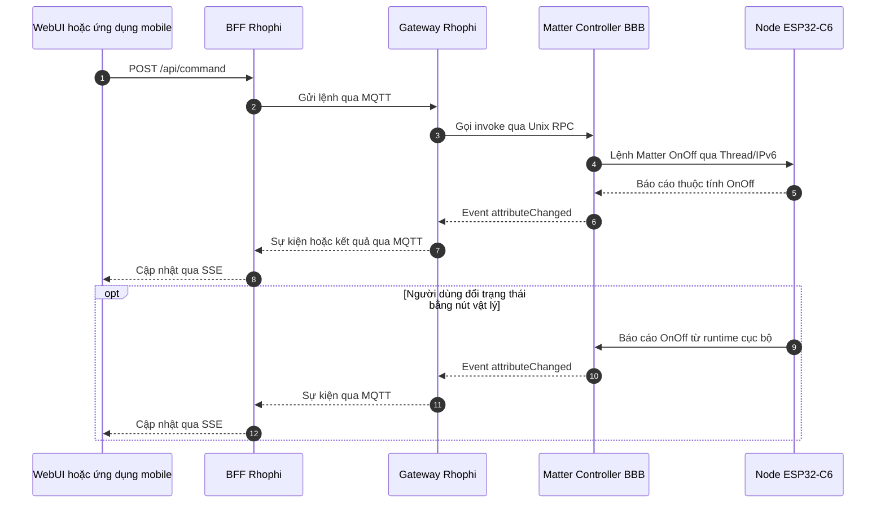

# Kiến trúc Điều khiển và Luồng tín hiệu sau Kết nối

> Trạng thái: Định hình cấu trúc truyền nhận tin lớp ứng dụng ngoài mạch sau khi thiết bị đã được kích hoạt (Provisioned) thành công và dọn sạch Fabric di động tạm thời.

## 1. Sơ đồ Luồng Tín hiệu Điều khiển Hai chiều End-to-End

### Quy tắc định tuyến và Đóng gói Giao thức:
1.  **Chiều xuống (Downlink Control):** Giao diện Người dùng phát lệnh đi dưới dạng REST API ➔ Đám mây BFF chuyển dịch thành bản tin đóng gói giao thức MQTT bắn xuống Gateway cục bộ ➔ Phần mềm Gateway đẩy dữ liệu qua giao tiếp nội bộ Unix RPC để đánh thức **Matter Controller** ➔ Bộ điều khiển mã hóa gói tin IPv6 chuẩn Matter bắn qua sóng Radio mạng Thread để chạm tới anten của chip ESP32-C6.
2.  **Chiều lên (Uplink Telemetry):** Thay đổi trạng thái tại thực địa (người dùng bấm nút công tắc cơ) kích hoạt hàm cập nhật thuộc tính mạng của `MatterNode`. Gói tin Thread báo về cho Controller ➔ Dịch ngược thành Sự kiện và bắn ngược lên Internet qua MQTT Broker ➔ Đám mây BFF tiếp nhận và đẩy dữ liệu thời gian thực ra giao diện hiển thị cho người dùng thông qua cơ chế **SSE (Server-Sent Events)**.
