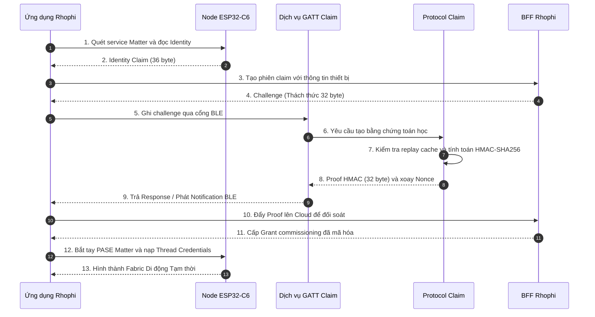
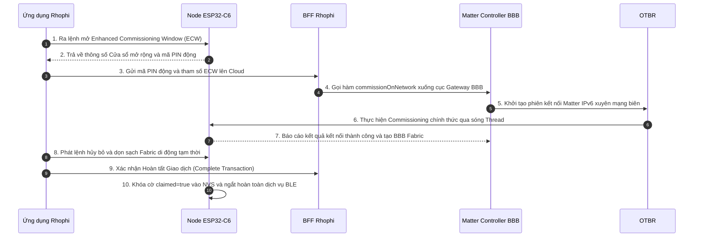

# Giải thích Chi tiết Quá trình Commissioning Lớp Kép

> Trạng thái: Tài liệu kiến trúc phân tích sâu vòng đời kết nối. Chu trình chuyển dịch thiết bị từ một Node trống ở nhà máy thành một thực thể thông minh thuộc mạng lưới Thread (chịu sự quản lý của Matter) và nằm trong danh mục sở hữu chính hãng của hệ sinh thái Rhophi.

---

## 1. Kiến trúc Tổng quan (The Hybrid Model)
Hệ thống Rhophi không sử dụng mô hình kết nối Matter đơn thuần. Thiết bị đi qua mô hình **Two-Stage Commissioning** để giải quyết hai bài toán độc lập:
1. **Xác thực Định danh (Rhophi Layer):** Đảm bảo thiết bị là phần cứng chính hãng do Rhophi sản xuất, ngăn chặn thiết bị giả mạo chui vào hệ thống của người dùng.
2. **Ủy quyền Kết nối (Matter Layer):** Đảm bảo thiết bị gia nhập mạng Thread nội bộ một cách bảo mật và chịu sự điều khiển trực tiếp từ cục trung tâm Gateway Linux Board (BBB Matter Controller) thông qua giao thức chuẩn quốc tế.

---

## 2. GIAI ĐOẠN 1: Xác thực Quyền sở hữu Vật lý & Cấp mạng Tạm thời (Chặng BLE)

Giai đoạn này diễn ra thông qua sóng ngắn Bluetooth Low Energy (BLE) kết nối giữa Ứng dụng di động (Mobile App) và chip ESP32-C6. Nó đóng vai trò làm sạch bề mặt thiết bị trước khi cho phép thiết bị chạm vào hạ tầng mạng chính.

### Giải thích Chi tiết từng Bước (Step-by-Step Breakdown):

* **Bước 1 + Bước 2 (Quét và Đọc Identity):** Người dùng kích hoạt chế độ kết nối, App di động kết nối vào dịch vụ GATT của ESP32-C6 qua BLE. App đọc chuỗi **Identity Claim (36 byte)** độc bản. Chuỗi này là duy nhất cho từng con chip (được sinh từ số MAC Address vật lý khi xuất xưởng và nạp sẵn trong phân vùng bảo mật `fctry`).
* **Bước 3 + Bước 4 (Xin lệnh Thách thức từ Cloud):** App gửi Identity vừa đọc lên máy chủ **BFF Rhophi**. Để chống lại việc hacker lấy một chuỗi Proof cũ ghi lại từ trước để lừa hệ thống, BFF sinh ra một chuỗi **Challenge (32 byte)** hoàn toàn ngẫu nhiên và duy nhất tại thời điểm đó (mô hình Cryptographic Nonce) gửi về cho App.
* **Bước 5 + Bước 6 (Đổ Thách thức xuống Mạch):** App di động thực hiện lệnh Ghi (Write Characteristic) chuỗi Challenge 32 byte này vào cổng dịch vụ GATT Claim trên ESP32-C6. Tầng GATT chuyển tiếp chuỗi tin này xuống khối xử lý giao thức mã hóa lớp sâu (`Protocol Claim`).
* **Bước 7 + Bước 8 (Ký số tạo Proof):** Khối Protocol kiểm tra thời gian hiệu lực của cửa sổ mạng. Tiếp theo, con chip lấy mã bí mật nhà máy (`claim_secret` nằm sâu trong phân vùng Flash được bảo vệ nghiêm ngặt bằng thuật toán *Flash Encryption*) để chạy hàm băm mật mã đối xứng: `HMAC-SHA256(secret, nonce || challenge || claim_id)`. Kết quả tạo ra một chuỗi **Proof 32 byte** độc bản. Ngay sau đó, chip thực hiện **xoay Nonce** và lưu Challenge vào bộ đệm Replay Cache để chặn đứng hoàn toàn các cuộc tấn công phát lại (Anti-Replay Attack).
* **Bước 9 + Bước 10 (Gửi bằng chứng đối soát):** Node gửi chuỗi Proof 32 byte ngược lại cho App thông qua cơ chế Notification của BLE. App lập tức trung chuyển chuỗi Proof này lên Cloud BFF.
* **Bước 11 (Cấp quyền sở hữu):** BFF lấy chuỗi `claim_secret` tương ứng của thiết bị đó lưu trong bảng cơ sở dữ liệu mã hóa gốc để tự tính toán một phép băm tương tự. Nếu kết quả BFF tính ra trùng khớp hoàn hảo với chuỗi Proof do con chip gửi lên, BFF xác nhận: *"Thiết bị này chuẩn 100% hàng chính hãng của Rhophi và chưa có ai làm chủ"*. BFF cấp về một mã **Grant Commissioning đã mã hóa** có giới hạn thời gian (gắn với Transaction ID).
* **Bước 12 + Bước 13 (Cấp mạng Thread & Tạo Fabric Tạm):** Nhận được Grant, App di động sử dụng mã **Matter Setup Passcode gốc** để thực hiện tiến trình bắt tay thiết lập khóa mật mã đối xứng (PASE) lớp ngoài của chuẩn Matter với Node qua sóng BLE. Khi đường truyền Matter-BLE đã được bọc mã hóa an toàn, App đổ thông số mạng **Thread Credentials** (PAN ID, Master Key...) xuống cho Node. Chip ESP32-C6 bật anten Radio Thread, gia nhập mạng lưới sóng nội bộ trong nhà và hình thành một mối quan hệ quản lý tạm thời với điện thoại mang tên **Mobile Fabric (Số Fabric tích hợp = 1)**.

---

## 3. GIAI ĐOẠN 2: Bàn giao Hạ tầng mạng sang Linux Board (Chặng Thread)

Tại giai đoạn này, điện thoại không còn giữ quyền điều khiển thiết bị nữa. Nó thực hiện một tiến trình bàn giao quyền lực an toàn (Fabric Handoff) sang cho cục Gateway cục bộ nằm tại thực địa.

### Giải thích Chi tiết từng Bước (Step-by-Step Breakdown):

* **Bước 1 + Bước 2 (Mở cửa sổ Nâng cao - ECW):** Khi Node đã trực tuyến trên mạng Thread, App di động gửi một lệnh Matter đặc biệt yêu cầu Node mở cửa sổ **Enhanced Commissioning Window (ECW)**. Khác với mã PIN cố định ở nhà máy, Node lúc này sẽ tự sinh ra một mã **PIN động ngẫu nhiên, chỉ dùng một lần** (One-time Passcode) để phục vụ riêng cho phiên bàn giao này, tránh việc lộ lọt mã cấu hình gốc.
* **Bước 3 + Bước 4 (Kích hoạt Gateway từ xa):** App di động lấy mã PIN động này gửi lên Cloud BFF. BFF lập tức thực hiện một lệnh gọi bảo mật (qua giao thức an toàn) chuyển tiếp mã PIN xuống **Matter Controller (MC)** đang chạy trên bo mạch **BeagleBone Black (BBB)** đặt tại nhà người dùng thông qua hàm API `commissionOnNetwork`.
* **Bước 5 + Bước 6 (Gateway chiếm quyền qua Thread):** Cục BBB tiếp nhận mã PIN động. Dịch vụ Controller trên BBB phát lệnh bắt tay kết nối IPv6 chuẩn Matter. Bản tin này đi qua cấu phần mạng biên **OTBR (OpenThread Border Router)** để chuyển dịch từ môi trường mạng Ethernet/Wi-Fi của Gateway sang môi trường sóng Radio Thread nội bộ để chạm tới chip ESP32-C6.
* **Bước 7 (Thiết lập Fabric Chính thức):** Node ESP32-C6 kiểm tra mã PIN động do BBB gửi tới, xác nhận trùng khớp, liền chấp nhận cục Gateway BBB làm "Chủ nhân chính thức". Lúc này, thiết bị tạo thêm một mối liên kết thứ hai mang tên **BBB Fabric (Số Fabric tích hợp = 2)**. Đây chính là *Nguồn sự thật tối cao (SSOT)* để điều khiển thiết bị từ nay về sau. BBB Controller độc quyền cấp và lưu trữ mã định danh mạng **Matter Node ID** cho thiết bị này.
* **Bước 8 + Bước 9 (Dọn dẹp và Hoàn tất Giao dịch):** Xác nhận BBB Fabric đã trực tuyến và điều khiển thông suốt, App di động phát lệnh điều khiển ra hệ thống để tự **gỡ bỏ mối quan hệ Fabric tạm thời (Mobile Fabric)** của chính mình ra khỏi bộ nhớ của chip ESP32-C6 (Số Fabric quay về = 1, chỉ còn duy nhất chủ mạng BBB). Giao dịch kết thúc, BFF cập nhật trạng thái lưu trữ thành `Complete` và đưa thiết bị vào danh mục quản lý Inventory của tài khoản người dùng trên Cloud.
* **Bước 10 (Niêm phong phần cứng):** Node tiếp nhận sự kiện vòng đời kết thúc (`kCommissioningComplete`), kích hoạt tác vụ nền nạp cờ **`claimed = true` bền vững vào phân vùng Flash NVS**. Đồng thời, hệ thống đóng hoàn toàn cửa sổ Claim GATT, **ngắt hoàn toàn tính năng quảng bá BLE** ứng dụng để khóa chặt toàn bộ bề mặt vật lý, ngăn chặn mọi hành vi dò quét và tấn công xâm nhập trái phép bằng Bluetooth từ bên ngoài thực địa.

----
---
title: Giải thích Chi tiết Quá trình Commissioning Lớp Kép
file_path: docs/09-detailed-commissioning-process.md
status: Tài liệu kiến trúc phân tích sâu vòng đời kết nối
tags:
  - architecture
  - matter
  - thread
  - commissioning
  - rhophi
  - esp32-c6
---

# Giải thích Chi tiết Quá trình Commissioning Lớp Kép

> [!info] **Thông tin Tài liệu**
> * **Tên file lưu trữ:** `docs/09-detailed-commissioning-process.md`
> * **Trạng thái:** Tài liệu kiến trúc phân tích sâu vòng đời kết nối. Chu trình chuyển dịch thiết bị từ một Node trống ở nhà máy thành một thực thể thông minh thuộc mạng lưới Thread (chịu sự quản lý của Matter) và nằm trong danh mục sở hữu chính hãng của hệ sinh thái Rhophi.

---

## Phần 1. Kiến trúc Tổng quan (The Hybrid Model)

Hệ thống Rhophi không sử dụng mô hình kết nối Matter đơn thuần. Thiết bị đi qua mô hình **Two-Stage Commissioning** để giải quyết hai bài toán độc lập:

1. **Xác thực Định danh (Rhophi Layer):** Đảm bảo thiết bị là phần cứng chính hãng do Rhophi sản xuất, ngăn chặn thiết bị giả mạo chui vào hệ thống của người dùng.
2. **Ủy quyền Kết nối (Matter Layer):** Đảm bảo thiết bị gia nhập mạng Thread nội bộ một cách bảo mật và chịu sự điều khiển trực tiếp từ cục trung tâm Gateway Linux Board (`BBB Matter Controller`) thông qua giao thức chuẩn quốc tế.

---

## Phần 2. GIAI ĐOẠN 1: Xác thực Quyền sở hữu Vật lý và Cấp mạng Tạm thời (Chặng BLE)

Giai đoạn này diễn ra thông qua sóng ngắn Bluetooth Low Energy (BLE) kết nối giữa Ứng dụng di động (Mobile App) và chip `ESP32-C6`. Nó đóng vai trò làm sạch bề mặt thiết bị trước khi cho phép thiết bị chạm vào hạ tầng mạng chính.

* **Bước 1. Quét và Đọc Identity:** Người dùng kích hoạt chế độ kết nối, App di động kết nối vào dịch vụ GATT của `ESP32-C6` qua BLE. App đọc chuỗi `Identity Claim` (36 byte) độc bản sinh từ số MAC Address vật lý khi xuất xưởng và nạp sẵn trong phân vùng bảo mật `fctry`.
* **Bước 2. Xin lệnh Thách thức từ Cloud:** App gửi Identity vừa đọc lên máy chủ BFF Rhophi. Để chống lại việc hacker lấy một chuỗi Proof cũ ghi lại từ trước để lừa hệ thống, BFF sinh ra một chuỗi `Challenge` (32 byte) hoàn toàn ngẫu nhiên và duy nhất tại thời điểm đó gửi về cho App.
* **Bước 3. Đổ Thách thức xuống Mạch:** App di động thực hiện lệnh Ghi vào đặc tính của dịch vụ GATT Claim trên `ESP32-C6`. Tầng GATT chuyển tiếp chuỗi tin này xuống khối xử lý giao thức mã hóa lớp sâu (`Protocol Claim`).
* **Bước 4. Ký số tạo Proof:** Khối Protocol kiểm tra thời gian hiệu lực của cửa sổ mạng. Tiếp theo, con chip lấy mã bí mật nhà máy (`claim_secret` nằm sâu trong phân vùng Flash được bảo vệ nghiêm ngặt bằng thuật toán Flash Encryption) để chạy hàm băm mật mã đối xứng: `HMAC-SHA256(secret, nonce + challenge + claim_id)`. Kết quả tạo ra một chuỗi `Proof` 32 byte độc bản. Ngay sau đó, chip thực hiện xoay Nonce và lưu Challenge vào bộ đệm `Replay Cache` để chặn đứng hoàn toàn các cuộc tấn công phát lại (*Anti-Replay Attack*).
* **Bước 5. Gửi bằng chứng đối soát:** Node gửi chuỗi `Proof` 32 byte ngược lại cho App thông qua cơ chế Notification của BLE. App lập tức trung chuyển chuỗi Proof này lên Cloud BFF.
* **Bước 6. Cấp quyền sở hữu:** BFF lấy chuỗi `claim_secret` tương ứng của thiết bị đó lưu trong bảng cơ sở dữ liệu mã hóa gốc để tự tính toán một phép băm tương tự. Nếu kết quả BFF tính ra trùng khớp hoàn hảo với chuỗi Proof do con chip gửi lên, BFF xác nhận thiết bị chuẩn 100% hàng chính hãng của Rhophi và chưa có ai làm chủ. BFF cấp về một mã `Grant Commissioning` đã mã hóa có giới hạn thời gian (gắn với Transaction ID).
* **Bước 7. Cấp mạng Thread và Tạo Fabric Tạm:** Nhận được Grant, App di động sử dụng mã `Matter Setup Passcode` gốc để thực hiện tiến trình bắt tay thiết lập khóa mật mã đối xứng (PASE) lớp ngoài của chuẩn Matter với Node qua sóng BLE. Khi đường truyền Matter-BLE đã được bọc mã hóa an toàn, App đổ thông số mạng `Thread Credentials` (PAN ID, Master Key...) xuống cho Node. Chip `ESP32-C6` bật anten Radio Thread, gia nhập mạng lưới sóng nội bộ trong nhà và hình thành một mối quan hệ quản lý tạm thời với điện thoại mang tên `Mobile Fabric` (Số Fabric tích hợp = 1).

---

## Phần 3. GIAI ĐOẠN 2: Bàn giao Hạ tầng mạng sang Linux Board (Chặng Thread)

Tại giai đoạn này, điện thoại không còn giữ quyền điều khiển thiết bị nữa. Nó thực hiện một tiến trình bàn giao quyền lực an toàn (*Fabric Handoff*) sang cho cục Gateway cục bộ nằm tại thực địa.

* **Bước 1. Ra lệnh mở Enhanced Commissioning Window (ECW):** Khi Node đã trực tuyến trên mạng Thread, App di động gửi một lệnh Matter đặc biệt yêu cầu Node mở cửa sổ `Enhanced Commissioning Window (ECW)`. Khác với mã PIN cố định ở nhà máy, Node lúc này sẽ tự sinh ra một mã PIN động ngẫu nhiên, chỉ dùng một lần (*One-time Passcode*) để phục vụ riêng cho phiên bàn giao này, tránh việc lộ lọt mã cấu hình gốc.
* **Bước 2. Kích hoạt Gateway từ xa:** App di động lấy mã PIN động này gửi lên Cloud BFF. BFF lập tức thực hiện một lệnh gọi bảo mật chuyển tiếp mã PIN xuống `Matter Controller (MC)` đang chạy trên bo mạch BeagleBone Black (BBB) đặt tại nhà người dùng thông qua hàm API `commissionOnNetwork`.
* **Bước 3. Gateway chiếm quyền qua Thread:** Cục BBB tiếp nhận mã PIN động. Dịch vụ Controller trên BBB phát lệnh bắt tay kết nối IPv6 chuẩn Matter. Bản tin này đi qua cấu phần mạng biên `OTBR` (OpenThread Border Router) để chuyển dịch từ môi trường mạng Ethernet/Wi-Fi của Gateway sang môi trường sóng Radio Thread nội bộ để chạm tới chip `ESP32-C6`.
* **Bước 4. Thiết lập Fabric Chính thức:** Node `ESP32-C6` kiểm tra mã PIN động do BBB gửi tới, xác nhận trùng khớp, liền chấp nhận cục Gateway BBB làm Chủ nhân chính thức. Lúc này, thiết bị tạo thêm một mối liên kết thứ hai mang tên `BBB Fabric` (Số Fabric tích hợp = 2). Đây chính là Nguồn sự thật tối cao (**SSOT**) để điều khiển thiết bị từ nay về sau. BBB Controller độc quyền cấp và lưu trữ mã định danh mạng `Matter Node ID` cho thiết bị này.
* **Bước 5. Dọn dẹp và Hoàn tất Giao dịch:** Xác nhận `BBB Fabric` đã trực tuyến và điều khiển thông suốt, App di động phát lệnh điều khiển ra hệ thống để tự gỡ bỏ mối quan hệ Fabric tạm thời (`Mobile Fabric`) của chính mình ra khỏi bộ nhớ của chip `ESP32-C6` (Số Fabric quay về = 1, chỉ còn duy nhất chủ mạng BBB). Giao dịch kết thúc, BFF cập nhật trạng thái lưu trữ thành `Complete` và đưa thiết bị vào danh mục quản lý `Inventory` của tài khoản người dùng trên Cloud.
* **Bước 6. Niêm phong phần cứng:** Node tiếp nhận sự kiện vòng đời kết thúc (`kCommissioningComplete`), kích hoạt tác vụ nền nạp cờ `claimed = true` bền vững vào phân vùng Flash NVS. Đồng thời, hệ thống đóng hoàn toàn cửa sổ Claim GATT, ngắt hoàn toàn tính năng quảng bá BLE ứng dụng để khóa chặt toàn bộ bề mặt vật lý, ngăn chặn mọi hành vi dò quét và tấn công xâm nhập trái phép bằng Bluetooth từ bên ngoài thực địa.

---

## Phần 4. PHÂN TÍCH HAI PHƯƠNG THỨC VẬN HÀNH ĐỘC LẬP (OPERATIONAL OPTIONS)

Thiết bị Rhophi Smart Device (`ESP32-C6`) mang bản chất Lai (Hybrid Layer). Do đó, khi mang ra ngoài thực địa, người dùng cuối có toàn quyền quyết định lựa chọn 1 trong 2 phương thức sử dụng độc lập dưới đây tùy theo nhu cầu hạ tầng sẵn có của họ. Đây là hai lựa chọn rẽ nhánh riêng biệt, không phải là hai bước tuần tự bắt buộc.

### 1. Phương thức sử dụng thuần Hệ sinh thái Bên thứ ba (Bỏ qua Rhophi)
Phương thức này xảy ra khi khách hàng mua công tắc Rhophi về nhưng không tải ứng dụng Rhophi, không cấu hình qua cục trung tâm Gateway BBB. Họ chỉ coi thiết bị như một linh kiện Matter phần cứng thông thường.

* **Luồng di chuyển dữ liệu:** Người dùng mở ứng dụng Apple Home hoặc Google Home, quét mã QR Matter in trên vỏ hộp (Mã QR tĩnh sinh ra từ `Setup Passcode` và `Discriminator` nạp sẵn từ nhà máy) để thiết bị Apple hoặc Google Hub tại nhà tự đóng vai trò là Commissioner, thực hiện bắt tay PASE mã hóa qua BLE và đổ thẳng thông số mạng Thread của họ vào mạch.
* **Ranh giới quản lý:** Thiết bị gia nhập mạng lưới Thread của bên thứ ba, nhận một số thứ tự Fabric của họ và chịu sự điều khiển trực tiếp của Siri hoặc Google Assistant. Toàn bộ hạ tầng Cloud BFF và Gateway BBB hoàn toàn không biết đến sự tồn tại của thiết bị này trong mạng lưới, thiết bị không nằm trong danh mục Inventory hệ thống.

### 2. Phương thức sử dụng Hệ sinh thái Kép (Hybrid Model - Khuyên dùng)
Đây là phương thức vận hành chuẩn chỉ mà hệ thống thiết kế nhằm tối ưu hóa tính năng giám sát, điều khiển từ xa thông qua giao diện WebUI trực tuyến và App của riêng Rhophi.

* **Luồng di chuyển dữ liệu:** Đi qua trọn vẹn Quy trình 2 chặng (**Two-Stage Commissioning**): Xác thực chính hãng độc bản với BFF thông qua cơ chế Thách thức Challenge-Response -> Đăng ký thành công Inventory -> App cấp thông tin mạng Thread -> Mạch mở Enhanced Window bàn giao quyền cho Matter Controller trên cục Gateway BBB chiếm quyền quản lý chính thức và cấp Node ID.
* **Mở rộng Đa chủ mạng (Multi-Admin):** Sau khi thiết bị đã nằm yên vị trong hệ thống Rhophi, người dùng có thể kích hoạt tính năng `Multi-Admin` của chuẩn Matter trên App Rhophi để sinh mã QR chia sẻ động. Apple Home hoặc Google Home lúc này sẽ quét mã này để chui vào mạch, tạo thêm một Fabric nằm song song (Ví dụ: `Fabric 1 = BBB`, `Fabric 2 = Apple`). Lúc này, người dùng vừa điều khiển được bằng WebUI trực tuyến ngoài Internet, vừa ra lệnh bằng giọng nói cục bộ trong nhà được.

---

## Phần 5. RỦI RO XUNG ĐỘT LOGIC MÃ NGUỒN VÀ GIẢI PHÁP CHỈNH SỬA (GOLDEN SPEC REFACTORING)

> [!warning] **Rủi ro Hệ thống hiện tại (The Edge-Case Bug)**
> Trong mã nguồn hiện tại của hồ sơ `matter_node`, sự kiện `kCommissioningComplete` được lập trình một cách cồng kềnh, đánh đồng mọi phiên kết thúc đều là kết nối của hệ thống Rhophi.
> 
> Nếu người dùng sử dụng **Lựa chọn 1** (Cắm thẳng thiết bị mới vào Apple Home), ngăn xếp Matter trên chip `ESP32-C6` vẫn sẽ kích hoạt sự kiện `kCommissioningComplete`. Khi đó:
> 1. Firmware lập tức gọi hàm `mark_commissioned()`.
> 2. Hàm này ép mạch tự động đóng cửa sổ Claim GATT, ghi cờ `claimed = true` bền vững vào phân vùng NVS và tắt hoàn toàn tính năng quảng bá BLE ứng dụng.
> 
> **Hậu quả:** Thiết bị tự niêm phong bảo mật vật lý khi chưa từng qua bước xác thực HMAC với BFF Rhophi. Từ nay về sau, người dùng không bao giờ có thể sử dụng App Rhophi để claim thiết bị này vào hệ thống được nữa (vì cổng BLE ứng dụng đã bị khóa chết), tạo ra một trải nghiệm lỗi nghiêm trọng, trừ khi họ phải ép mạch Factory Reset bằng cách giữ nút 10 giây để làm sạch từ đầu.

> [!success] **Giải pháp Khắc phục Chuẩn hóa (Architecture Fix)**
> Để cho phép thiết bị Matter hoạt động linh hoạt, tự do rẽ nhánh theo đúng tiêu chuẩn toàn cầu, logic điều phối sự kiện trong tệp `MatterNode.cpp` bắt buộc phải được tái cấu trúc bọc thêm bộ lọc trạng thái (**State Guard**):
> * **Quy tắc mới:** Chỉ cho phép thiết bị thực hiện hàm đóng mạch `mark_commissioned()` và ghi cờ `claimed = true` bền vững lên Flash NVS khi và chỉ khi trạng thái bộ nhớ tạm trong phiên kết nối hiện tại đã được xác lập là `ClaimVerified` (Tức là thiết bị đã vượt qua chặng 1 - giải mã thành công Challenge từ App Rhophi gửi xuống).
> * **Cơ chế Fallback:** Nếu sự kiện `kCommissioningComplete` xảy ra mà trạng thái kiểm tra vẫn là `FactoryNew` (Đồng nghĩa với việc Apple hoặc Google Home đang tự kết nối trực tiếp), firmware sẽ bỏ qua không gọi `mark_commissioned()`, không ghi cờ `claimed = true`, giữ nguyên trạng thái cổng BLE mở ngầm. Nhờ đó, người dùng vẫn có thể dùng App Rhophi để Claim thiết bị vào hệ thống song song ở bất kỳ thời điểm nào về sau mà không bị khóa cứng mạch.

---

## Phần 6. CƠ CHẾ KHỞI TẠO VÀ NGUỒN GỐC MÃ QR TRONG PHƯƠNG ÁN 1 (ONBOARDING PAYLOAD)

Trong **Phương án 1** (Sử dụng thuần hệ sinh thái Apple hoặc Google Home), mã QR quét từ vòng đầu tiên chính là **Mã QR Onboarding Matter gốc** (*Static Onboarding QR Code*). Mã này được nhà sản xuất (Rhophi) in và dán cố định trên vỏ hộp sản phẩm hoặc thân thiết bị tại nhà máy.

### Mục 1. Cấu trúc và Thuật toán mã hóa của Mã QR gốc
Mã QR Matter không chứa văn bản thô, mà là một Chuỗi ký tự được mã hóa dạng **Base38** (`Setup Payload`) từ các thông số kỹ thuật cốt lõi định danh phần cứng (được lưu bền vững trong phân vùng bảo mật nhà máy `fctry` của chip `ESP32-C6`):

* **Vendor ID (VID):** Mã định danh hãng Rhophi do liên minh CSA cấp (Ví dụ: `0xFFF1`).
* **Product ID (PID):** Mã định danh dòng sản phẩm công tắc (Ví dụ: `0x8000`).
* **Setup Passcode:** Mã PIN Matter tĩnh gốc gồm 8 chữ số (Ví dụ: `20202021`), đóng vai trò làm khóa đối xứng thiết lập phiên bảo mật PASE ban đầu.
* **Discriminator:** Mã phân biệt 12-bit (Ví dụ: `3840`), giúp ứng dụng quét BLE phân biệt chính xác Node nào đang phát tín hiệu kết nối nếu trong phòng lab có nhiều công tắc cùng bật nguồn một lúc.

### Mục 2. Cách thức tạo ra mã QR tại Nhà máy (Manufacturing Tool)
Vì dự án chạy trên nền tảng `ESP-Matter (CHIP)`, việc sinh mã QR được tự động hóa thông qua script Python tiêu chuẩn của SDK:

* **Lệnh thực thi:**
  `python3 generate_setup_payload.py --passcode 20202021 --discriminator 3840 --vendor-id 0xFFF1 --product-id 0x8000 --discovery-mode 2 --commissioning-flow 0`
* **Kết quả đầu ra của công cụ:** Chuỗi Payload tĩnh dạng `MT:Y.K9042C00KA0648300` và tệp hình ảnh QR (`.png`) nhãn QR Matter tiêu chuẩn được in hàng loạt và dán trực tiếp lên sản phẩm trước khi đóng hộp xuất xưởng. Khi Apple hoặc Google Home quét nhãn này, ứng dụng tự trích xuất ngược ra mã PIN `20202021` để bắt tay PASE mã hóa với Node qua BLE.

---

## Phần 7. QUY TRÌNH CHIA SẺ SANG APPLE HOẶC GOOGLE HOME TRONG PHƯƠNG ÁN 2 (MULTI-ADMIN FLOW)

Trong **Phương án 2** (Sử dụng hệ sinh thái Kép của Rhophi), khi người dùng muốn đưa thiết bị sang điều khiển song song trên Apple Home hoặc Google Home, hệ thống tuyệt đối không dùng lại chiếc mã QR in trên vỏ hộp ở Phương án 1. Thay vào đó, App Rhophi sẽ điều phối để Node `ESP32-C6` tự động sinh ra một **Mã QR chia sẻ động** mới hoàn toàn tại thực địa.

Tiến trình này tuân thủ tính năng **Multi-Admin** (Đa chủ mạng) của giao thức Matter thông qua 5 bước nghiêm ngặt:

> **Mô hình luồng lệnh:** Người dùng bấm Ủy quyền trên App Rhophi $\rightarrow$ BFF / BBB phát lệnh qua mạng Thread $\rightarrow$ `ESP32-C6` mở ECW và tự sinh PIN động $\rightarrow$ Apple Home quét QR động trên màn hình App.

* **Bước 1. Kích hoạt yêu cầu:** Thiết bị công tắc lúc này đã online ổn định và chịu sự quản lý của cục trung tâm BBB Gateway. Người dùng truy cập App Rhophi (hoặc WebUI), chọn vào thiết bị và nhấn nút **Chia sẻ thiết bị / Kết nối Apple Home**.
* **Bước 2. Mở cửa sổ mở rộng:** App Rhophi gửi lệnh lên Cloud BFF chuyển tiếp xuống mạch BBB. Matter Controller trên BBB phát một bản tin mạng IPv6 xuyên qua cấu phần mạng biên OTBR, chạy trên sóng Thread để ra lệnh cho Node `ESP32-C6`: Hãy kích hoạt hàm `OpenEnhancedCommissioningWindow (ECW)`.
* **Bước 3. Sinh mã PIN ngẫu nhiên bảo mật:** Lõi Matter trên chip `ESP32-C6` tiếp nhận, mở một cửa sổ thời gian ngắn (thường từ 180 đến 300 giây) ở trạng thái chờ kết nối. Đồng thời, chip sẽ tự tính toán ngẫu nhiên một mã `Setup Passcode` mới hoàn toàn (Ví dụ: `58301942`), khác hoàn toàn mã PIN gốc nhà máy để bảo mật tuyệt đối phiên bàn giao, chặn đứng nguy cơ lộ lọt khóa gốc.
* **Bước 4. Đồng bộ hóa mã QR động:** Node `ESP32-C6` gửi ngược mã PIN động và cấu hình phiên kết nối về cho BBB chuyển tiếp lên Cloud BFF rồi đẩy thẳng về giao diện App Rhophi của người dùng. Ứng dụng di động lập tức hiển thị chuỗi số động này thành một **Mã QR chia sẻ động** hiển thị trực quan trên màn hình điện thoại.
* **Bước 5. Ứng dụng Apple Home quét và Đăng ký:** Người dùng mở ứng dụng Apple Home, chọn tính năng Thêm thiết bị và đưa camera quét chiếc mã QR động đang hiển thị trên giao diện App Rhophi. Apple Hub (HomePod/Apple TV) sẽ bắt tay kết nối trực tiếp với `ESP32-C6` bằng chính mã PIN động đó thông qua tuyến đường mạng Thread sẵn có trong nhà, nạp thêm `Apple Fabric` vào bộ nhớ bền vững của chip.

### Trạng thái Bộ nhớ sau Handoff
Sau khi chu trình kết thúc thành công, chip `ESP32-C6` vận hành ở chế độ đa cấu trúc mạng với 2 Fabric lưu trữ độc lập chạy song song:

1. **Fabric 1 (BBB Gateway Fabric):** Độc quyền phục vụ luồng lệnh, đồng bộ trạng thái từ WebUI / Cloud BFF Rhophi.
2. **Fabric 2 (Apple Fabric):** Độc quyền phục vụ luồng lệnh điều khiển giọng nói qua trợ lý ảo Siri hoặc ứng dụng Apple Home cục bộ.